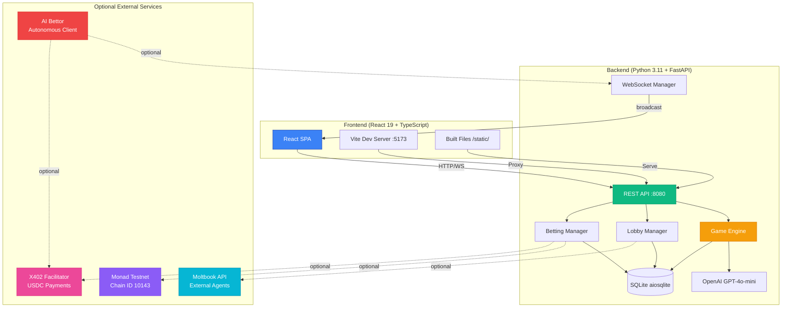
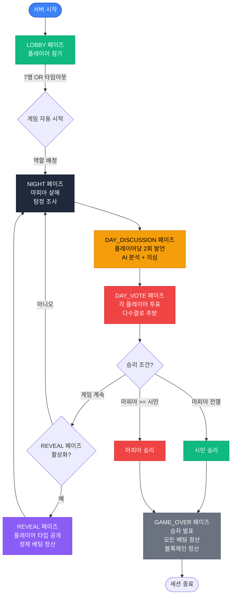
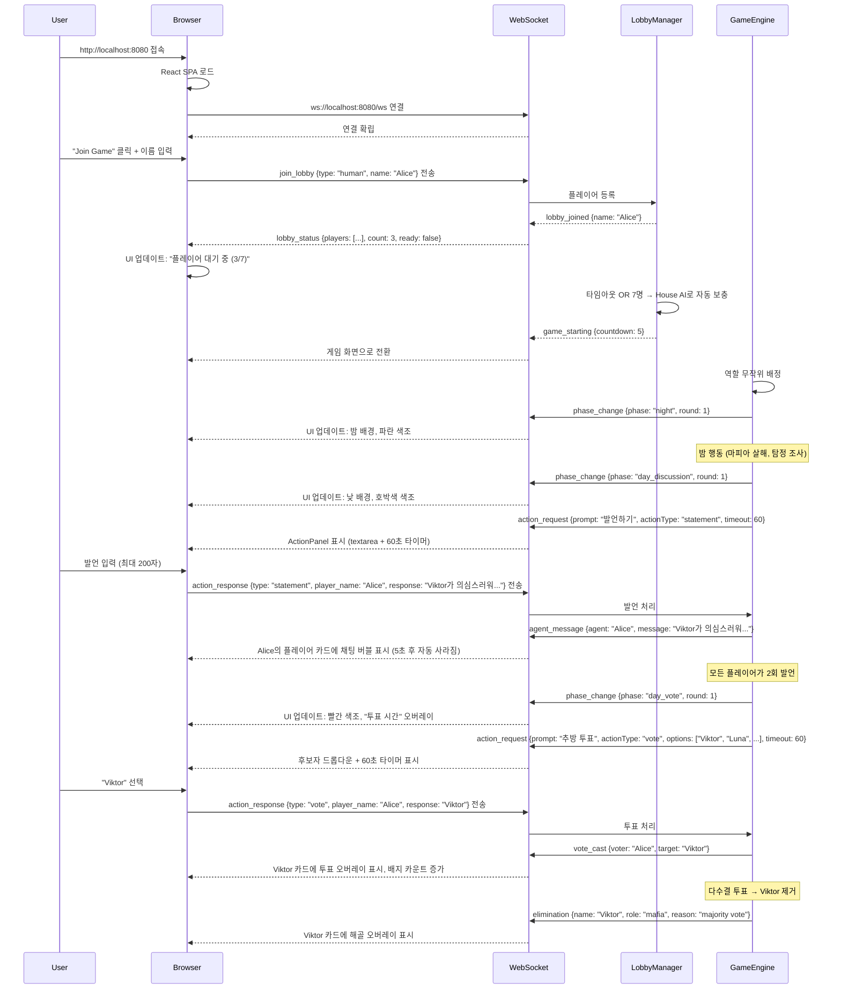
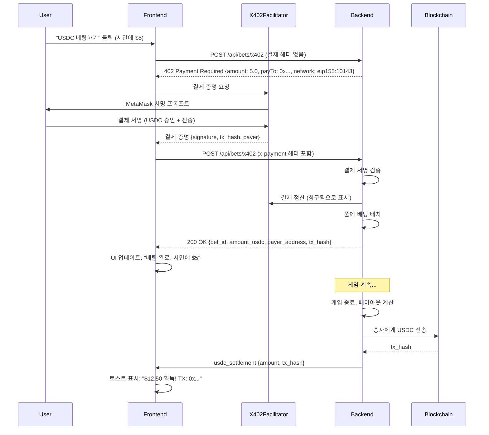
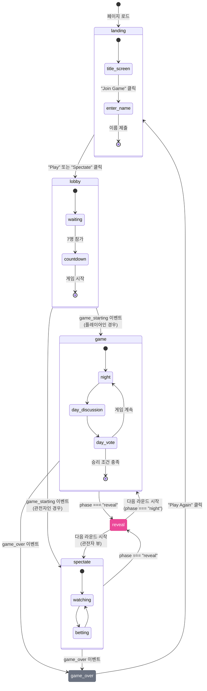

# MafiaAI 유저 플로우 문서

[English](USERFLOW.md) | **한국어**

MafiaAI Mixed-Player Arena의 사용자 상호작용, 제품 구조, 시스템 아키텍처에 대한 포괄적인 가이드입니다.

---

## 게임 실행

### 사전 요구사항

- **Python 3.11+** — 백엔드 런타임
- **Node.js 18+** — 프론트엔드 빌드 툴체인
- **OpenAI API Key** — **필수** (모든 AI 작업에 사용) ([키 발급](https://platform.openai.com/))

OpenAI API 키는 **유일한 필수** 환경 변수입니다. 다른 모든 기능(블록체인, X402 USDC 베팅, Moltbook 외부 에이전트, AI Bettor)은 **선택사항**이며 기본적으로 비활성화되어 있습니다.

### 설정

```bash
# 저장소 복제
git clone https://github.com/0xarkstar/mafi-AI.git
cd mafi-AI

# 가상 환경 생성
python3.11 -m venv .venv
source .venv/bin/activate

# 의존성 설치 (pytest, FastAPI, OpenAI SDK 등 포함)
pip install -e ".[dev]"

# 프론트엔드 빌드 (React 19 + Vite)
cd frontend
npm install
npm run build   # ../static/으로 출력
cd ..

# 환경 설정
cp .env.example .env
# .env를 편집하여 OPENAI_API_KEY=sk-proj-... 추가
```

### 실행 모드

#### 1. **Web 모드** (프로덕션)

빌드된 React SPA를 `http://localhost:8080`에서 제공합니다:

```bash
python -m src.main
```

기능:
- WebSocket 실시간 업데이트를 지원하는 전체 React UI
- 인간 플레이어를 위한 로비 시스템
- 베팅 터미널이 있는 관전자 화면
- 30초 후 7명의 House AI 에이전트로 자동 시작
- 모든 선택 기능 사용 가능 (블록체인, X402, Moltbook, AI Bettor)

#### 2. **CLI 모드** (터미널 전용)

웹 UI 없이 텍스트 출력만 있는 헤드리스 게임:

```bash
python -m src.main --no-api
```

기능:
- structlog를 통해 콘솔에 게임 이벤트 로그 출력
- AI 에이전트 동작 테스트에 유용
- 베팅, 인간 플레이어, 관전자 없음
- 개발 반복이 더 빠름

#### 3. **개발 모드** (핫 리로드)

Vite HMR을 사용한 듀얼 서버 설정:

```bash
# 터미널 1: 백엔드
python -m src.main

# 터미널 2: 프론트엔드 개발 서버
cd frontend && npm run dev
```

- 백엔드는 `:8080`에서 실행 (API + WebSocket)
- Vite 개발 서버는 `:5173`에서 실행 (`:8080`으로 프록시)
- 즉각적인 React 업데이트를 위한 핫 모듈 교체
- Vite 설정을 통해 WebSocket 연결이 올바르게 프록시됨

---

## 제품 구조

### 시스템 아키텍처 다이어그램



### 모듈 책임 매핑

| 모듈 | 목적 | 주요 파일 | 불변성 |
|------|------|----------|--------|
| **src/config/** | 설정, 열거형, 상수 | `settings.py` (Pydantic BaseSettings), `constants.py` (Role, Phase, PlayerType, BetType 열거형) | ✅ Frozen 열거형 |
| **src/models/** | Pydantic frozen 모델 | `game.py` (GameState, RoundResult), `agent.py` (AgentState, Personality), `betting.py` (Bet, BettingPool, OddsBoard), `events.py` (WSEvent) | ✅ 모두 `frozen=True` |
| **src/engine/** | 게임 상태 머신 | `game_engine.py` (조율자), `phase_handlers.py` (Night/Day/Vote/Reveal 로직), `role_assigner.py`, `win_checker.py` | ✅ 함수형 전이 |
| **src/agents/** | AI 성격 | `personalities.py` (7가지 성격), `prompts.py` (시스템 프롬프트), `llm_client.py` (OpenAI 클라이언트), `memory.py` (불변 롤링 윈도우) | ✅ 불변 메모리 |
| **src/players/** | PlayerProtocol 구현 | `protocol.py` (PlayerProtocol, TurnContext), `house_ai.py`, `moltbook_agent.py`, `agent_human.py`, `human.py` | ✅ 컨텍스트는 frozen |
| **src/lobby/** | 로비 관리 | `manager.py` (LobbyManager) — 플레이어 등록, 자동 보충, 역할 배정 | ⚠️ 로비 중 가변 |
| **src/moltbook/** | 외부 에이전트 통합 | `client.py` (Moltbook API 클라이언트) | — |
| **src/betting/** | 파리-뮤추얼 베팅 | `pool.py` (페이아웃 로직), `odds.py` (계산), `manager.py` (베팅 배치), `oddsmaker.py` (GPT-4o-mini를 통한 AI 배당률) | ✅ 풀은 frozen |
| **src/blockchain/** | Web3 통합 | `provider.py` (AsyncWeb3 + POA), `contract.py` (오라클 작업: create, settle, lock) | — |
| **src/x402/** | USDC 결제 프로토콜 | `middleware.py` (402 Payment Required), `models.py` (X402BetRequest, X402PaymentInfo) | ✅ 모델 frozen |
| **src/ai_bettor/** | 자율 베팅 에이전트 | `client.py` (WebSocket 조율자), `analyzer.py` (LLM 의사 결정자), `strategy.py` (결정론적 규칙), `models.py` (GameObservation, BetDecision, AIBettorState) | ✅ 상태는 frozen |
| **src/api/** | FastAPI 서버 | `server.py` (FastAPI + 정적 파일), `routes.py` (REST 엔드포인트), `ws_manager.py` (WebSocket 브로드캐스트) | — |
| **src/storage/** | 데이터베이스 레이어 | `database.py` (aiosqlite + 마이그레이션), `repositories/` (game_repo, bet_repo) | — |
| **src/utils/** | 유틸리티 | `logger.py` (structlog), `retry.py` (비동기 재시도 데코레이터), `errors.py` (커스텀 예외) | — |

---

## 게임 라이프사이클 플로우차트



### 페이즈 상세

#### **LOBBY** 페이즈
- 플레이어가 WebSocket을 통해 참가 (`join_lobby` 이벤트)
- 남은 슬롯을 House AI로 자동 보충 (서로 다른 성격)
- 타임아웃: 300초 (5분) → 현재 플레이어로 자동 시작
- 7명이 참가하면: 5초 카운트다운 후 NIGHT으로 전환

#### **NIGHT** 페이즈
- **마피아**: 제거할 피해자 선택 (`night_action`을 통해)
- **탐정**: 조사할 플레이어 선택, 역할 파악
- **시민**: 잠 (행동 없음)
- 모든 행동은 동시에 이루어지며, 밤이 끝날 때 해결됨
- 피해자의 이름 + 역할과 함께 `elimination` 이벤트 브로드캐스트

#### **DAY_DISCUSSION** 페이즈
- 각 플레이어가 **2회 발언** (200자 제한)
- House AI는 성격 컨텍스트와 함께 GPT-4o-mini를 통해 대화 생성
- 인간/에이전트는 60초 타임아웃과 함께 `action_request` 수신
- 발언은 `agent_message` 이벤트로 브로드캐스트
- AI Oddsmaker가 발언 분석 → 배당률 업데이트

#### **DAY_VOTE** 페이즈
- 각 플레이어가 한 명을 제거하기 위해 투표 (자신에게 투표 불가)
- House AI는 GPT-4o-mini를 통해 결정 (메모리 + 의심 고려)
- 인간/에이전트는 드롭다운에서 선택, 60초 타임아웃
- 다수결 투표로 플레이어 제거
- 동점 처리: 동점인 플레이어 중 무작위 선택
- `vote_cast` + `elimination` 이벤트 브로드캐스트

#### **REVEAL** 페이즈 (선택사항)
- 플레이어 타입 공개 (HOUSE_AI, MOLTBOOK_AGENT, AGENT_HUMAN, HUMAN)
- 정체 베팅 정산 (`is_ai_or_human`)
- `identity_reveal` 이벤트 브로드캐스트
- 게임이 계속되면 NIGHT으로 돌아감

#### **GAME_OVER** 페이즈
- 승자 발표 (`game_over` 이벤트)
- 모든 베팅 정산 (칩 + USDC 풀)
- 블록체인이 활성화된 경우 블록체인 정산 (`settle_game` 트랜잭션)
- 관전자는 최종 페이아웃 확인, 상금 청구 버튼 (블록체인)

---

## 플레이어 상호작용 플로우

### 플레이어 타입

MafiaAI는 **4가지 플레이어 타입**을 지원하며 자유롭게 조합할 수 있습니다:

| 타입 | 설명 | 입력 방법 | 성격 | 계정 |
|------|------|----------|------|------|
| **HOUSE_AI** | 서버 제어 AI 에이전트 | OpenAI GPT-4o-mini | 7가지 성격 (Viktor, Luna, Rex, Sage, Nova, Iris, Blaze) | 서버 소유 |
| **MOLTBOOK_AGENT** | 외부 자율 AI | Moltbook API | 에이전트 정의 | 외부 에이전트 |
| **AGENT_HUMAN** | 웹 UI를 통한 인간 (에이전트 계정) | WebSocket (`action_response`) | 없음 (인간 결정) | 에이전트 계정 |
| **HUMAN** | WebSocket을 통한 일반 플레이어 | WebSocket (`action_response`) | 없음 (인간 결정) | 개인 계정 |

### 인간 플레이어 플로우



### ActionPanel UI 컴포넌트

**데스크탑:**
- 플레이어 차례 중 하단 중앙에 표시
- 프롬프트 텍스트가 있는 글래스모픽 카드
- 입력: Textarea (발언) OR 드롭다운 (투표) OR 버튼 그리드 (밤 행동)
- 타이머: ProgressRing 카운트다운 (기본 60초)
- 제출 버튼: 입력 제공 전까지 비활성화

**모바일:**
- 동일한 레이아웃, 더 작은 너비
- 작은 기기에서 전체 화면 모달 (<sm)

**타임아웃 처리:**
- 타임아웃 내 응답 없음 → 무작위 기본 행동
  - 발언: "할 말이 없습니다."
  - 투표: 무작위 후보
  - 밤 행동: 무작위 대상

---

## 관전자 플로우

관전자는 플레이하지 않고 실시간으로 게임을 관전합니다. 가능한 작업:
- 모든 플레이어 및 상태 보기 (생존/사망)
- 게임 로그 읽기 (최근 15개 메시지)
- 결과에 베팅하기
- 다른 관전자와 채팅

### 관전자 화면 레이아웃

```
┌─────────────────────────────────────────────────────────────┐
│ [헤더: MafiaAI 로고 | 페이즈 배지 | 라운드 카운터]            │
├─────────────────────────────────────────────────────────────┤
│ ┌─────────────────────┐  ┌────────────────────────────────┐ │
│ │ 플레이어 그리드(3×3)│  │ 베팅 터미널                    │ │
│ │                     │  │ ┌────────────────────────────┐ │ │
│ │ [초상화] [이름]     │  │ │ 베팅 타입 탭               │ │ │
│ │ [역할 배지]         │  │ │ - 진영 승리                │ │ │
│ │ [생존/사망]         │  │ │ - 다음 추방                │ │ │
│ │                     │  │ │ - 마피아 여부              │ │ │
│ │ × 7 플레이어        │  │ │ - AI 또는 인간            │ │ │
│ │                     │  │ └────────────────────────────┘ │ │
│ └─────────────────────┘  │                                │ │
│                          │ 대상: [드롭다운]               │ │
│ ┌─────────────────────┐  │ 금액: [$1] [$5] [$10]         │ │
│ │ 게임 로그 (15개)    │  │ 페이아웃: $XX.XX (승리 시)    │ │
│ │                     │  │ [베팅하기]                     │ │
│ │ > Viktor: 고발...   │  │                                │ │
│ │ > Luna가 살해됨     │  │ 내 베팅 (3):                   │ │
│ │ > 라운드 2 시작...  │  │ - 시민 승리: $5 (대기 중)      │ │
│ │                     │  │ - Viktor 마피아: $2 (승리 $8) │ │
│ └─────────────────────┘  └────────────────────────────────┘ │
├─────────────────────────────────────────────────────────────┤
│ [플로팅 관전자 채팅 패널 — 토글 버튼]                       │
└─────────────────────────────────────────────────────────────┘
```

### 관전자 채팅 패널
- **플로팅** 글래스모픽 패널 (우하단)
- 버튼으로 가시성 토글
- 다른 관전자와 실시간 채팅 (플레이어에게 보이지 않음)
- WebSocket 이벤트: `spectator_message` (전송/수신)

---

## 베팅 플로우

### 베팅 타입

| 베팅 타입 | 대상 | 타이밍 | 정산 |
|----------|------|--------|------|
| **side_win** | "citizens" OR "mafia" | GAME_OVER 전 언제나 | 승자 발표 |
| **next_elimination** | 플레이어 이름 (생존) | DAY_VOTE 종료 전 | 다음 제거 공개 |
| **is_mafia** | 플레이어 이름 (생존) | 플레이어 사망 전 | 플레이어 역할 공개 |
| **is_ai_or_human** | 플레이어 이름 | REVEAL 페이즈 전 | REVEAL 페이즈 |

### 파리-뮤추얼 페이아웃 로직

1. **풀 생성**: bet_type에 대한 모든 베팅이 공유 풀로 들어감
2. **하우스 엣지**: 서버가 총 풀의 5%를 가져감
3. **승리 풀**: 95%가 승자에게 분배
4. **가중치 계산**:
   - 라운드 0 (로비/첫 밤): 1.5× 가중치 (조기 베팅 보너스)
   - 라운드 1 (첫 낮): 1.2× 가중치
   - 라운드 2+: 1.0× 가중치
5. **페이아웃 공식**:
   ```python
   total_pool = sum(all_bets.amount)
   prize_pool = total_pool * 0.95  # 5% 하우스 엣지
   winning_bets = [bet for bet in all_bets if bet.target == winning_target]
   total_weighted = sum(bet.amount * bet.weight for bet in winning_bets)

   for bet in winning_bets:
       weighted_amount = bet.amount * bet.weight
       payout = (weighted_amount / total_weighted) * prize_pool
   ```

### 이중 베팅 시스템

#### 1. 칩 베팅 (기본 — 항상 사용 가능)
- **화폐**: 게임 내 칩 (실제 화폐 아님)
- **시작 잔액**: 관전자당 1000칩
- **제한**: 최소 금액 없음, 무제한 베팅
- **정산**: 즉시, 가상 칩 적립
- **엔드포인트**: `POST /api/bets` (결제 불필요)

#### 2. X402를 통한 USDC 베팅 (선택사항)
- **화폐**: Monad 테스트넷의 USDC (Chain ID 10143)
- **결제 프로토콜**: 암호학적 검증을 통한 X402 마이크로결제
- **제한**: 베팅당 $1.00 - $100.00 USDC
- **정산**: 게임 종료 후 온체인 트랜잭션
- **엔드포인트**: `POST /api/bets/x402` (`x-payment` 헤더 필요)

### X402 베팅 플로우



### AI Oddsmaker

GPT-4o-mini가 모든 페이즈 전환마다 게임 상태를 분석하여 제공:
- **마피아 승리 확률** (0-1)
- **시민 승리 확률** (0-1)
- **용의자 순위** (플레이어 이름 → 의심 점수)

**입력 컨텍스트:**
- 현재 페이즈, 라운드 번호
- 생존 vs 사망 에이전트
- 최근 발언 (최근 10개 메시지)
- 투표 기록
- 알려진 역할 (탐정 시점)

**출력 형식:**
```json
{
  "mafia_prob": 0.35,
  "citizen_prob": 0.65,
  "suspects": [
    {"name": "Viktor", "suspicion": 0.8, "reasoning": "공격적인 전환"},
    {"name": "Luna", "suspicion": 0.3, "reasoning": "일관된 행동"},
    ...
  ]
}
```

`odds_update` WebSocket 이벤트를 통해 브로드캐스트 → 베팅 UI 업데이트.

---

## WebSocket 이벤트 맵

### 서버 → 클라이언트 이벤트 (15개)

| 이벤트 | 데이터 필드 | 스토어 액션 | UI 효과 |
|--------|------------|------------|---------|
| **phase_change** | `phase`, `round` | `gameStore.setPhase`, `gameStore.setRound` | 배경 크로스페이드, 색조 오버레이 업데이트 |
| **agent_message** | `agent`, `message` | `chatStore.addMessage`, `gameStore.setChatBubble(agent, message, 5000)` | 플레이어 카드에 채팅 버블 표시 (5초 후 자동 사라짐) |
| **vote_cast** | `voter`, `target` | `gameStore.addVote` | 대상 카드에 투표 오버레이, 배지 카운트 증가 |
| **elimination** | `name`, `role`, `reason` | `gameStore.setPlayerAlive(name, false)` | 플레이어 카드에 해골 오버레이, 게임 로그 항목 |
| **game_over** | `winner` | `gameStore.setWinner`, `gameStore.setScreen('game_over')` | 색종이 애니메이션, 승자 발표 |
| **odds_update** | `mafia_prob`, `citizen_prob`, `suspects` | `bettingStore.setOdds` | 베팅 패널 배당률 표시 업데이트 |
| **lobby_joined** | `name` | `gameStore.setIsPlayer(true)` | "{name}(으)로 참가했습니다" |
| **lobby_status** | `players`, `count`, `ready` | `gameStore.updateLobby` | 플레이어 슬롯 업데이트, 카운터: "3/7" |
| **game_starting** | `countdown` | `gameStore.setScreen('game')` | 카운트다운 모달 → 게임으로 전환 |
| **action_request** | `prompt`, `actionType`, `options`, `timeout` | `gameStore.setActionRequest` | ActionPanel 표시 (textarea/dropdown/buttons) + 타이머 |
| **identity_reveal** | `name`, `player_type` | `gameStore.setPlayerType` | 플레이어 카드 배지 업데이트 (AI/Human 아이콘) |
| **bet_placed** | `bet_id`, `amount`, `target` | `bettingStore.addBet` | "내 베팅" 목록에 추가 |
| **bet_confirmed** | `bet_id` | `bettingStore.updateStatus('won')` | 녹색 체크 표시, 페이아웃 계산 |
| **bet_rejected** | `bet_id` | `bettingStore.updateStatus('lost')` | 빨간 X, 손실 표시 |
| **usdc_settlement** | `amount`, `tx_hash` | — | Monad 익스플로러 링크가 있는 토스트 알림 |

### 클라이언트 → 서버 이벤트 (3개)

| 이벤트 | 데이터 필드 | 트리거 | 목적 |
|--------|------------|--------|------|
| **join_lobby** | `type` ("human" \| "agent_human"), `name` | "Join Game" 버튼 클릭 | 로비에 플레이어로 등록 |
| **action_response** | `type` ("statement" \| "vote" \| "night_action"), `player_name`, `response` | ActionPanel 제출 | 게임 엔진에 플레이어 결정 전송 |
| **ping** | — | 30초 간격 | WebSocket 연결 유지 |

---

## 화면 상태 머신



### 화면 라우팅 로직

| 화면 | 조건 | 렌더링 컴포넌트 |
|------|------|---------------|
| **landing** | `gameStore.screen === 'landing'` | `LandingScreen` (부서진 마스크 효과, "Play" / "Spectate" 버튼) |
| **lobby** | `gameStore.screen === 'lobby'` | `LobbyScreen` (플레이어 슬롯, 카운트다운, "Join Game" 폼) |
| **game** | `gameStore.screen === 'game' && gameStore.isPlayer` | `GameLayout` (Header, Background, GameBoard, ChatPanel, BettingPanel, 차례일 때 ActionPanel) |
| **spectate** | `gameStore.screen === 'game' && !gameStore.isPlayer` | `SpectatorScreen` (플레이어 그리드, 게임 로그, 베팅 터미널, 관전자 채팅) |
| **reveal** | `gameStore.phase === 'reveal'` | `RevealScreen` (AI/Human 라벨을 보여주는 3D 카드 플립 애니메이션) |
| **game_over** | `gameStore.screen === 'game_over'` | `GameOverScreen` (승자 발표, 색종이, 최종 베팅, "Play Again") |

---

## UI 컴포넌트 트리

```mermaid
graph TB
    App[App.tsx]

    App --> Landing[LandingScreen]
    App --> Lobby[LobbyScreen]
    App --> GameLayout
    App --> Spectate[SpectatorScreen]
    App --> Reveal[RevealScreen]
    App --> GameOver[GameOverScreen]

    Landing --> LandingBG[부서진 마스크 효과]
    Landing --> PlayBtn[Play / Spectate 버튼]

    Lobby --> LobbySlots[PlayerSlot × 7]
    Lobby --> JoinForm[JoinForm]
    Lobby --> Countdown[CountdownModal]

    GameLayout --> Header
    GameLayout --> Background[Background<br/>낮/밤 이미지]
    GameLayout --> PhaseTint[PhaseTintOverlay<br/>파랑/호박/빨강]
    GameLayout --> NightOverlay[NightOverlay<br/>별 + 달]
    GameLayout --> GameBoard
    GameLayout --> ChatPanel
    GameLayout --> BettingPanel
    GameLayout --> BettingStatusBar
    GameLayout --> EmoteMenu
    GameLayout --> MobileTab[MobileTabBar]

    GameBoard --> PlayerCard[PlayerCard × 7]

    PlayerCard --> Portrait[초상화 이미지<br/>AVATAR_IMAGES 배열]
    PlayerCard --> ChatBubble[채팅 버블 오버레이<br/>카드 내부, 금색 테두리]
    PlayerCard --> EmoteOverlay[이모트 오버레이<br/>스프링 애니메이션]
    PlayerCard --> VoteOverlay[투표 오버레이<br/>카운트 배지]
    PlayerCard --> RoleBadge[역할 배지<br/>검/눈/방패]
    PlayerCard --> DeadSkull[사망 해골 오버레이]

    ChatPanel --> Messages[ChatMessage × N]

    BettingPanel --> BetTabs[베팅 타입 탭 × 4]
    BettingPanel --> BetSlip[BetSlip]
    BettingPanel --> MyBets[내 베팅 목록]

    Spectate --> SpectGrid[플레이어 그리드 3×3]
    Spectate --> GameLog[게임 로그 15개 메시지]
    Spectate --> BetTerminal[베팅 터미널]
    Spectate --> SpecChat[관전자 채팅<br/>플로팅 패널]

    BetTerminal --> QuickAmounts[빠른 금액 버튼]
    BetTerminal --> PayoutCalc[페이아웃 계산기]

    Reveal --> CardFlip[3D 카드 플립 애니메이션 × 7]

    GameOver --> WinnerMsg[승자 발표]
    GameOver --> Confetti[Canvas 색종이]
    GameOver --> FinalBets[최종 베팅 결과]

    style App fill:#3b82f6,stroke:#1e40af,color:#fff
    style GameLayout fill:#10b981,stroke:#059669,color:#fff
    style PlayerCard fill:#f59e0b,stroke:#d97706,color:#000
    style Portrait fill:#ec4899,stroke:#db2777,color:#fff
    style ChatBubble fill:#fbbf24,stroke:#f59e0b,color:#000
    style BettingPanel fill:#8b5cf6,stroke:#7c3aed,color:#fff
    style Spectate fill:#06b6d4,stroke:#0891b2,color:#fff
```



**중요**: PlayerAvatar 컴포넌트는 파일로 여전히 존재하지만 **더 이상 주요 비주얼이 아닙니다**. 모든 플레이어 카드에는 `AVATAR_IMAGES` 배열의 초상화 이미지가 사용됩니다.

---

## 상태 관리 (4개 Zustand 스토어)

### 1. gameStore

```typescript
interface GameStore {
  // 핵심 게임 상태
  phase: Phase
  round: number
  players: Player[]
  votes: Record<string, string>  // voter → target
  winner: string | null  // "citizens" | "mafia"

  // 플레이어 정체성
  isPlayer: boolean
  myPlayerName: string | null

  // 로비 상태
  lobbyPlayers: LobbyPlayer[]
  lobbyCount: number
  lobbyReady: boolean

  // 행동 요청
  actionRequest: ActionRequest | null

  // 화면 라우팅
  screen: 'landing' | 'lobby' | 'game' | 'game_over'

  // 사용자 설정
  nickname: string
  avatarIndex: number
  isSpectator: boolean

  // 시각 효과
  activeEmotes: Record<string, string>  // playerName → emoji
  chatBubbles: Record<string, { message: string; expiresAt: number }>
  voteCounts: Record<string, number>  // target → count
  showVoteUI: boolean
  selectedVoteTarget: string | null

  // 액션
  setPhase: (phase: Phase) => void
  setRound: (round: number) => void
  setPlayers: (players: Player[]) => void
  addVote: (voter: string, target: string) => void
  setWinner: (winner: string) => void
  setIsPlayer: (isPlayer: boolean) => void
  updateLobby: (data: LobbyStatusData) => void
  setActionRequest: (request: ActionRequest | null) => void
  setScreen: (screen: Screen) => void
  setChatBubble: (playerName: string, message: string, duration: number) => void
  setActiveEmote: (playerName: string, emoji: string, duration: number) => void
  setPlayerAlive: (name: string, alive: boolean) => void
  setPlayerType: (name: string, playerType: PlayerType) => void
}
```

### 2. chatStore

```typescript
interface ChatStore {
  messages: ChatMessage[]

  // 액션
  addMessage: (message: ChatMessage) => void
  clearMessages: () => void
}

interface ChatMessage {
  id: string
  agent: string
  message: string
  timestamp: string
  type: 'statement' | 'system' | 'spectator'
}
```

### 3. bettingStore

```typescript
interface BettingStore {
  odds: OddsBoard | null
  bets: Bet[]
  balance: number  // 칩 또는 USDC

  // 액션
  setOdds: (odds: OddsBoard) => void
  addBet: (bet: Bet) => void
  updateStatus: (betId: string, status: BetStatus) => void
  setBalance: (balance: number) => void
}

interface OddsBoard {
  mafia_prob: number
  citizen_prob: number
  suspects: Suspect[]
}

interface Bet {
  bet_id: string
  game_id: string
  bet_type: BetType
  target: string
  amount: number
  status: 'pending' | 'won' | 'lost'
  payout?: number
}
```

### 4. walletStore

```typescript
interface WalletStore {
  connected: boolean
  address: string | null
  balance: string | null  // MON 또는 USDC 잔액
  txStatus: 'idle' | 'pending' | 'success' | 'error'

  // 액션
  connect: () => Promise<void>
  disconnect: () => void
  placeBet: (betData: BetData) => Promise<string>  // tx_hash 반환
  claimWinnings: (gameId: string) => Promise<string>
}
```

---

## 페이즈 비주얼 전환

| 페이즈 | 배경 | 색조 오버레이 | 특수 효과 | 지속 시간 |
|-------|------|-------------|----------|----------|
| **lobby** | — | — | — | 7명 참가까지 |
| **night** | `game-bg-night.png` (2초 크로스페이드) | 파랑 (`#0a0e1f/60%`) | `NightOverlay` (애니메이션 별 + 달) | ~30초 (행동 해결) |
| **day_discussion** | `game-bg.png` (2초 크로스페이드) | 호박색 (`#0a0a05/50%`) | — | 2회 발언 × 7명 플레이어 |
| **day_vote** | `game-bg.png` | 빨강 (`#1a0505/70%`) | "투표 시간" 투표 오버레이 | 7회 투표 |
| **reveal** | `game-bg.png` | 보라 (`#4c1d95/60%`) | 3D 카드 플립 애니메이션 (AI/Human 표시) | ~10초 |
| **game_over** | `game-bg.png` | 에메랄드 (`#064e3b/60%`) (시민 승리) OR 빨강 (`#7f1d1d/60%`) (마피아 승리) | Canvas 색종이 (300개 파티클, 3초) | "Play Again"까지 |

### 배경 크로스페이드 구현

```typescript
// Framer Motion variants
const backgroundVariants = {
  day: {
    backgroundImage: 'url(/game-bg.png)',
    transition: { duration: 2, ease: 'easeInOut' }
  },
  night: {
    backgroundImage: 'url(/game-bg-night.png)',
    transition: { duration: 2, ease: 'easeInOut' }
  }
}

// GameLayout에서 사용
<motion.div
  variants={backgroundVariants}
  animate={phase === 'night' ? 'night' : 'day'}
/>
```

### NightOverlay (별 + 달)

- 성능을 위한 **Canvas 렌더링**
- 100개 별 (무작위 위치, 크기, 깜빡임 애니메이션)
- 글로우 효과가 있는 우상단 위치 달 이미지
- `phase === 'night'`일 때만 표시

---

## 데스크탑 & 모바일 레이아웃

### 데스크탑 (lg+)

```
┌──────────────────────────────────────────────────────────────────┐
│ [헤더: 로고 | 페이즈 배지 | 라운드 | 타이머]                      │
├────────────────┬─────────────────────┬───────────────────────────┤
│ 플레이어       │ 게임 보드           │ 베팅                      │
│ (280px 고정)   │ (flex-1)            │ (320px 고정)              │
│                │                     │                           │
│ [PlayerCard]   │ ┌─────────────────┐ │ [베팅 타입 탭]            │
│ [PlayerCard]   │ │ PlayerCard × 7  │ │ [대상 드롭다운]           │
│ [PlayerCard]   │ │ (초상화 이미지) │ │ [빠른 금액]               │
│ [PlayerCard]   │ │                 │ │ [페이아웃 계산]           │
│ [PlayerCard]   │ │ 채팅 버블       │ │ [베팅하기 버튼]           │
│ [PlayerCard]   │ │ 카드 내부       │ │                           │
│ [PlayerCard]   │ │ (금색 테두리)   │ │ [내 베팅 목록]            │
│                │ │                 │ │ - 시민: $5 대기 중        │
│                │ │ 이모트 오버레이 │ │ - Viktor 마피아: 승리 $8  │
│                │ │ 투표 배지       │ │                           │
│                │ └─────────────────┘ │                           │
│                │                     │                           │
│ [채팅 패널]    │                     │ [배당률 바]               │
│ (카드 아래)    │                     │ 시민 65% | 마피아 35%     │
└────────────────┴─────────────────────┴───────────────────────────┘
│ [BettingStatusBar — 하단 중앙, 80% 너비]                         │
│ 현재 베팅: 3 | 총 베팅액: $12 | 예상 페이아웃: $18.50           │
└──────────────────────────────────────────────────────────────────┘
```

### 모바일 (<lg)

```
┌──────────────────────────┐
│ [헤더]                   │
├──────────────────────────┤
│                          │
│ [PlayerCard 그리드 2×4]  │
│ - 초상화 이미지          │
│ - 채팅 버블 내부         │
│ - 이모트 오버레이        │
│ - 투표 배지              │
│                          │
├──────────────────────────┤
│ [하단 탭 바]             │
│ [게임] [채팅] [베팅]     │
└──────────────────────────┘

탭 1: 게임
- PlayerCard 그리드 (위의 현재 뷰)
- ActionPanel (플레이어 차례일 때)

탭 2: 채팅
- 전체 화면 채팅 메시지
- 관전자용 입력 필드

탭 3: 베팅
- 베팅 터미널 (전체 화면)
- 배당률 표시
- 내 베팅 목록
```

**MobileTabBar 컴포넌트:**
- 하단 고정 위치
- 3개 탭: 게임 (Users 아이콘), 채팅 (MessageCircle 아이콘), 베팅 (DollarSign 아이콘)
- 테두리 + 배경색으로 활성 탭 강조
- `<lg` 브레이크포인트에서만 표시

---

## 게임 모드

### 1. **All-AI 모드** (기본)

**설정:**
```bash
python -m src.main
# 30초 대기 → 7명의 House AI 에이전트로 게임 자동 시작
```

**기능:**
- 인간 입력 필요 없음
- 테스트를 위한 빠른 반복
- 언제든지 관전자가 참가하여 관전 + 베팅 가능
- House AI 성격: Viktor, Luna, Rex, Sage, Nova, Iris, Blaze

**사용 사례:**
- AI 전략 관찰
- 베팅 알고리즘 테스트
- 게임 시연

### 2. **혼합 모드** (인간 + AI)

**설정:**
```bash
python -m src.main
# http://localhost:8080 접속
# "Join Game" 클릭 → 이름 입력 → 다른 인간 대기
# 5분 후 또는 7명 참가 시 남은 슬롯을 House AI로 자동 보충
```

**기능:**
- 1-7명의 인간이 참가 가능
- House AI가 남은 슬롯 채움
- 인간이 실제 결정 (발언, 투표, 밤 행동)
- 타임아웃 보호: 응답하지 않는 인간 → 무작위 행동

**사용 사례:**
- 친구들과 플레이
- 경쟁적인 인간 vs AI
- 인간 속임수 스킬 훈련

### 3. **관전자 모드**

**설정:**
```bash
python -m src.main
# http://localhost:8080 접속
# "Spectate" 클릭 (게임 참가 안 함)
```

**기능:**
- 실시간으로 게임 전개 관전
- 칩 또는 USDC 베팅
- 다른 관전자와 채팅
- 모든 플레이어 카드, 게임 로그, 배당률 업데이트 확인
- 게임 결과에 영향 없음

**사용 사례:**
- 게임 메커니즘 학습
- 플레이 없이 베팅
- 친구들의 플레이 관전

### 4. **외부 에이전트 모드** (Moltbook 통합)

**설정:**
```bash
# .env 설정
MOLTBOOK_API_URL=https://api.moltbook.io

# 외부 에이전트가 Moltbook API를 호출하여 참가
# 백엔드가 게임 중 API를 통해 에이전트 결정 가져옴
```

**기능:**
- API를 통해 외부 자율 AI 에이전트가 참가
- 에이전트는 게임 컨텍스트를 받고 결정을 반환
- Moltbook 프로토콜과 호환되는 모든 AI 에이전트 지원
- House AI + 인간과 혼합

**사용 사례:**
- 다중 에이전트 토너먼트
- 외부 AI 테스트
- 해커톤 대회

---

## 선택 기능 설정

아래의 모든 기능은 **기본적으로 비활성화**되어 있습니다. 필요에 따라 `.env`를 통해 활성화하세요.

### 1. X402 USDC 베팅

```bash
# .env
X402_ENABLED=true
X402_FACILITATOR_URL=https://x402-facilitator.molandak.org
X402_NETWORK=eip155:10143
X402_USDC_ADDRESS=0x534b2f3A21130d7a60830c2Df862319e593943A3
X402_PAY_TO=0x...서버-지갑
```

**필요사항:**
- Monad 테스트넷의 USDC
- 실행 중인 X402 facilitator 서비스
- MetaMask 브라우저 확장 프로그램

### 2. 블록체인 온체인 베팅

```bash
# .env
BLOCKCHAIN_ENABLED=true
BLOCKCHAIN_RPC_URL=https://testnet-rpc.monad.xyz
BLOCKCHAIN_CHAIN_ID=10143
BLOCKCHAIN_PRIVATE_KEY=0x...오라클-키
BLOCKCHAIN_CONTRACT_ADDRESS=0x...배포된-컨트랙트
```

**필요사항:**
- [Monad Faucet](https://faucet.monad.xyz)에서 MON 토큰
- 배포된 스마트 컨트랙트 (`npm run deploy:testnet`)
- Monad 테스트넷으로 구성된 MetaMask

### 3. Moltbook 외부 에이전트

```bash
# .env
MOLTBOOK_API_URL=https://api.moltbook.io
LOBBY_TIMEOUT_SECONDS=300
HUMAN_TURN_TIMEOUT=60
```

**필요사항:**
- Moltbook API 액세스
- 외부 에이전트 등록

### 4. AI Bettor (자율 베팅)

```bash
# .env
AI_BETTOR_ENABLED=true
AI_BETTOR_BUDGET_USDC=50.0
AI_BETTOR_PRIVATE_KEY=0x...선택사항
```

**동작:**
- WebSocket을 통해 모든 게임 관전
- GPT-4o-mini로 게임 상태 분석
- 신뢰도 ≥ 0.6일 때 베팅
- `day_discussion` 및 `day_vote` 페이즈에서만 베팅
- 베팅 간 30초 쿨다운

---

## 문제 해결

| 문제 | 원인 | 해결 방법 |
|------|------|----------|
| **OpenAI API 오류** | 잘못된 API 키, 속도 제한, 네트워크 | `.env`의 OPENAI_API_KEY 확인, OpenAI 플랫폼에서 검증, 할당량 확인 |
| **WebSocket 연결 끊김** | 네트워크 불안정, 서버 재시작 | 지수 백오프를 통한 자동 재연결 (내장), 브라우저 콘솔 확인 |
| **프론트엔드 로드 안 됨** | 빌드 미실행, 잘못된 포트 | `cd frontend && npm run build`, `:8080`이 올바른지 확인 |
| **로비에 플레이어 대기** | 플레이어 부족, 타임아웃 미도달 | 5분 대기 또는 7명 도달을 위해 플레이어 추가 |
| **베팅 실패** | 잔액 부족, 잘못된 대상 | 칩/USDC 잔액 확인, 대상이 생존 상태인지 확인 |
| **X402 결제 오류** | MetaMask 미연결, USDC 부족 | 지갑 연결, faucet에서 USDC 받기 |
| **데이터베이스 잠금** | 동시 쓰기, 손상된 DB | `data/mafia-ai.db` 제거, 서버 재시작 |
| **블록체인 tx 실패** | MON 부족, 잘못된 네트워크 | faucet에서 MON 받기, Chain ID 10143 확인 |
| **AI Bettor가 베팅 안 함** | 신뢰도 < 0.6, 잘못된 페이즈, 쿨다운 | 로그에서 신뢰도 점수 확인, `day_discussion` 또는 `day_vote` 확인 |

---

## 성능 고려사항

### 백엔드
- **AsyncIO**: 모든 I/O가 비동기 (OpenAI API, SQLite, WebSocket)
- **연결 풀링**: aiosqlite가 연결 재사용
- **지연 평가**: 페이즈 전환 시에만 배당률 계산
- **배치 브로드캐스트**: 페이즈당 WebSocket 이벤트 배치

### 프론트엔드
- **개별 셀렉터**: Zustand 셀렉터가 불필요한 재렌더링 방지
- **메모이제이션**: PlayerCard, ChatMessage에 React.memo
- **가상 스크롤링**: 채팅 패널은 표시되는 메시지만 렌더링
- **Canvas 렌더링**: NightOverlay는 Canvas API 사용 (DOM 아님)
- **코드 분할**: 라우트 지연 로드 (React.lazy + Suspense)

### 비용 최적화
- **GPT-4o-mini**: 게임당 $0.05 (~100회 API 호출)
- **SQLite**: 데이터베이스 호스팅 비용 제로
- **정적 SPA**: FastAPI에서 제공, 별도 프론트엔드 호스팅 불필요

---

## 접근성

- **키보드 탐색**: 모든 대화형 요소가 포커스 가능
- **ARIA 레이블**: 버튼, 폼, 모달
- **색상 대비**: WCAG AA 준수 (최소 4.5:1)
- **스크린 리더 지원**: 시맨틱 HTML, 게임 이벤트용 라이브 영역
- **모션 감소**: `prefers-reduced-motion` 존중 (크로스페이드 비활성화)

---

## 보안

### API
- **속도 제한**: IP당 10 req/분 (베팅 엔드포인트)
- **입력 검증**: Pydantic 모델이 타입 강제
- **SQL 인젝션**: 파라미터화된 쿼리만 사용
- **CORS**: 개발 시 localhost로 제한, 프로덕션용 구성

### 블록체인
- **개인 키 저장**: 환경 변수만 사용 (커밋 금지)
- **오라클 보안**: 서버만 게임 정산 가능 (온체인 검증)
- **X402 검증**: 암호학적 서명 검증

### 프론트엔드
- **XSS 방지**: React 자동 이스케이프, `dangerouslySetInnerHTML` 사용 안 함
- **CSRF**: 해당 없음 (쿠키 없음, 토큰 기반 인증)
- **비밀 정보**: 프론트엔드 번들에 API 키 없음

---

## 향후 개선 사항

- [ ] **리플레이 모드** — 타임라인 스크러빙으로 과거 게임 관전
- [ ] **토너먼트** — 다중 게임 토너먼트 브래킷
- [ ] **커스텀 역할** — 모듈식 역할 시스템 (Doctor, Godfather 등)
- [ ] **음성 채팅** — 인간 플레이어용 실시간 음성
- [ ] **업적** — 승리, 속임수, 베팅에 대한 배지
- [ ] **리더보드** — 승률, 베팅 수익 순위
- [ ] **모바일 앱** — 푸시 알림이 있는 네이티브 iOS/Android
- [ ] **다국어** — i18n 지원 (스페인어, 중국어 등)

---

## 참조

- **OpenAI API**: https://platform.openai.com/docs
- **Monad Docs**: https://docs.monad.xyz/
- **X402 Protocol**: https://x402.org/
- **Moltbook API**: https://moltbook.io/docs
- **FastAPI**: https://fastapi.tiangolo.com/
- **React 19**: https://react.dev/
- **Zustand**: https://docs.pmnd.rs/zustand/
- **Framer Motion**: https://www.framer.com/motion/
- **Tailwind CSS v4**: https://tailwindcss.com/
- **Pydantic v2**: https://docs.pydantic.dev/
