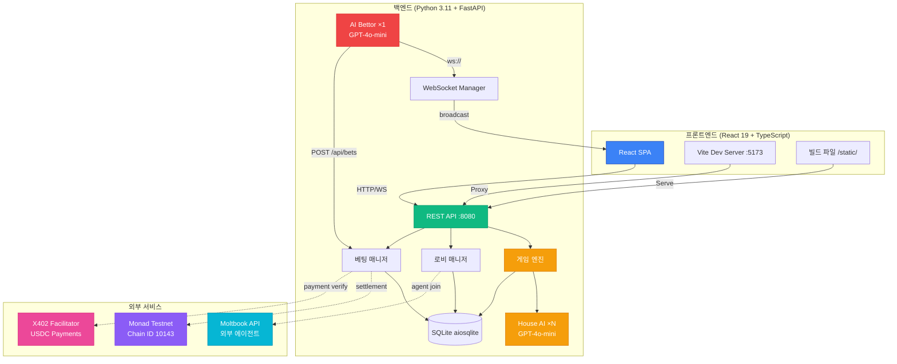
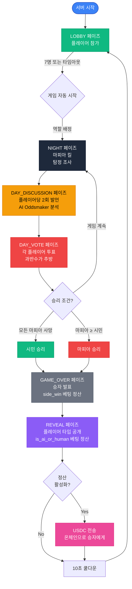
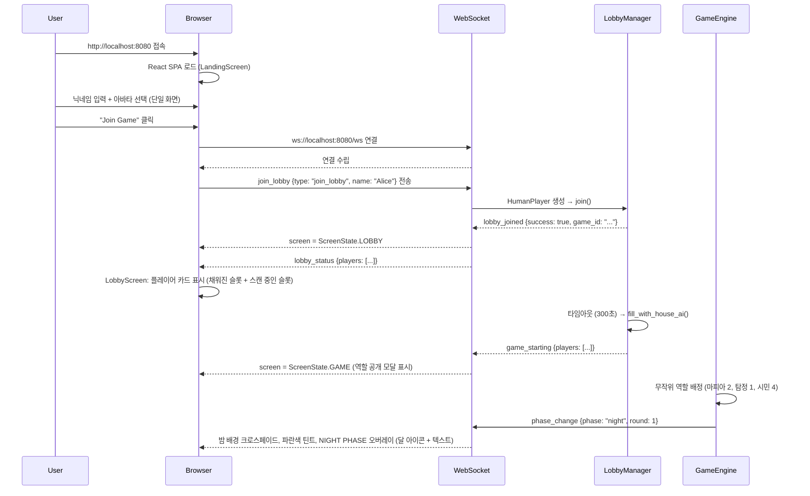
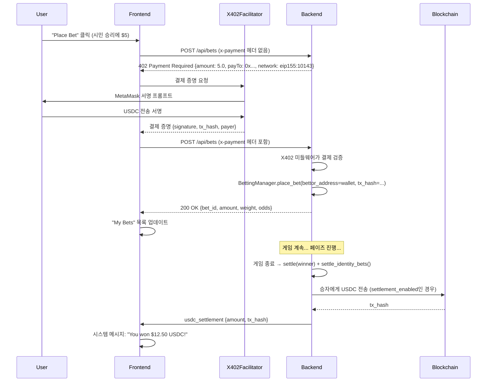
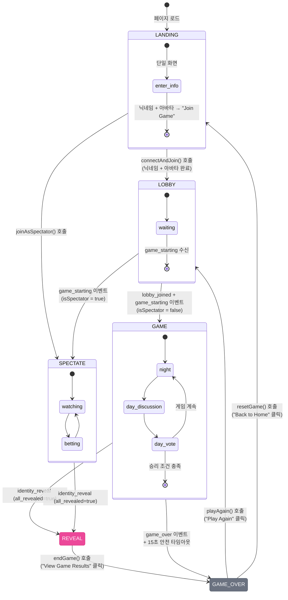

# MafiaAI 유저 플로우 문서

[English](USERFLOW.md) | **한국어**

MafiaAI Mixed-Player Arena의 사용자 상호작용, 시스템 아키텍처, 액터별 플로우에 대한 포괄적인 가이드.

---

## 게임 실행

### 사전 요구사항

- **Python 3.11+** — 백엔드 런타임
- **Node.js 18+** — 프론트엔드 빌드 툴체인
- **OpenAI API Key** — **필수** (모든 AI 작업에 사용) ([키 발급](https://platform.openai.com/))

OpenAI API 키는 **유일한 필수** 환경 변수입니다. 다른 모든 기능(블록체인, X402 USDC 베팅, Moltbook 외부 에이전트, AI Bettor)은 **선택사항**이며 기본적으로 비활성화되어 있습니다.

### 설정

```bash
# 저장소 복제
git clone https://github.com/0xarkstar/mafi-AI.git
cd mafi-AI

# 가상 환경 생성
python3.11 -m venv .venv
source .venv/bin/activate

# 의존성 설치 (pytest, FastAPI, OpenAI SDK 등 포함)
pip install -e ".[dev]"

# 프론트엔드 빌드 (React 19 + Vite)
cd frontend
npm install
npm run build   # ../static/ 으로 출력
cd ..

# 환경 변수 설정
cp .env.example .env
# .env 편집 후 OPENAI_API_KEY=sk-proj-... 추가
```

### 실행 모드

#### 1. **웹 모드** (프로덕션)

빌드된 React SPA를 `http://localhost:8080`에서 서빙:

```bash
python -m src.main
```

기능:
- WebSocket 실시간 업데이트가 포함된 완전한 React UI
- 휴먼 플레이어를 위한 로비 시스템
- 베팅 터미널이 있는 관전자 화면
- 로비 타임아웃(기본 300초) 후 빈 슬롯을 House AI로 자동 충원하여 게임 자동 시작
- 모든 선택적 기능 사용 가능 (블록체인, X402, Moltbook, AI Bettor)

#### 2. **CLI 모드** (터미널 전용)

웹 UI 없이 텍스트 출력만:

```bash
python -m src.main --no-api
```

기능:
- structlog를 통해 콘솔에 게임 이벤트 로그
- AI 에이전트 동작 테스트에 유용
- 베팅, 휴먼 플레이어, 관전자 없음
- 개발 반복에 더 빠름

#### 3. **개발 모드** (핫 리로드)

Vite HMR이 있는 듀얼 서버 설정:

```bash
# 터미널 1: 백엔드
python -m src.main

# 터미널 2: 프론트엔드 개발 서버
cd frontend && npm run dev
```

- 백엔드는 `:8080`에서 실행 (API + WebSocket)
- Vite 개발 서버는 `:5173`에서 실행 (`:8080`으로 프록시)
- React 즉시 업데이트를 위한 핫 모듈 교체
- Vite 설정을 통해 WebSocket 연결이 올바르게 프록시됨

---

## 시스템 아키텍처 다이어그램



**모듈 책임 맵:**

| 모듈 | 용도 | 주요 파일 |
|--------|---------|-----------|
| **src/config/** | 설정, 열거형, 상수 | `settings.py` (Pydantic BaseSettings), `constants.py` (Role, Phase, PlayerType, BetType) |
| **src/models/** | Pydantic frozen 모델 | `game.py`, `agent.py`, `betting.py`, `events.py` — 모두 `frozen=True` |
| **src/engine/** | 게임 상태 머신 | `game_engine.py`, `phase_handlers.py`, `role_assigner.py`, `win_checker.py` |
| **src/agents/** | AI 성격 | `personalities.py` (7종), `prompts.py`, `llm_client.py`, `memory.py` |
| **src/players/** | PlayerProtocol 구현 | `protocol.py`, `house_ai.py`, `moltbook_agent.py`, `agent_human.py`, `human.py` |
| **src/lobby/** | 로비 관리 | `manager.py` (LobbyManager) |
| **src/moltbook/** | 외부 에이전트 통합 | `client.py` (DM API), `auth.py` (Identity JWT 검증) |
| **src/betting/** | 파리뮤추얼 베팅 | `pool.py`, `odds.py`, `manager.py`, `oddsmaker.py`, `settlement.py` |
| **src/blockchain/** | Web3 통합 | `provider.py` (AsyncWeb3 + POA), `gateway.py` (V2 commit-reveal, lock, settle) |
| **src/x402/** | USDC 결제 프로토콜 | `middleware.py` (402 Payment Required), `models.py` (frozen) |
| **src/ai_bettor/** | 자율 베팅 | `client.py` (WebSocket 오케스트레이터), `analyzer.py` (LLM), `strategy.py`, `models.py` |
| **src/api/** | FastAPI 서버 | `server.py`, `routes.py`, `ws_manager.py` |
| **src/storage/** | 데이터베이스 레이어 | `database.py` (aiosqlite), `repositories/` |
| **src/utils/** | 유틸리티 | `logger.py` (structlog), `retry.py`, `errors.py` |
| **frontend/src/screens/** | 화면 단위 React 컴포넌트 | `LandingScreen.tsx`, `LobbyScreen.tsx`, `GameScreen.tsx`, `SpectatorScreen.tsx`, `RevealScreen.tsx`, `GameOverScreen.tsx` |
| **frontend/src/components/** | 공유 UI 컴포넌트 | `GameComponents.tsx` (PlayerCard, GamePlayerCard, BettingStatusBar, EmoteMenu, ChatBoard), `UIComponents.tsx` (GlassCard, Button, Input) |
| **frontend/src/store.ts** | 통합 Zustand 상태 | 게임, 채팅, 베팅, 지갑, WebSocket 상태를 모두 관리하는 단일 `useGameStore` |
| **frontend/src/websocket.ts** | WebSocket 클라이언트 | 지수 백오프 자동 재연결, 25초 ping keepalive |
| **frontend/src/types.ts** | TypeScript 열거형 & 인터페이스 | `ScreenState`, `GamePhase`, `Role`, `Player`, `Message`, `Bet`, `BetType` |
| **frontend/src/mappers.ts** | 백엔드 ↔ 프론트엔드 매핑 | `mapPhase`, `mapRole`, `mapWinner`, `buildPlayerFromName` |
| **frontend/src/constants.ts** | 정적 데이터 | `AGENTS_DATA` (7 에이전트), `PHASE_GRADIENTS` |

---

## 게임 라이프사이클 플로차트



### 페이즈 세부사항

#### **LOBBY** 페이즈
- 플레이어가 WebSocket (`join_lobby`) 또는 REST API (`/api/lobby/join-agent`)를 통해 참가
- 남은 슬롯은 House AI로 자동 충원 (각각 고유한 성격)
- 타임아웃: `LOBBY_TIMEOUT_SECONDS` (기본 300초) → 현재 인원으로 게임 자동 시작
- 7명 도달 시: 즉시 게임 시작
- 역할 배정: 마피아 2명, 탐정 1명, 시민 4명 (무작위)

#### **NIGHT** 페이즈
- **마피아**: 제거할 희생자 선택 (`night_action`)
- **탐정**: 조사할 플레이어 선택, 역할 확인
- **시민**: 수면 (행동 없음)
- 모든 행동은 동시에 이루어지며, 밤이 끝날 때 처리됨
- 희생자의 이름 + 역할과 함께 `elimination` 이벤트 브로드캐스트

#### **DAY_DISCUSSION** 페이즈
- 각 플레이어가 **2회 발언** (200자 제한)
- House AI는 성격 맥락을 포함하여 GPT-4o-mini를 통해 대화 생성
- 휴먼/에이전트는 60초 타임아웃과 함께 `action_request` 수신
- 발언은 `agent_message` 이벤트로 브로드캐스트
- AI Oddsmaker가 발언 분석 → `odds_update`를 통해 배당률 업데이트

#### **DAY_VOTE** 페이즈
- 각 플레이어가 한 명에게 투표 (자신에게는 투표 불가)
- House AI는 GPT-4o-mini를 통해 결정 (메모리 + 의심 고려)
- 휴먼/에이전트는 후보 중 선택, 60초 타임아웃
- 과반수 투표로 플레이어 제거
- 동점: 동점자 중 무작위 선택
- `vote_cast` + `elimination` 이벤트 브로드캐스트

#### **GAME_OVER** 페이즈
- 승자 발표 (페이아웃과 함께 `game_over` 이벤트)
- `side_win`, `next_elimination`, `is_mafia` 베팅 정산
- REVEAL 페이즈로 전환

#### **REVEAL** 페이즈
- 플레이어 타입 공개 (HOUSE_AI, MOLTBOOK_AGENT, AGENT_HUMAN, HUMAN)
- `is_ai_or_human` 베팅 정산
- `identity_reveal` 이벤트 브로드캐스트
- `settlement_enabled=true`인 경우 USDC 온체인 정산

---

## 플레이어 상호작용 플로우

### 휴먼이 참가하고 플레이하는 방법



### 페이즈별 휴먼 플레이어 행동

| 페이즈 | UI | 플레이어 행동 | 타임아웃 (60초 폴백) |
|-------|------|-------------|--------------|
| **NIGHT** | `game-bg-night.png` 크로스페이드 (2초 CSS 전환), 파란색 틴트 `#0a0e1f/60%`, 풀스크린 "NIGHT PHASE" 오버레이 (달 아이콘 + 애니메이션 텍스트, 3초 후 자동 닫힘) | 마피아: 모달에서 대상 이름 클릭. 탐정: 모달에서 대상 이름 클릭. 시민: 행동 없음. | 무작위 대상 |
| **DAY_DISCUSSION** | `game-bg.png` 크로스페이드 (2초 CSS 전환), 황갈색 틴트 `#0a0a05/50%`. ChatBoard 헤더에 "Your Turn to Speak" 표시 | ChatBoard에 발언 입력 → Enter 또는 전송 버튼으로 `action_response` 전송 | "I have nothing to say." |
| **DAY_VOTE** | 빨간색 틴트 `#1a0505/70%`. 플레이어 카드에 빨간색 호버 오버레이 + 대상 아이콘 표시. 카드 우측 상단에 투표 수 배지. | 살아있는 플레이어 카드 클릭 (cursor-pointer, 빨간색 호버 글로우) | 무작위 후보 |
| **REVEAL** | 보라색 방사형 그래디언트 배경. 3D 카드 플립 애니메이션 (각 카드 클릭) | 플레이어 카드를 클릭하여 AI/Human 정체 공개. "View Game Results" 클릭으로 진행 | — |
| **GAME_OVER** | 승자 색상 그래디언트 (빨간색/초록색) + 캔버스 컨페티 (150개 파티클) | 베팅 내역 + 플레이어 명단 확인. "Play Again" (→ LOBBY) 또는 "Back to Home" (→ LANDING) 클릭 | — |

**상호작용 프로토콜:**

```
서버 → WebSocket: action_request {prompt, action_type, options, timeout: 60}
    ↓
프론트엔드 (GameScreen): action_type에 따라 렌더링:
  - "statement" → ChatBoard 헤더 = "Your Turn to Speak", submitActionResponse로 전송
  - "vote" → 플레이어 카드 클릭 가능 (showVoteButtons = true)
  - "night_action" → 대상 버튼이 있는 풀스크린 Night Action 모달
    ↓
사용자 제출 → WebSocket: action_response {type: "action_response", player_name, response}
    ↓
서버: HumanPlayer._response_future.set_result(response) → GameEngine 처리
```

### 역할 공개 모달

게임 시작 시 `GameScreen`에 즉시 풀스크린 역할 공개 모달이 표시됩니다:

- **마피아** — 빨간색 테마, 검 아이콘, "들키지 않고 시민을 제거하세요"
- **탐정** — 파란색 테마, 눈 아이콘, "매 밤 플레이어 한 명을 조사하세요"
- **시민** — 초록색 테마, 방패 아이콘, "마피아를 찾아 투표로 추방하세요"

플레이어가 "Start Game"을 탭하면 모달이 닫히고 게임이 시작됩니다.

---

## 관전자 플로우

관전자는 게임플레이에 참여하지 않고 실시간으로 게임을 관람하며 베팅합니다.

### 관전자로 참가하기

1. 랜딩 화면으로 이동
2. "Spectate Match" 클릭 (닉네임이나 아바타 불필요)
3. `isSpectator = true`, 화면이 `ScreenState.SPECTATE`로 전환
4. WebSocket 연결되지만 `join_lobby`는 전송하지 않음 — 관전자는 브로드캐스트 이벤트만 수신
5. 모든 게임 이벤트 수신 (phase_change, agent_message, vote_cast, elimination 등)
6. 우측의 베팅 터미널에서 USDC 베팅 가능

### 관전자 화면 레이아웃

```
┌─────────────────────────────────────────────────────────────────┐
│ [헤더: MAFI-AI | 👁 관전자 | 페이즈 | 라운드 | 타이머 | $USDC | 나가기] │
├─────────────────────────────────────────┬───────────────────────┤
│                                         │                       │
│  게임 보드 (flex-1)                      │  베팅 터미널           │
│  ┌──────────────────────────────┐       │  (380px 고정)          │
│  │  PlayerCard × 4 (상단 행)    │       │                       │
│  │  - 초상화 이미지              │       │  [실시간 배당률]        │
│  │  - 채팅 버블 오버레이         │       │  마피아 2.86x          │
│  │  - 이모트 오버레이            │       │  시민 1.54x            │
│  └──────────────────────────────┘       │                       │
│  ┌──────────────────────────────┐       │  [베팅 하기 (USDC)]    │
│  │  PlayerCard × 3 (하단 행)    │       │  베팅 타입 드롭다운     │
│  └──────────────────────────────┘       │  대상 드롭다운         │
│                                         │  금액 입력            │
│  [BettingStatusBar — 하단 중앙]          │  빠른 금액            │
│                                         │  예상 페이아웃        │
│  [관전자 채팅 FAB — 좌측 하단]            │  베팅 버튼            │
│                                         │                       │
│                                         │  [내 베팅 목록]        │
│                                         │  [게임 로그 — 15개]   │
│                                         │                       │
│                                         │  [X402 Protocol 브랜딩] │
└─────────────────────────────────────────┴───────────────────────┘
```

**관전자 채팅**: 좌측 하단 FAB으로 토글하는 플로팅 패널 (340×420px). 다른 시청자의 시뮬레이션 메시지 표시. 닫혀 있을 때 FAB에 읽지 않은 배지 표시.

---

## 베팅 플로우

### 4가지 베팅 타입

| 베팅 타입 | 대상 | 타이밍 | 정산 |
|----------|--------|--------|------------|
| **side_win** | `"citizens"` 또는 `"mafia"` | GAME_OVER 이전 언제든지 | 승자 발표 시 |
| **next_elimination** | 플레이어 이름 (생존자) | DAY_VOTE 종료 전 | 다음 제거 공개 시 |
| **is_mafia** | 플레이어 이름 (생존자) | 플레이어 사망 전 | 플레이어 역할 공개 시 |
| **is_ai_or_human** | 플레이어 이름 (생존자) | REVEAL 페이즈 전 | REVEAL 페이즈에서 |

### 파리뮤추얼 페이아웃 로직

1. **풀 생성**: 동일한 bet_type의 모든 베팅이 공유 풀로 합산
2. **하우스 엣지**: 서버가 총 풀의 5% 차감
3. **승리 풀**: 95%를 승자에게 분배
4. **조기 베팅 보너스**:
   - 라운드 0 (로비/밤 1): 1.5× 가중치
   - 라운드 1 (첫 번째 낮): 1.2× 가중치
   - 라운드 2+: 1.0× 가중치
5. **페이아웃 공식**:
   ```python
   prize_pool = total_pool * 0.95          # 5% 하우스 엣지
   weighted_amount = bet.amount * bet.weight
   payout = (weighted_amount / total_weighted) * prize_pool
   ```

### X402 결제 프로토콜 (선택사항)

X402가 활성화되면 모든 베팅에 USDC 결제 필요:



### AI Oddsmaker

GPT-4o-mini가 매 페이즈 전환 시 게임 상태 분석:

**입력:** 현재 페이즈, 라운드, 생존/사망 에이전트, 최근 발언, 투표 이력

**출력:**
```json
{
  "mafia_prob": 0.35,
  "citizen_prob": 0.65,
  "suspects": [
    {"name": "Viktor", "suspicion": 0.8, "reasoning": "Aggressive deflection"},
    {"name": "Luna", "suspicion": 0.3, "reasoning": "Consistent behavior"}
  ]
}
```

배당률은 블렌딩됨: AI 분석 70% + 실제 베팅 분포에서 도출한 시장 암시 배당률 30%.

모든 연결된 클라이언트의 `BettingStatusBar`와 `SpectatorScreen` 베팅 터미널을 업데이트하기 위해 `odds_update` WebSocket 이벤트를 통해 브로드캐스트.

---

## WebSocket 이벤트 맵

### 서버 → 클라이언트 이벤트 (16개 이벤트)

| 이벤트 | 데이터 필드 | 트리거 | UI 효과 |
|-------|-------------|---------|-----------|
| **phase_change** | `phase`, `round`, `alive_agents` | 페이즈 전환 | 배경 크로스페이드 (2초 CSS 전환), 틴트 오버레이 업데이트, `alive_agents`에서 사망 플레이어 업데이트, game_starting을 놓친 경우 GAME 화면으로 자동 전환 |
| **agent_message** | `agent`, `message` | 플레이어 발언 | 플레이어 카드에 채팅 버블 (5초 자동 제거), ChatBoard에 메시지 추가, activeSpeakerId로 카드에 3초간 금색 글로우 강조 |
| **vote_cast** | `voter`, `target` | 플레이어 투표 | ChatBoard에 시스템 메시지 |
| **elimination** | `agent` (또는 `eliminated`), `role`, `reason` | 플레이어 제거 | 플레이어 카드에 해골 오버레이 (회색조 초상화), ChatBoard에 빨간 해골 배너와 함께 제거 메시지 |
| **game_over** | `winner`, `rounds`, `alive_agents`, `payouts` | 게임 종료 | 스토어에 `winner` 설정. REVEAL 화면이 아닌 경우 15초 후 GAME_OVER로 자동 전환 |
| **odds_update** | `mafia_win_prob`, `citizen_win_prob`, `mafia_suspects` | Oddsmaker 분석 | BettingStatusBar 애니메이션 바, SpectatorScreen 배당률 표시 |
| **lobby_joined** | `success`, `game_id` | 플레이어가 로비 참가 | screen → ScreenState.LOBBY, connectionStatus → 'connected' |
| **lobby_status** | `players` (이름 배열) | 로비 상태 변경 | 초상화 카드 또는 스캔 중인 플레이스홀더로 플레이어 슬롯 업데이트 |
| **game_starting** | `players` (name, player_type 포함 배열) | 게임 시작 | screen → ScreenState.GAME (또는 SPECTATE), 역할 공개 모달 표시 |
| **action_request** | `prompt`, `action_type`, `options`, `timeout`, `context` | 플레이어 차례 | 스토어에 `currentAction` 설정; 발언 시 ChatBoard = "Your Turn to Speak"; 투표 시 플레이어 카드 클릭 가능; night_action 시 Night Action 모달 |
| **identity_reveal** | `player_name` (또는 `name`), `role`, `player_type`, `all_revealed` | REVEAL 페이즈 | 플레이어 `isAi` 필드 업데이트; `all_revealed`이면 screen → ScreenState.REVEAL |
| **bet_confirmed** | `bet_id`, `amount_usdc`, `target` | 베팅 확인 | USDC 베팅 상태 → 'pending', ChatBoard에 시스템 메시지 |
| **bet_rejected** | `reason` | 베팅 거부 | ChatBoard에 시스템 오류 메시지 |
| **usdc_settlement** | `bet_id`, `won`, `payout` | USDC 페이아웃 | 베팅 상태 → 'won'/'lost', usdcBalance 업데이트, 시스템 메시지 |
| **new_lobby** | `message` | 새 게임 로비 오픈 (10초 쿨다운 후) | 시스템 메시지: "새 게임 로비가 열렸습니다!" |
| **error** | `message` | 서버 오류 | ChatBoard에 오류 시스템 메시지 |

### 클라이언트 → 서버 이벤트 (5개 이벤트)

| 이벤트 | 데이터 필드 | 트리거 | 목적 |
|-------|-------------|---------|---------|
| **join_lobby** | `type: "join_lobby"`, `name`, `avatar_index` | "Join Game" 클릭 | 플레이어로 등록 |
| **action_response** | `type: "action_response"`, `player_name`, `response` | 발언 입력 / 플레이어 카드 클릭 / 밤 행동 선택 | 플레이어 결정을 서버로 전송 |
| **place_bet** | `type: "place_bet"`, `bet_id`, `bet_type`, `target`, `amount_usdc` | 베팅 패널에서 "Place Bet" 클릭 | WebSocket을 통해 USDC 베팅 |
| **rejoin_lobby** | `type: "rejoin_lobby"`, `name`, `avatar_index` | Game Over 화면에서 "Play Again" 클릭 | 다음 게임 로비에 재참가 |
| **ping** | `type: "ping"` | 25초 간격 (자동) | WebSocket 유지 — 서버는 `{type: "pong"}`으로 응답 (클라이언트가 무시) |

---

## 화면 상태 머신



### 화면 라우팅 로직

| ScreenState | 조건 | 렌더링된 컴포넌트 |
|------------|-----------|---------------------|
| **LANDING** | `screen === ScreenState.LANDING` | `LandingScreen` — 파편화된 마스크 효과, 닉네임 + 아바타 선택 (지갑 불필요) |
| **LOBBY** | `screen === ScreenState.LOBBY` | `LobbyScreen` — 플레이어 초상화 그리드 (7 슬롯), 진행 바, 스캔 중인 플레이스홀더 슬롯 |
| **GAME** | `screen === ScreenState.GAME` | `GameScreen` — 2섹션 레이아웃: 보드 (플레이어 카드 + BettingStatusBar) + ChatBoard (우측 340px 고정); 로드 시 역할 공개 모달 |
| **SPECTATE** | `screen === ScreenState.SPECTATE` | `SpectatorScreen` — 보드 + 380px 베팅 터미널 우측 패널, 관전자 채팅 FAB |
| **REVEAL** | `screen === ScreenState.REVEAL` | `RevealScreen` — 3D 카드 플립 그리드 (4열), 보라색 그래디언트 배경, "탭하여 공개" 카드 |
| **GAME_OVER** | `screen === ScreenState.GAME_OVER` | `GameOverScreen` — 승자 발표, 캔버스 컨페티, 베팅 수, 플레이어 명단, Play Again / Back to Home |

---

## UI 컴포넌트 트리

```mermaid
graph TB
    App[App.tsx<br/>AnimatePresence 화면 전환]

    App --> Landing[LandingScreen]
    App --> Lobby[LobbyScreen]
    App --> Game[GameScreen]
    App --> Spectate[SpectatorScreen]
    App --> Reveal[RevealScreen]
    App --> GameOver[GameOverScreen]

    Landing --> LandingBG[파편화된 마스크 SVG 효과<br/>landing-bg.png, 70개 수평 스트립]
    Landing --> FloatPieces[플로팅 조각 파티클<br/>이음새에서 20개 떠다니는 이미지 파편]
    Landing --> WalletStep[지갑 연결 단계<br/>MetaMask OR 시뮬레이션 0x71C...9A21]
    Landing --> NickStep[닉네임 단계<br/>입력 + Next 버튼 + 관전 버튼]
    Landing --> AvatarStep[아바타 선택 단계<br/>8개 캐릭터 초상화 4×2 그리드]

    Lobby --> LobbyGrid[플레이어 초상화 그리드<br/>PlayerCard × 채워진 슬롯]
    Lobby --> EmptySlots[스캔 중인 플레이스홀더 슬롯<br/>Loader2 스피너, 점선 테두리]
    Lobby --> ProgressBar[채우기 진행 바<br/>players.length / 7]

    Game --> BG[배경 크로스페이드<br/>game-bg.png ↔ game-bg-night.png<br/>2초 CSS transition-opacity]
    Game --> PhaseTint[페이즈 틴트 오버레이<br/>파란 밤 / 황갈색 낮 / 빨간 투표<br/>2초 CSS transition-all]
    Game --> NightOverlay[Night Phase 오버레이<br/>달 아이콘 + NIGHT PHASE 텍스트<br/>3초 후 자동 닫힘]
    Game --> RoleRevealModal[역할 공개 모달<br/>풀스크린, 스프링 애니메이션<br/>검/눈/방패 아이콘 + 설명]
    Game --> NightActionModal[Night Action 모달<br/>마피아/탐정용 대상 버튼 그리드]
    Game --> Header[헤더<br/>로고 + 페이즈 배지 + 라운드 + 타이머 + 행동 표시]
    Game --> Board[게임 보드<br/>flex-1 가운데]
    Game --> ChatPanel[채팅 패널<br/>우측 340px 고정]
    Game --> MobileFAB[모바일 채팅 FAB<br/>좌측 하단, md+ 에서 숨김]
    Game --> MobileDrawer[모바일 채팅 드로어<br/>우측에서 슬라이드, 전체 너비]

    Board --> BSBar[BettingStatusBar<br/>하단 가운데, 배당률 바]
    Board --> TopRow[상단 행 4열 그리드<br/>GamePlayerCard × 4]
    Board --> BotRow[하단 행 3열 그리드<br/>GamePlayerCard × 3]

    TopRow --> GPC[GamePlayerCard]
    GPC --> Portrait[초상화 이미지<br/>AVATAR_IMAGES 배열<br/>또는 아이콘 폴백]
    GPC --> ChatBubble[채팅 버블 오버레이<br/>5초 자동 제거<br/>금색 테두리, 화살표 포인터]
    GPC --> EmoteOv[이모트 오버레이<br/>스프링 애니메이션, 3초<br/>위로 떠오름]
    GPC --> VoteOv[투표 오버레이<br/>빨간 호버 글로우 + 대상 아이콘<br/>우측 상단 빨간 배지]
    GPC --> DeadSkull[사망 해골 오버레이<br/>회색조 초상화 + 해골 아이콘]
    GPC --> RoleBadge[역할 배지 좌측 상단<br/>검=마피아 / 눈=탐정 / 방패=시민<br/>인간 플레이어만]

    ChatPanel --> ChatBoard[ChatBoard<br/>메시지 + 입력 + EmoteMenu]
    ChatBoard --> EmoteMenu[EmoteMenu<br/>8개 이모트 팝업 그리드<br/>Smile 버튼으로 트리거]

    Spectate --> SBoard[게임 보드 flex-1]
    Spectate --> BettingTerminal[베팅 터미널 380px<br/>실시간 배당률 + 베팅 하기 + 내 베팅 + 게임 로그]
    Spectate --> SpecChatFAB[관전자 채팅 FAB<br/>좌측 하단, 읽지 않은 배지]
    Spectate --> SpecChatPanel[관전자 채팅 패널<br/>340×420px 팝업, 시뮬레이션 메시지]

    Reveal --> RevealCards[RevealCard × 7<br/>클릭 시 3D 플립]
    RevealCards --> FrontFace[앞면: 초상화 + 이름 + 탭하여 공개]
    RevealCards --> BackFace[뒷면: AI/Human 라벨 + 역할 배지]

    GameOver --> Confetti[캔버스 컨페티<br/>150개 파티클, 중력 시뮬레이션]
    GameOver --> WinnerCard[GlassCard<br/>트로피 아이콘 + 승자 텍스트]
    GameOver --> PlayerRoster[플레이어 명단 그리드<br/>생존/사망 상태 + 역할 라벨]

    style App fill:#3b82f6,stroke:#1e40af,color:#fff
    style Game fill:#10b981,stroke:#059669,color:#fff
    style GPC fill:#f59e0b,stroke:#d97706,color:#000
    style Portrait fill:#ec4899,stroke:#db2777,color:#fff
    style ChatBubble fill:#fbbf24,stroke:#f59e0b,color:#000
    style BettingTerminal fill:#8b5cf6,stroke:#7c3aed,color:#fff
    style Spectate fill:#06b6d4,stroke:#0891b2,color:#fff
```



---

## 상태 관리 (통합 Zustand 스토어 1개)

프론트엔드는 **단일 Zustand 스토어** (`store.ts`)를 사용하여 모든 게임, UI, WebSocket, 베팅, 지갑 상태를 하나의 `useGameStore` 훅으로 관리합니다.

```typescript
interface GameState {
  // 화면 라우팅
  screen: ScreenState;        // LANDING | LOBBY | GAME | SPECTATE | REVEAL | GAME_OVER

  // 게임 상태
  phase: GamePhase;           // DAY_DISCUSSION | DAY_VOTE | NIGHT | REVEAL
  round: number;
  players: Player[];
  winner: 'Mafia' | 'Citizens' | null;
  activeEmotes: Record<string, string>;  // playerId → emoji (3초 후 자동 제거)

  // 채팅 / 메시지
  messages: Message[];        // 채팅 + 시스템 + 제거 + game_over 통합 로그

  // 베팅 상태
  bets: Bet[];                // 칩 베팅 (로컬 전용)
  usdcBets: USDCBet[];        // 로컬 추적 USDC 베팅
  usdcBalance: number;        // 시작 잔액 50.0 USDC

  // 플레이어 정보
  nickname: string;
  avatarIndex: number | null;

  // WebSocket 통합
  connectionStatus: 'disconnected' | 'connecting' | 'connected';
  gameId: string | null;
  playerName: string;
  currentAction: ActionRequest | null;  // 서버에서 온 pending action_request
  odds: OddsData | null;               // 최신 odds_update 데이터
  isSpectator: boolean;

  // 액션 (스토어 메서드)
  connectAndJoin: (nickname: string, avatarIndex: number) => void;
  joinAsSpectator: () => void;
  handleWSEvent: (event: any) => void;
  submitActionResponse: (response: string) => void;
  addMessage: (msg: Omit<Message, 'id' | 'timestamp'>) => void;
  placeBet: (amount: number, target: 'Mafia' | 'Citizens') => void;
  placeBetUSDC: (betType: BetType, target: string, amount: number) => void;
  triggerEmote: (playerId: string, emote: string) => void;
  triggerReveal: () => void;
  endGame: () => void;
  resetGame: () => void;
  playAgain: () => void;
}
```

### 주요 상태 전환

| 액션 | 스토어 변경 |
|--------|-------------|
| `connectAndJoin(nick, avatar)` | WebSocket 열기, `onOpen` 시 name + avatar_index와 함께 `join_lobby` 전송 |
| `joinAsSpectator()` | `isSpectator = true, screen = SPECTATE`, WebSocket 열기 (`join_lobby` 없음) |
| `handleWSEvent("lobby_joined")` | `screen = LOBBY, gameId = ...` |
| `handleWSEvent("game_starting")` | `screen = GAME` (또는 `SPECTATE`), 플레이어 채우기 |
| `handleWSEvent("phase_change")` | `phase` 업데이트, `alive_agents`에서 사망 플레이어 재계산 |
| `handleWSEvent("agent_message")` | `messages[]`에 메시지 추가 |
| `handleWSEvent("action_request")` | `currentAction` 설정 (관전자는 무시) |
| `submitActionResponse(text)` | `action_response` WS 메시지 전송, `currentAction` 초기화 |
| `handleWSEvent("game_over")` | `winner` 설정; 안전 타임아웃 → 15초 후 `screen = GAME_OVER` |
| `handleWSEvent("identity_reveal")` | 플레이어 `isAi` 업데이트; `all_revealed`이면 `screen = REVEAL` |
| `endGame()` | `screen = GAME_OVER` |
| `playAgain()` | 게임 상태 리셋, `rejoin_lobby` WS 메시지 전송, `screen = LOBBY` |
| `resetGame()` | WebSocket 연결 해제, 모든 상태 초기값으로 재설정, `screen = LANDING` |

---

## 페이즈 시각적 전환

| 페이즈 | 배경 | 틴트 오버레이 | 특수 효과 |
|-------|-----------|-------------|----------------|
| **lobby** | 방사형 인디고 그래디언트 | — | 진행 바 애니메이션 |
| **night** | `game-bg-night.png` (크로스페이드, 2초 CSS `transition-opacity`) | 파란색 `#0a0e1f/60%` (2초 CSS 전환) | NightOverlay: 회전하는 달 아이콘 + "NIGHT PHASE" 텍스트가 있는 풀스크린 블랙 모달, 3초 후 자동 닫힘 |
| **day_discussion** | `game-bg.png` (크로스페이드, 2초 CSS `transition-opacity`) | 황갈색 `#0a0a05/50%` (2초 CSS 전환) | — |
| **day_vote** | `game-bg.png` | 빨간색 `#1a0505/70%` (2초 CSS 전환) | 플레이어 카드에 빨간 호버 글로우, 투표 수 배지 |
| **reveal** | 보라색 방사형 그래디언트 배경 | — | 클릭 시 3D 카드 플립 애니메이션 (CSS `rotateY(180deg)`) |
| **game_over** | 에메랄드 그래디언트 (시민) 또는 빨간색 그래디언트 (마피아) | `opacity-40` 그래디언트 | 캔버스 컨페티 (150개 파티클, 중력 시뮬레이션) |

### 배경 크로스페이드 구현

배경 크로스페이드는 CSS `transition-opacity`를 사용하는 두 개의 겹친 `` 요소로 구현됩니다 — framer-motion이 아님:

```tsx
{/* 낮 배경 */}

{/* 밤 배경 */}

{/* 페이즈 틴트 오버레이 */}
<div className={`absolute inset-0 transition-all duration-[2000ms]
  ${phase === GamePhase.NIGHT ? 'bg-[#0a0e1f]/60' :
    phase === GamePhase.DAY_VOTE ? 'bg-[#1a0505]/70' :
    'bg-[#0a0a05]/50'}`}
/>
```

---

## 데스크톱 & 모바일 레이아웃

### 데스크톱 (md+)

**GameScreen:**
```
┌──────────────────────────────────────────────────────────────────┐
│ [헤더: 로고 | 페이즈 배지 + 라운드 + 타이머 | 행동 표시기]           │
├──────────────────────────────────────────────┬───────────────────┤
│                                              │                   │
│  게임 보드 (flex-1)                           │  채팅 패널        │
│                                              │  (340px 고정)     │
│  ┌──────────────────────────────────┐        │                   │
│  │  GamePlayerCard × 4 (상단 행)    │        │  [헤더:           │
│  │  - 초상화 이미지                  │        │   Encrypted       │
│  │  - 채팅 버블 오버레이             │        │   Channel /       │
│  │  - 이모트 오버레이               │        │   Your Turn       │
│  │  - 투표 배지 우측 상단           │        │   to Speak]       │
│  │  - 역할 배지 좌측 상단           │        │                   │
│  │  - 사망 시 해골                  │        │  [메시지]          │
│  └──────────────────────────────────┘        │                   │
│  ┌──────────────────────────────────┐        │  [이모트 버튼]     │
│  │  GamePlayerCard × 3 (하단 행)    │        │  [입력 + 전송]     │
│  └──────────────────────────────────┘        │                   │
│                                              │                   │
│  [BettingStatusBar — 하단 가운데]             │                   │
│  마피아 2.86x |======---| 시민 1.54x          │                   │
└──────────────────────────────────────────────┴───────────────────┘
```

**SpectatorScreen:**
```
┌──────────────────────────────────────────────┬───────────────────┐
│  게임 보드 (flex-1)                           │ 베팅 터미널       │
│  (GameScreen과 동일한 플레이어 그리드)          │ (380px 고정)     │
│                                              │                   │
│  [관전자 채팅 FAB — 좌측 하단]                │ [실시간 배당률]   │
│                                              │ [베팅 하기]       │
│                                              │ [내 베팅]         │
│                                              │ [게임 로그]       │
└──────────────────────────────────────────────┴───────────────────┘
```

### 모바일 (<md)

**GameScreen 모바일:**
```
┌──────────────────────────────┐
│ [헤더]                        │
│                              │
│ [GamePlayerCard 그리드 2×2+]  │
│ - 채팅 버블                   │
│ - 이모트 오버레이              │
│ - 투표 배지                   │
│                              │
│ [BettingStatusBar]           │
│                              │
│ [채팅 FAB — 좌측 하단 ●]      │
└──────────────────────────────┘

FAB 탭 시 → 채팅 드로어가 우측에서 슬라이드 (전체 너비):
┌──────────────────────────────┐
│ [Encrypted Channel]    [✕]   │
│                              │
│ [메시지 스크롤 영역]           │
│                              │
│ [😊] [입력            ] [▶]  │
└──────────────────────────────┘
```

모바일 탭 바 없음 — 모바일 채팅은 FAB + 전체 너비 슬라이드 드로어.

---

## 선택적 기능 구성

아래 모든 기능은 **기본적으로 비활성화**되어 있습니다. `.env`를 통해 활성화하세요.

### X402 USDC 베팅

```bash
X402_ENABLED=true
X402_FACILITATOR_URL=https://x402-facilitator.molandak.org
X402_NETWORK=eip155:10143
X402_USDC_ADDRESS=0x534b2f3A21130d7a60830c2Df862319e593943A3
X402_PAY_TO=0x...서버-지갑-주소
```

필요사항: Monad 테스트넷의 USDC, X402 facilitator 서비스, MetaMask (휴먼용).

### 블록체인 온체인 정산

```bash
SETTLEMENT_ENABLED=true
SETTLEMENT_PRIVATE_KEY=0x...server-wallet-key
BLOCKCHAIN_RPC_URL=https://testnet-rpc.monad.xyz
BLOCKCHAIN_CHAIN_ID=10143
```

필요사항: [Monad Faucet](https://faucet.monad.xyz)에서 MON 토큰, USDC가 충전된 서버 지갑.

### Moltbook 외부 에이전트

```bash
MOLTBOOK_API_URL=https://api.moltbook.io
MOLTBOOK_APP_KEY=moltdev_xxx
MOLTBOOK_AUDIENCE=mafia-ai.example.com
LOBBY_TIMEOUT_SECONDS=300
```

필요사항: Moltbook 개발자 앱 키, 등록된 에이전트.

### AI Bettor (자율 베팅)

```bash
AI_BETTOR_ENABLED=true
AI_BETTOR_BUDGET_USDC=50.0
AI_BETTOR_PRIVATE_KEY=0x...optional
```

동작: WebSocket으로 관람, GPT-4o-mini로 분석, 확신도 ≥ 0.6일 때 베팅, `day_discussion`/`day_vote` 중에만, 30초 쿨다운.

---

## 문제 해결

| 문제 | 원인 | 해결 방법 |
|-------|-------|-----|
| **OpenAI API 오류** | 잘못된 키, 속도 제한 | `.env`에서 OPENAI_API_KEY 확인, 할당량 검증 |
| **WebSocket 연결 끊김** | 네트워크 불안정 | 지수 백오프로 자동 재연결 (내장, 최대 10초 지연) |
| **프론트엔드가 로드되지 않음** | 빌드가 실행되지 않음 | `cd frontend && npm run build` |
| **로비에서 멈춤** | 플레이어 부족, 타임아웃 미도달 | 타임아웃 대기 또는 더 많은 플레이어 추가 |
| **/api/bets에서 402** | X402가 활성화되지 않았거나 결제 헤더 없음 | `.env`에서 `X402_ENABLED=true` 설정 |
| **X402 결제 오류** | MetaMask 미연결, USDC 부족 | 지갑 연결, faucet에서 USDC 받기 |
| **데이터베이스 잠김** | 동시 쓰기 | `data/mafia-ai.db` 제거, 재시작 |
| **블록체인 tx 실패** | MON 부족 | faucet에서 MON 받기, Chain ID 10143 확인 |
| **AI Bettor가 베팅하지 않음** | 확신도 < 0.6, 잘못된 페이즈, 쿨다운 | 로그에서 확신도 점수 확인 |
| **Moltbook 에이전트 참가 실패** | 잘못된 JWT, 잘못된 앱 키 | `MOLTBOOK_APP_KEY`와 에이전트 등록 검증 |
| **자동 전환이 작동하지 않음** | 클라이언트가 game_starting를 놓침 | phase_change 핸들러가 LOBBY/LANDING인 경우 GAME 화면으로 자동 전환 |
| **채팅 메시지가 전송되지 않음** | 활성 `action_request` 없음 | 로컬 메시지는 턴이 아닐 때 로컬에만 표시; `action_response`는 `currentAction`이 설정된 경우에만 전송 |

---

## 성능

- **AsyncIO**: 모든 I/O가 비동기 (OpenAI API, SQLite, WebSocket)
- **지연 평가**: 페이즈 전환 시에만 배당률 계산
- **단일 스토어 셀렉터**: 구조 분해를 통한 `useGameStore()`로 불필요한 리렌더링 방지
- **CSS 전환**: 배경 크로스페이드에 `transition-opacity` 사용 (JS 애니메이션 루프 없음)
- **GPT-4o-mini**: 게임당 ~$0.05 (~100회 API 호출)
- **SQLite**: 데이터베이스 호스팅 비용 제로

---

## 보안

- **속도 제한**: IP당 10 req/min (베팅 엔드포인트)
- **입력 검증**: Pydantic 모델이 타입 강제
- **SQL 인젝션**: 매개변수화된 쿼리만 사용
- **비밀 키**: 환경 변수만 사용 (커밋 금지)
- **X402 검증**: 암호화 서명 검증
- **XSS 방지**: React 자동 이스케이프, `dangerouslySetInnerHTML` 사용 안 함
- **Moltbook Identity**: 서버 사이드 API 호출을 통한 JWT 검증

---

## 참조

- **OpenAI API**: https://platform.openai.com/docs
- **Monad Docs**: https://docs.monad.xyz/
- **X402 Protocol**: https://x402.org/
- **Moltbook API**: https://moltbook.io/docs
- **FastAPI**: https://fastapi.tiangolo.com/
- **React 19**: https://react.dev/
- **Zustand**: https://docs.pmnd.rs/zustand/
- **Framer Motion**: https://www.framer.com/motion/
- **Tailwind CSS v4**: https://tailwindcss.com/
- **Pydantic v2**: https://docs.pydantic.dev/
