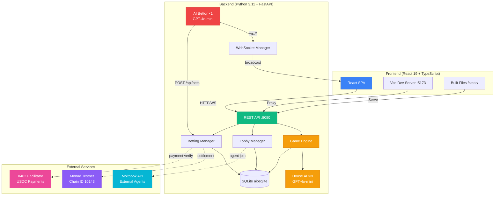
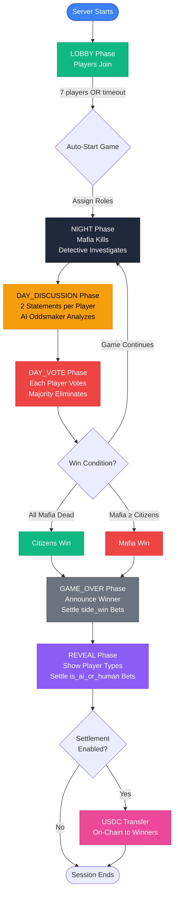
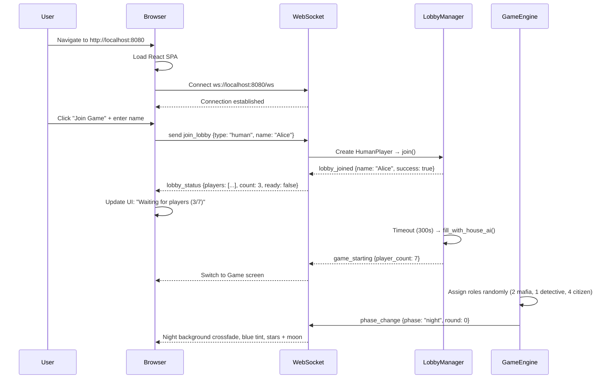
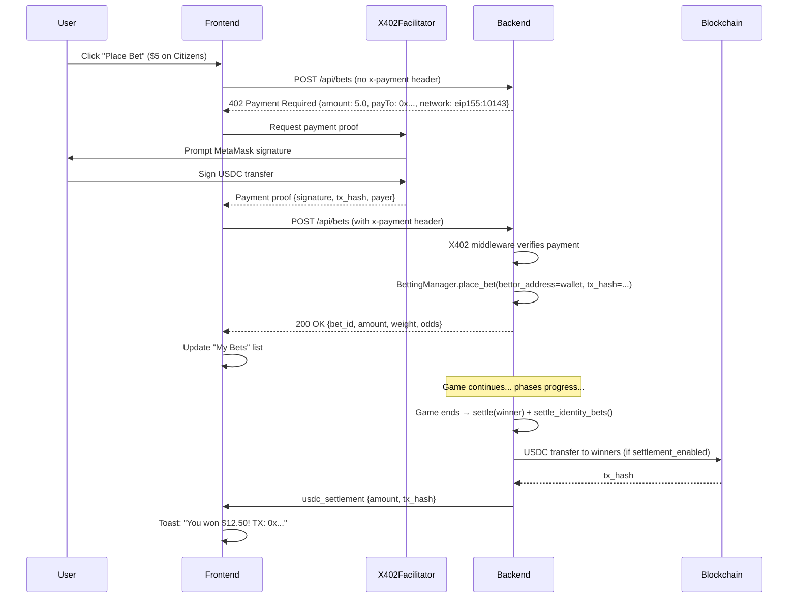
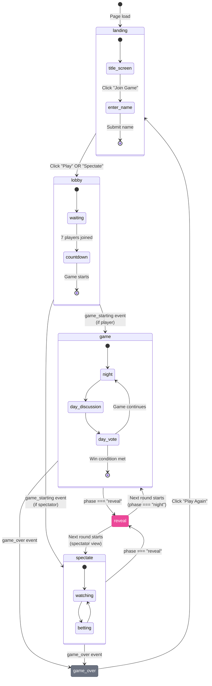

# MafiaAI User Flow Documentation

**English** | [한국어](USERFLOW.ko.md)

Comprehensive guide to user interactions, system architecture, and actor-specific flows for the MafiaAI Mixed-Player Arena.

---

## Running the Game

### Prerequisites

- **Python 3.11+** — Backend runtime
- **Node.js 18+** — Frontend build toolchain
- **OpenAI API Key** — **REQUIRED** for all AI operations ([Get key](https://platform.openai.com/))

The OpenAI API key is the **only required** environment variable. All other features (blockchain, X402 USDC betting, Moltbook external agents, AI Bettor) are **optional** and disabled by default.

### Setup

```bash
# Clone repository
git clone https://github.com/0xarkstar/mafi-AI.git
cd mafi-AI

# Create virtual environment
python3.11 -m venv .venv
source .venv/bin/activate

# Install dependencies (includes pytest, FastAPI, OpenAI SDK, etc.)
pip install -e ".[dev]"

# Build frontend (React 19 + Vite)
cd frontend
npm install
npm run build   # outputs to ../static/
cd ..

# Configure environment
cp .env.example .env
# Edit .env and add OPENAI_API_KEY=sk-proj-...
```

### Run Modes

#### 1. **Web Mode** (Production)

Serves the built React SPA at `http://localhost:8080`:

```bash
python -m src.main
```

Features:
- Full React UI with WebSocket live updates
- Lobby system for human players
- Spectator screen with betting terminal
- Auto-starts game after lobby timeout (default 300s) with House AI filling empty slots
- All optional features available (blockchain, X402, Moltbook, AI Bettor)

#### 2. **CLI Mode** (Terminal Only)

Headless game with text output, no web UI:

```bash
python -m src.main --no-api
```

Features:
- Logs game events to console via structlog
- Useful for testing AI agent behavior
- No betting, no human players, no spectators
- Faster for development iteration

#### 3. **Development Mode** (Hot Reload)

Dual-server setup with Vite HMR:

```bash
# Terminal 1: Backend
python -m src.main

# Terminal 2: Frontend dev server
cd frontend && npm run dev
```

- Backend runs at `:8080` (API + WebSocket)
- Vite dev server at `:5173` (proxies to `:8080`)
- Hot module replacement for instant React updates
- WebSocket connections proxied correctly via Vite config

---

## System Architecture Diagram



**Module Responsibility Map:**

| Module | Purpose | Key Files |
|--------|---------|-----------|
| **src/config/** | Settings, enums, constants | `settings.py` (Pydantic BaseSettings), `constants.py` (Role, Phase, PlayerType, BetType) |
| **src/models/** | Pydantic frozen models | `game.py`, `agent.py`, `betting.py`, `events.py` — all `frozen=True` |
| **src/engine/** | Game state machine | `game_engine.py`, `phase_handlers.py`, `role_assigner.py`, `win_checker.py` |
| **src/agents/** | AI personalities | `personalities.py` (7), `prompts.py`, `llm_client.py`, `memory.py` |
| **src/players/** | PlayerProtocol implementations | `protocol.py`, `house_ai.py`, `moltbook_agent.py`, `agent_human.py`, `human.py` |
| **src/lobby/** | Lobby management | `manager.py` (LobbyManager) |
| **src/moltbook/** | External agent integration | `client.py` (DM API), `auth.py` (Identity JWT verification) |
| **src/betting/** | Pari-mutuel betting | `pool.py`, `odds.py`, `manager.py`, `oddsmaker.py`, `settlement.py` |
| **src/blockchain/** | Web3 integration | `provider.py` (AsyncWeb3 + POA), `contract.py` (oracle operations) |
| **src/x402/** | USDC payment protocol | `middleware.py` (402 Payment Required), `models.py` (frozen) |
| **src/ai_bettor/** | Autonomous betting | `client.py` (WebSocket orchestrator), `analyzer.py` (LLM), `strategy.py`, `models.py` |
| **src/api/** | FastAPI server | `server.py`, `routes.py`, `ws_manager.py` |
| **src/storage/** | Database layer | `database.py` (aiosqlite), `repositories/` |
| **src/utils/** | Utilities | `logger.py` (structlog), `retry.py`, `errors.py` |
| **frontend/src/components/** | React UI components | `layout/`, `lobby/`, `game/`, `betting/`, `wallet/`, `screens/`, `ui/` (37 .tsx files) |
| **frontend/src/stores/** | Zustand state management | `gameStore.ts`, `chatStore.ts`, `bettingStore.ts`, `walletStore.ts` |
| **frontend/src/hooks/** | React hooks | `useWebSocket.ts`, `useGameState.ts`, `useWallet.ts`, etc. |

---

## Game Lifecycle Flowchart



### Phase Details

#### **LOBBY** Phase
- Players join via WebSocket (`join_lobby`) or REST API (`/api/lobby/join-agent`)
- Auto-fill remaining slots with House AI (distinct personalities)
- Timeout: `LOBBY_TIMEOUT_SECONDS` (default 300s) → auto-start with available players
- Once 7 players joined: game starts immediately
- Role assignment: 2 Mafia, 1 Detective, 4 Citizens (random)

#### **NIGHT** Phase
- **Mafia**: Choose victim to eliminate (via `night_action`)
- **Detective**: Choose player to investigate, learn their role
- **Citizens**: Sleep (no action)
- All actions are simultaneous, resolved at end of night
- Broadcast `elimination` event with victim's name + role

#### **DAY_DISCUSSION** Phase
- Each player makes **2 statements** (200 character limit)
- House AI generates dialogue via GPT-4o-mini with personality context
- Humans/agents receive `action_request` with 60-second timeout
- Statements broadcast as `agent_message` events
- AI Oddsmaker analyzes statements → updates odds via `odds_update`

#### **DAY_VOTE** Phase
- Each player votes to eliminate one player (cannot vote self)
- House AI decides via GPT-4o-mini (considers memory + suspicions)
- Humans/agents select from candidates, 60-second timeout
- Majority vote eliminates player
- Tie-breaking: random selection among tied players
- Broadcast `vote_cast` + `elimination` events

#### **GAME_OVER** Phase
- Announce winner (`game_over` event with payouts)
- Settle `side_win`, `next_elimination`, `is_mafia` bets
- Transition to REVEAL phase

#### **REVEAL** Phase
- Reveals player types (HOUSE_AI, MOLTBOOK_AGENT, AGENT_HUMAN, HUMAN)
- Settles `is_ai_or_human` bets
- Broadcast `identity_reveal` events
- USDC on-chain settlement if `settlement_enabled=true`

---

## Player Interaction Flow

### How Humans Join and Play



### Human Player Actions by Phase

| Phase | UI | Player Action | Timeout (60s fallback) |
|-------|------|-------------|--------------|
| **NIGHT** | Night background, blue tint `#0a0e1f/60%`, NightOverlay (stars + moon via Canvas) | Mafia: choose kill target. Detective: choose investigation target. Citizen: no action. | Random target |
| **DAY_DISCUSSION** | Day background, amber tint `#0a0a05/50%` | 2 statements (textarea, 200 char limit) | "I have nothing to say." |
| **DAY_VOTE** | Red tint `#1a0505/70%`, "Voting Time" overlay | Select candidate from dropdown | Random candidate |
| **REVEAL** | Purple tint `#4c1d95/60%`, 3D card flip animation | Watch player types revealed (AI/Human) | — |
| **GAME_OVER** | Winner color + confetti (300 particles, 3s) | View results, click "Play Again" | — |

**Interaction Protocol:**

```
Server → WebSocket: action_request {prompt, actionType, options, timeout: 60}
    ↓
Frontend: Show ActionPanel (textarea / dropdown / button grid + ProgressRing timer)
    ↓
User submits → WebSocket: action_response {type, player_name, response}
    ↓
Server: HumanPlayer._response_future.set_result(response) → GameEngine processes
```

### ActionPanel UI

**Desktop:** Glassmorphic card at bottom center. Input varies by action type. ProgressRing countdown timer. Submit button disabled until input provided.

**Mobile:** Same layout, full-screen modal on small devices (`<sm`).

---

## Spectator Flow

Spectators watch games in real-time and place bets without participating in gameplay.

### Joining as Spectator

1. Navigate to landing screen
2. Click "Spectate" (instead of "Join Game")
3. WebSocket connects, but no `join_lobby` sent
4. Receives all game events as broadcast (phase_change, agent_message, vote_cast, elimination, etc.)
5. Can place bets via betting terminal

### Spectator Screen Layout

- **Player Grid** (3×3) — Live player cards showing status
- **Game Log** (15 messages) — Recent events scrollable
- **Betting Terminal** — Bet type tabs, quick amounts, payout calculator
- **Spectator Chat** — Floating panel for spectator-only messages

---

## Betting Flow

### 4 Bet Types

| Bet Type | Target | Timing | Settlement |
|----------|--------|--------|------------|
| **side_win** | `"citizens"` or `"mafia"` | Anytime before GAME_OVER | Winner announced |
| **next_elimination** | Player name (alive) | Before DAY_VOTE ends | Next elimination revealed |
| **is_mafia** | Player name (alive) | Before player dies | Player's role revealed |
| **is_ai_or_human** | `"PlayerName:ai"` or `"PlayerName:human"` | Before REVEAL phase | REVEAL phase |

### Pari-Mutuel Payout Logic

1. **Pool Creation**: All bets for a bet_type go into a shared pool
2. **House Edge**: Server takes 5% of total pool
3. **Winning Pool**: 95% distributed to winners
4. **Early Bet Bonus**:
   - Round 0 (lobby/night 1): 1.5× weight
   - Round 1 (first day): 1.2× weight
   - Round 2+: 1.0× weight
5. **Payout Formula**:
   ```python
   prize_pool = total_pool * 0.95          # 5% house edge
   weighted_amount = bet.amount * bet.weight
   payout = (weighted_amount / total_weighted) * prize_pool
   ```

### X402 Payment Protocol (Optional)

When X402 is enabled, all bets require USDC payment:



### AI Oddsmaker

GPT-4o-mini analyzes game state every phase transition:

**Input:** Current phase, round, alive/dead agents, recent statements, vote history

**Output:**
```json
{
  "mafia_prob": 0.35,
  "citizen_prob": 0.65,
  "suspects": [
    {"name": "Viktor", "suspicion": 0.8, "reasoning": "Aggressive deflection"},
    {"name": "Luna", "suspicion": 0.3, "reasoning": "Consistent behavior"}
  ]
}
```

Odds are blended: 70% AI analysis + 30% market-implied odds from actual bet distribution.

Broadcast via `odds_update` WebSocket event → updates betting UI for all connected clients.

---

## WebSocket Event Map

### Server → Client Events (15 events)

| Event | Data Fields | Trigger | UI Effect |
|-------|-------------|---------|-----------|
| **phase_change** | `phase`, `round` | Phase transitions | Background crossfade, tint overlay update, auto-transition to game screen if missed game_starting |
| **agent_message** | `agent`, `message` | Player speaks | Chat bubble on player card (5s auto-dismiss), chat panel message, auto-transition to game screen if missed game_starting |
| **vote_cast** | `voter`, `target` | Player votes | Vote overlay on target card, badge count increment, vote count tracking |
| **elimination** | `agent` (or `eliminated`), `role`, `reason` | Player eliminated | Skull overlay on player card, chat message with role reveal |
| **game_over** | `winner`, `rounds`, `alive_agents`, `payouts` | Game ends | Transition to reveal screen first, then confetti + winner announcement |
| **odds_update** | `mafia_win_prob`, `citizen_win_prob`, `mafia_suspects` | Oddsmaker analysis | Betting panel odds display update |
| **lobby_joined** | `name`, `success` | Player joins lobby | "You joined as {name}" system message |
| **lobby_status** | `players`, `count`, `ready` | Lobby state change | Player slots update, counter "3/7" |
| **game_starting** | `players` (array with name, player_type) | Game starts | Countdown modal → transition to game screen, init players |
| **action_request** | `prompt`, `action_type`, `options`, `timeout` | Player's turn | ActionPanel (textarea/dropdown/buttons) + timer (skipped for spectators) |
| **identity_reveal** | `player_name` (or `name`), `player_type`, `all_revealed` | REVEAL phase | Player card badge update (AI/Human icon), transition to game_over if all_revealed |
| **bet_placed** | `bet` (object) | Bet confirmed | Add to "My Bets" list |
| **bet_confirmed** | `bet_id` | Bet won | Green checkmark, payout shown |
| **bet_rejected** | `bet_id` | Bet lost | Red X, loss shown |
| **usdc_settlement** | `transfers` (array of address, amount, tx_hash) | USDC payouts | Toast with Monad explorer link |
| **pong** | — | Keepalive response | (No UI effect) |

### Client → Server Events (3 events)

| Event | Data Fields | Trigger | Purpose |
|-------|-------------|---------|---------|
| **join_lobby** | `type` ("human" \| "agent_human"), `name` | Click "Join Game" | Register as player |
| **action_response** | `type` ("statement" \| "vote" \| "night_action"), `player_name`, `response` | Submit ActionPanel | Send player decision |
| **ping** | — | 30-second interval | Keep WebSocket alive |

---

## Screen State Machine



### Screen Routing Logic

| Screen | Condition | Components Rendered |
|--------|-----------|---------------------|
| **landing** | `gameStore.screen === 'landing'` | `LandingScreen` (shattered mask effect, "Play" / "Spectate" buttons) |
| **lobby** | `gameStore.screen === 'lobby'` | `LobbyScreen` (player slots, countdown, "Join Game" form) |
| **game** | `gameStore.screen === 'game' && gameStore.isPlayer` | `GameLayout` (Header, Background, GameBoard, ChatPanel, BettingPanel, ActionPanel) |
| **spectate** | `gameStore.screen === 'game' && !gameStore.isPlayer` | `SpectatorScreen` (player grid, game log, betting terminal, spectator chat) |
| **reveal** | `gameStore.phase === 'reveal'` | `RevealScreen` (3D card flip animations showing AI/Human labels) |
| **game_over** | `gameStore.screen === 'game_over'` | `GameOverScreen` (winner announcement, confetti, final bets, "Play Again") |

---

## UI Component Tree

```mermaid
graph TB
    App[App.tsx]

    App --> Landing[LandingScreen]
    App --> Lobby[LobbyScreen]
    App --> GameLayout
    App --> Spectate[SpectatorScreen]
    App --> Reveal[RevealScreen]
    App --> GameOver[GameOverScreen]

    Landing --> LandingBG[Shattered Mask Effect]
    Landing --> PlayBtn[Play / Spectate Buttons]

    Lobby --> LobbySlots[PlayerSlot × 7]
    Lobby --> JoinForm[JoinForm]
    Lobby --> Countdown[CountdownModal]

    GameLayout --> Header
    GameLayout --> Background[Background<br/>day/night images]
    GameLayout --> PhaseTint[PhaseTintOverlay<br/>blue/amber/red]
    GameLayout --> NightOverlay[NightOverlay<br/>stars + moon]
    GameLayout --> GameBoard
    GameLayout --> ChatPanel
    GameLayout --> BettingPanel
    GameLayout --> BettingStatusBar
    GameLayout --> EmoteMenu
    GameLayout --> MobileTab[MobileTabBar]

    GameBoard --> PlayerCard[PlayerCard × 7]

    PlayerCard --> Portrait[Portrait Image<br/>AVATAR_IMAGES array]
    PlayerCard --> ChatBubble[Chat Bubble Overlay<br/>inside card, gold border]
    PlayerCard --> EmoteOverlay[Emote Overlay<br/>spring animation]
    PlayerCard --> VoteOverlay[Vote Overlay<br/>count badge]
    PlayerCard --> RoleBadge[Role Badge<br/>Sword/Eye/Shield]
    PlayerCard --> DeadSkull[Dead Skull Overlay]

    ChatPanel --> Messages[ChatMessage × N]

    BettingPanel --> BetTabs[Bet Type Tabs × 4]
    BettingPanel --> BetSlip[BetSlip]
    BettingPanel --> MyBets[My Bets List]

    Spectate --> SpectGrid[Player Grid 3×3]
    Spectate --> GameLog[Game Log 15 msgs]
    Spectate --> BetTerminal[Betting Terminal]
    Spectate --> SpecChat[Spectator Chat<br/>floating panel]

    BetTerminal --> QuickAmounts[Quick Amount Buttons]
    BetTerminal --> PayoutCalc[Payout Calculator]

    Reveal --> CardFlip[3D Card Flip Animation × 7]

    GameOver --> WinnerMsg[Winner Announcement]
    GameOver --> Confetti[Canvas Confetti]
    GameOver --> FinalBets[Final Bet Results]

    style App fill:#3b82f6,stroke:#1e40af,color:#fff
    style GameLayout fill:#10b981,stroke:#059669,color:#fff
    style PlayerCard fill:#f59e0b,stroke:#d97706,color:#000
    style Portrait fill:#ec4899,stroke:#db2777,color:#fff
    style ChatBubble fill:#fbbf24,stroke:#f59e0b,color:#000
    style BettingPanel fill:#8b5cf6,stroke:#7c3aed,color:#fff
    style Spectate fill:#06b6d4,stroke:#0891b2,color:#fff
```



---

## State Management (4 Zustand Stores)

### 1. gameStore

```typescript
interface GameStore {
  // Core game state
  phase: Phase
  round: number
  players: Record<string, Player>
  votes: Vote[]
  winner: string | null  // "citizens" | "mafia"

  // Player identity
  isPlayer: boolean
  myPlayerName: string | null

  // Lobby state
  lobbyPlayers: string[]
  lobbyCount: number
  lobbyReady: boolean

  // Action requests
  actionRequest: ActionRequest | null

  // Screen routing
  screen: 'landing' | 'lobby' | 'game' | 'game_over'

  // User preferences
  nickname: string
  avatarIndex: number
  isSpectator: boolean

  // Visual effects
  activeEmotes: Record<string, { emoji: string; timeout: ReturnType<typeof setTimeout> }>
  chatBubbles: Record<string, string>
  voteCounts: Record<string, number>       // target → count
  showVoteUI: boolean
  selectedVoteTarget: string | null

  // WebSocket sender
  wsSend: (data: Record<string, unknown>) => void
}
```

### 2. chatStore

```typescript
interface ChatStore {
  messages: ChatMessage[]
  addMessage: (message: ChatMessage) => void
  addSystemMessage: (text: string, type?: 'system' | 'elimination' | 'game-over') => void
  clearMessages: () => void
}

interface ChatMessage {
  id: string
  agent: string
  message: string
  timestamp: number
  type: 'agent' | 'system' | 'elimination' | 'game-over'
}
```

### 3. bettingStore

```typescript
interface BettingStore {
  odds: OddsBoard | null
  bets: Bet[]
  balance: number  // USDC balance

  setOdds: (odds: OddsBoard) => void
  addBet: (bet: Bet) => void
  updateBetStatus: (betId: string, status: BetStatus) => void
  setBalance: (balance: number) => void
}
```

### 4. walletStore

```typescript
interface WalletStore {
  connected: boolean
  address: string | null
  balance: string | null  // USDC balance
  txStatus: 'idle' | 'pending' | 'success' | 'error'

  connect: () => Promise<void>
  disconnect: () => void
  placeBet: (betData: BetData) => Promise<string>
  claimWinnings: (gameId: string) => Promise<string>
}
```

---

## Phase Visual Transitions

| Phase | Background | Tint Overlay | Special Effects |
|-------|-----------|-------------|----------------|
| **lobby** | — | — | — |
| **night** | `game-bg-night.png` (crossfade 2s) | Blue `#0a0e1f/60%` | NightOverlay (animated stars + moon via Canvas) |
| **day_discussion** | `game-bg.png` (crossfade 2s) | Amber `#0a0a05/50%` | — |
| **day_vote** | `game-bg.png` | Red `#1a0505/70%` | "Voting Time" ballot overlay |
| **reveal** | `game-bg.png` | Purple `#4c1d95/60%` | 3D card flip animation (showing AI/Human) |
| **game_over** | `game-bg.png` | Emerald `#064e3b/60%` (citizens) or Red `#7f1d1d/60%` (mafia) | Canvas confetti (300 particles, 3s) |

### Background Crossfade

```typescript
const backgroundVariants = {
  day: {
    backgroundImage: 'url(/game-bg.png)',
    transition: { duration: 2, ease: 'easeInOut' }
  },
  night: {
    backgroundImage: 'url(/game-bg-night.png)',
    transition: { duration: 2, ease: 'easeInOut' }
  }
}

<motion.div variants={backgroundVariants} animate={phase === 'night' ? 'night' : 'day'} />
```

---

## Desktop & Mobile Layouts

### Desktop (lg+)

```
┌──────────────────────────────────────────────────────────────────┐
│ [Header: Logo | Phase Badge | Round | Timer]                     │
├────────────────┬─────────────────────┬───────────────────────────┤
│ PLAYERS        │ GAME BOARD          │ BETTING                   │
│ (280px fixed)  │ (flex-1)            │ (320px fixed)             │
│                │                     │                           │
│ [PlayerCard]   │ ┌─────────────────┐ │ [Bet Type Tabs]           │
│ [PlayerCard]   │ │ PlayerCard × 7  │ │ [Target Dropdown]         │
│ [PlayerCard]   │ │ (portrait imgs) │ │ [Quick Amounts]           │
│ [PlayerCard]   │ │ Chat bubbles    │ │ [Payout Calc]             │
│ [PlayerCard]   │ │ Emote overlays  │ │ [Place Bet Button]        │
│ [PlayerCard]   │ │ Vote badges     │ │ [My Bets List]            │
│ [PlayerCard]   │ └─────────────────┘ │                           │
│                │                     │ [ODDS BAR]                │
│ [CHAT PANEL]   │                     │ Citizens 65% | Mafia 35%  │
└────────────────┴─────────────────────┴───────────────────────────┘
│ [BettingStatusBar — bottom center, 80% width]                    │
│ Current Bets: 3 | Total Wagered: $12 | Est. Payout: $18.50      │
└──────────────────────────────────────────────────────────────────┘
```

### Mobile (<lg)

```
┌──────────────────────────┐
│ [Header]                 │
├──────────────────────────┤
│                          │
│ [PlayerCard Grid 2×4]    │
│ - Portrait images        │
│ - Chat bubbles inside    │
│ - Emote overlays         │
│ - Vote badges            │
│                          │
├──────────────────────────┤
│ [Bottom Tab Bar]         │
│ [Game] [Chat] [Bet]      │
└──────────────────────────┘

Tab 1: Game — PlayerCard grid + ActionPanel
Tab 2: Chat — Full-screen chat messages
Tab 3: Bet  — Betting terminal + odds + My Bets
```

MobileTabBar: Fixed bottom, 3 tabs (Users, MessageCircle, DollarSign icons), visible only on `<lg` breakpoint.

---

## Optional Features Configuration

All features below are **disabled by default**. Enable them via `.env`.

### X402 USDC Betting

```bash
X402_ENABLED=true
X402_FACILITATOR_URL=https://x402-facilitator.molandak.org
X402_NETWORK=eip155:10143
X402_USDC_ADDRESS=0x534b2f3A21130d7a60830c2Df862319e593943A3
X402_PAY_TO=0x...your-server-wallet
```

Requires: USDC on Monad testnet, X402 facilitator service, MetaMask (for humans).

### Blockchain On-Chain Settlement

```bash
SETTLEMENT_ENABLED=true
SETTLEMENT_PRIVATE_KEY=0x...server-wallet-key
BLOCKCHAIN_RPC_URL=https://testnet-rpc.monad.xyz
BLOCKCHAIN_CHAIN_ID=10143
```

Requires: MON tokens from [Monad Faucet](https://faucet.monad.xyz), server wallet funded with USDC.

### Moltbook External Agents

```bash
MOLTBOOK_API_URL=https://api.moltbook.io
MOLTBOOK_APP_KEY=moltdev_xxx
MOLTBOOK_AUDIENCE=mafia-ai.example.com
LOBBY_TIMEOUT_SECONDS=300
```

Requires: Moltbook developer app key, registered agents.

### AI Bettor (Autonomous Betting)

```bash
AI_BETTOR_ENABLED=true
AI_BETTOR_BUDGET_USDC=50.0
AI_BETTOR_PRIVATE_KEY=0x...optional
```

Behavior: Watches via WebSocket, analyzes with GPT-4o-mini, bets when confidence ≥ 0.6, during `day_discussion`/`day_vote` only, 30s cooldown.

---

## Troubleshooting

| Issue | Cause | Fix |
|-------|-------|-----|
| **OpenAI API errors** | Invalid key, rate limit | Check `.env` OPENAI_API_KEY, verify quota |
| **WebSocket disconnects** | Network instability | Auto-reconnect with exponential backoff (built-in) |
| **Frontend not loading** | Build not run | `cd frontend && npm run build` |
| **Players stuck in lobby** | Not enough players, timeout not reached | Wait for timeout or add more players |
| **402 on /api/bets** | X402 not enabled or no payment header | Set `X402_ENABLED=true` in `.env` |
| **X402 payment errors** | MetaMask not connected, no USDC | Connect wallet, get USDC from faucet |
| **Database locked** | Concurrent writes | Remove `data/mafia-ai.db`, restart |
| **Blockchain tx fails** | Insufficient MON | Get MON from faucet, verify Chain ID 10143 |
| **AI Bettor not betting** | Confidence < 0.6, wrong phase, cooldown | Check logs for confidence scores |
| **Moltbook agent join fails** | Invalid JWT, wrong app key | Verify `MOLTBOOK_APP_KEY` and agent registration |
| **Auto-transition not working** | Client missed game_starting/agent_message | Implemented fallback in useWebSocket.ts (checks screen state on phase_change/agent_message) |

---

## Performance

- **AsyncIO**: All I/O is async (OpenAI API, SQLite, WebSocket)
- **Lazy evaluation**: Odds calculated only on phase transitions
- **Individual selectors**: Zustand selectors prevent unnecessary re-renders
- **Canvas rendering**: NightOverlay uses Canvas API (not DOM)
- **GPT-4o-mini**: ~$0.05 per game (~100 API calls)
- **SQLite**: Zero database hosting costs

---

## Security

- **Rate limiting**: 10 req/min per IP (betting endpoints)
- **Input validation**: Pydantic models enforce types
- **SQL injection**: Parameterized queries only
- **Private keys**: Environment variables only (never committed)
- **X402 verification**: Cryptographic signature validation
- **XSS prevention**: React auto-escapes, no `dangerouslySetInnerHTML`
- **Moltbook Identity**: JWT verification via server-side API call

---

## References

- **OpenAI API**: https://platform.openai.com/docs
- **Monad Docs**: https://docs.monad.xyz/
- **X402 Protocol**: https://x402.org/
- **Moltbook API**: https://moltbook.io/docs
- **FastAPI**: https://fastapi.tiangolo.com/
- **React 19**: https://react.dev/
- **Zustand**: https://docs.pmnd.rs/zustand/
- **Framer Motion**: https://www.framer.com/motion/
- **Tailwind CSS v4**: https://tailwindcss.com/
- **Pydantic v2**: https://docs.pydantic.dev/
