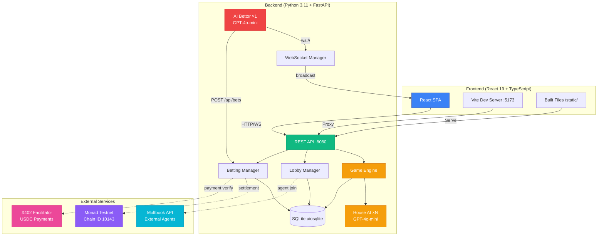
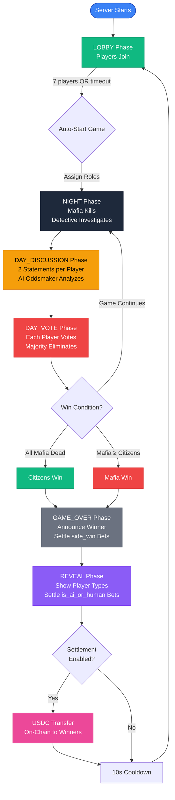
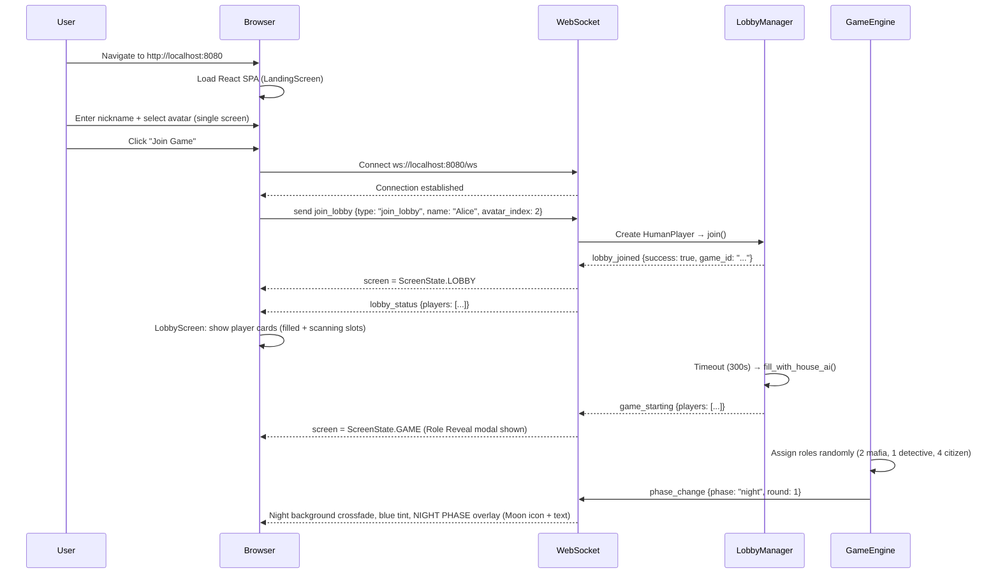
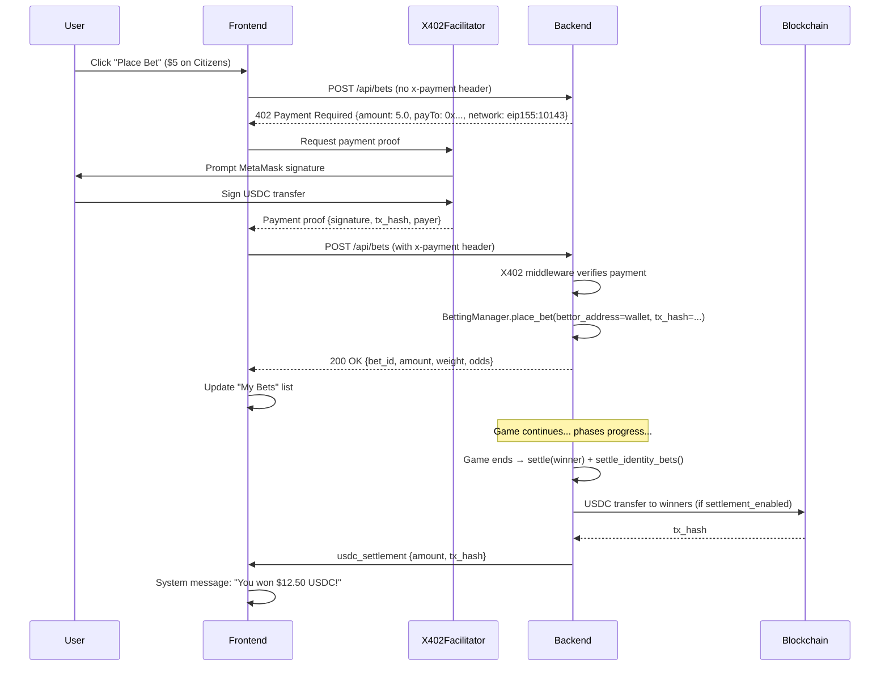
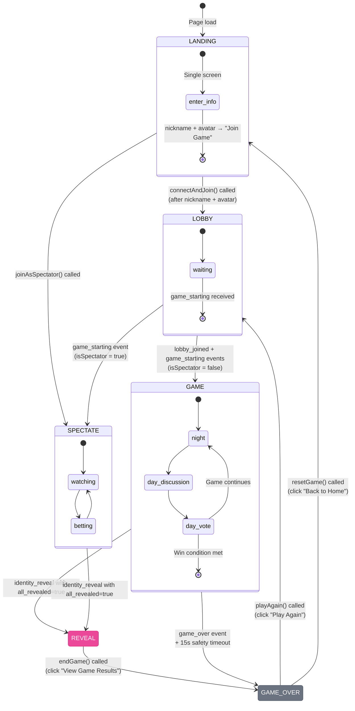

# MafiaAI User Flow Documentation

**English** | [한국어](USERFLOW.ko.md)

Comprehensive guide to user interactions, system architecture, and actor-specific flows for the MafiaAI Mixed-Player Arena.

---

## Running the Game

### Prerequisites

- **Python 3.11+** — Backend runtime
- **Node.js 18+** — Frontend build toolchain
- **OpenAI API Key** — **REQUIRED** for all AI operations ([Get key](https://platform.openai.com/))

The OpenAI API key is the **only required** environment variable. All other features (blockchain, X402 USDC betting, Moltbook external agents, AI Bettor) are **optional** and disabled by default.

### Setup

```bash
# Clone repository
git clone https://github.com/0xarkstar/mafi-AI.git
cd mafi-AI

# Create virtual environment
python3.11 -m venv .venv
source .venv/bin/activate

# Install dependencies (includes pytest, FastAPI, OpenAI SDK, etc.)
pip install -e ".[dev]"

# Build frontend (React 19 + Vite)
cd frontend
npm install
npm run build   # outputs to ../static/
cd ..

# Configure environment
cp .env.example .env
# Edit .env and add OPENAI_API_KEY=sk-proj-...
```

### Run Modes

#### 1. **Web Mode** (Production)

Serves the built React SPA at `http://localhost:8080`:

```bash
python -m src.main
```

Features:
- Full React UI with WebSocket live updates
- Lobby system for human players
- Spectator screen with betting terminal
- Auto-starts game after lobby timeout (default 300s) with House AI filling empty slots
- All optional features available (blockchain, X402, Moltbook, AI Bettor)

#### 2. **CLI Mode** (Terminal Only)

Headless game with text output, no web UI:

```bash
python -m src.main --no-api
```

Features:
- Logs game events to console via structlog
- Useful for testing AI agent behavior
- No betting, no human players, no spectators
- Faster for development iteration

#### 3. **Development Mode** (Hot Reload)

Dual-server setup with Vite HMR:

```bash
# Terminal 1: Backend
python -m src.main

# Terminal 2: Frontend dev server
cd frontend && npm run dev
```

- Backend runs at `:8080` (API + WebSocket)
- Vite dev server at `:5173` (proxies to `:8080`)
- Hot module replacement for instant React updates
- WebSocket connections proxied correctly via Vite config

---

## System Architecture Diagram



**Module Responsibility Map:**

| Module | Purpose | Key Files |
|--------|---------|-----------|
| **src/config/** | Settings, enums, constants | `settings.py` (Pydantic BaseSettings), `constants.py` (Role, Phase, PlayerType, BetType) |
| **src/models/** | Pydantic frozen models | `game.py`, `agent.py`, `betting.py`, `events.py` — all `frozen=True` |
| **src/engine/** | Game state machine | `game_engine.py`, `phase_handlers.py`, `role_assigner.py`, `win_checker.py` |
| **src/agents/** | AI personalities | `personalities.py` (7), `prompts.py`, `llm_client.py`, `memory.py` |
| **src/players/** | PlayerProtocol implementations | `protocol.py`, `house_ai.py`, `moltbook_agent.py`, `agent_human.py`, `human.py` |
| **src/lobby/** | Lobby management | `manager.py` (LobbyManager) |
| **src/moltbook/** | External agent integration | `client.py` (DM API), `auth.py` (Identity JWT verification) |
| **src/betting/** | Pari-mutuel betting | `pool.py`, `odds.py`, `manager.py`, `oddsmaker.py`, `settlement.py` |
| **src/blockchain/** | Web3 integration | `provider.py` (AsyncWeb3 + POA), `gateway.py` (V2 commit-reveal, lock, settle) |
| **src/x402/** | USDC payment protocol | `middleware.py` (402 Payment Required), `models.py` (frozen) |
| **src/ai_bettor/** | Autonomous betting | `client.py` (WebSocket orchestrator), `analyzer.py` (LLM), `strategy.py`, `models.py` |
| **src/api/** | FastAPI server | `server.py`, `routes.py`, `ws_manager.py` |
| **src/storage/** | Database layer | `database.py` (aiosqlite), `repositories/` |
| **src/utils/** | Utilities | `logger.py` (structlog), `retry.py`, `errors.py` |
| **frontend/src/screens/** | Screen-level React components | `LandingScreen.tsx`, `LobbyScreen.tsx`, `GameScreen.tsx`, `SpectatorScreen.tsx`, `RevealScreen.tsx`, `GameOverScreen.tsx` |
| **frontend/src/components/** | Shared UI components | `GameComponents.tsx` (PlayerCard, GamePlayerCard, BettingStatusBar, EmoteMenu, ChatBoard), `UIComponents.tsx` (GlassCard, Button, Input) |
| **frontend/src/store.ts** | Unified Zustand state | Single `useGameStore` managing all game, chat, betting, wallet, and WebSocket state |
| **frontend/src/websocket.ts** | WebSocket client | Auto-reconnect with exponential backoff, 25s ping keepalive |
| **frontend/src/types.ts** | TypeScript enums & interfaces | `ScreenState`, `GamePhase`, `Role`, `Player`, `Message`, `Bet`, `BetType` |
| **frontend/src/mappers.ts** | Backend ↔ frontend mapping | `mapPhase`, `mapRole`, `mapWinner`, `buildPlayerFromName` |
| **frontend/src/constants.ts** | Static data | `AGENTS_DATA` (7 agents), `PHASE_GRADIENTS` |

---

## Game Lifecycle Flowchart



### Phase Details

#### **LOBBY** Phase
- Players join via WebSocket (`join_lobby`) or REST API (`/api/lobby/join-agent`)
- Auto-fill remaining slots with House AI (distinct personalities)
- Timeout: `LOBBY_TIMEOUT_SECONDS` (default 300s) → auto-start with available players
- Once 7 players joined: game starts immediately
- Role assignment: 2 Mafia, 1 Detective, 4 Citizens (random)

#### **NIGHT** Phase
- **Mafia**: Choose victim to eliminate (via `night_action`)
- **Detective**: Choose player to investigate, learn their role
- **Citizens**: Sleep (no action)
- All actions are simultaneous, resolved at end of night
- Broadcast `elimination` event with victim's name + role

#### **DAY_DISCUSSION** Phase
- Each player makes **2 statements** (200 character limit)
- House AI generates dialogue via GPT-4o-mini with personality context
- Humans/agents receive `action_request` with 60-second timeout
- Statements broadcast as `agent_message` events
- AI Oddsmaker analyzes statements → updates odds via `odds_update`

#### **DAY_VOTE** Phase
- Each player votes to eliminate one player (cannot vote self)
- House AI decides via GPT-4o-mini (considers memory + suspicions)
- Humans/agents select from candidates, 60-second timeout
- Majority vote eliminates player
- Tie-breaking: random selection among tied players
- Broadcast `vote_cast` + `elimination` events

#### **GAME_OVER** Phase
- Announce winner (`game_over` event with payouts)
- Settle `side_win`, `next_elimination`, `is_mafia` bets
- Transition to REVEAL phase

#### **REVEAL** Phase
- Reveals player types (HOUSE_AI, MOLTBOOK_AGENT, AGENT_HUMAN, HUMAN)
- Settles `is_ai_or_human` bets
- Broadcast `identity_reveal` events
- USDC on-chain settlement if `settlement_enabled=true`

---

## Player Interaction Flow

### How Humans Join and Play



### Human Player Actions by Phase

| Phase | UI | Player Action | Timeout (60s fallback) |
|-------|------|-------------|--------------|
| **NIGHT** | `game-bg-night.png` crossfades in (2s CSS transition), blue tint `#0a0e1f/60%`, fullscreen "NIGHT PHASE" overlay (Moon icon + animated text, auto-dismisses after 3s) | Mafia: click target name in modal. Detective: click target name in modal. Citizen: no action. | Random target |
| **DAY_DISCUSSION** | `game-bg.png` crossfades in (2s CSS transition), amber tint `#0a0a05/50%`. ChatBoard header shows "Your Turn to Speak" | Type statement in ChatBoard → Enter or Send button submits via `action_response` | "I have nothing to say." |
| **DAY_VOTE** | Red tint `#1a0505/70%`. Player cards show red hover overlay + Target icon. Vote count badge appears on card top-right. | Click any alive player card (cursor-pointer, red hover glow) | Random candidate |
| **REVEAL** | Purple radial gradient background. 3D card flip animation (click each card) | Click player cards to reveal AI/Human identity. Click "View Game Results" to proceed | — |
| **GAME_OVER** | Winner-color gradient (red/green) + canvas confetti (150 particles) | View bets placed + player roster. Click "Play Again" (→ LOBBY) or "Back to Home" (→ LANDING) | — |

**Interaction Protocol:**

```
Server → WebSocket: action_request {prompt, action_type, options, timeout: 60}
    ↓
Frontend (GameScreen): Renders based on action_type:
  - "statement" → ChatBoard header = "Your Turn to Speak", sends via submitActionResponse
  - "vote" → Player cards become clickable (showVoteButtons = true)
  - "night_action" → Fullscreen Night Action modal with target buttons
    ↓
User submits → WebSocket: action_response {type: "action_response", player_name, response}
    ↓
Server: HumanPlayer._response_future.set_result(response) → GameEngine processes
```

### Role Reveal Modal

When the game starts, a fullscreen Role Reveal modal appears immediately in `GameScreen`:

- **Mafia** — Red theme, Sword icon, "Eliminate citizens without being caught"
- **Detective** — Blue theme, Eye icon, "Investigate one player each night"
- **Citizen** — Green theme, Shield icon, "Find and vote out the Mafia"

Player taps "Start Game" to dismiss the modal and begin playing.

---

## Spectator Flow

Spectators watch games in real-time and place bets without participating in gameplay.

### Joining as Spectator

1. Navigate to landing screen
2. Click "Spectate Match" (no nickname or avatar needed)
3. `isSpectator = true`, screen transitions to `ScreenState.SPECTATE`
4. WebSocket connects, but no `join_lobby` sent — spectators only receive broadcast events
5. Receives all game events (phase_change, agent_message, vote_cast, elimination, etc.)
6. Can place USDC bets via the right-side Betting Terminal

### Spectator Screen Layout

```
┌─────────────────────────────────────────────────────────────────┐
│ [Header: MAFI-AI | 👁 Spectator | Phase | Round | Timer | $USDC | Exit] │
├─────────────────────────────────────────┬───────────────────────┤
│                                         │                       │
│  Game Board (flex-1)                    │  Betting Terminal     │
│  ┌──────────────────────────────┐       │  (380px fixed)        │
│  │  PlayerCard × 4 (top row)    │       │                       │
│  │  - portrait image             │       │  [Live Odds]          │
│  │  - chat bubble overlay        │       │  Mafia 2.86x          │
│  │  - emote overlay              │       │  Citizens 1.54x       │
│  └──────────────────────────────┘       │                       │
│  ┌──────────────────────────────┐       │  [Place Bet (USDC)]   │
│  │  PlayerCard × 3 (bottom row) │       │  Bet Type dropdown    │
│  └──────────────────────────────┘       │  Target dropdown      │
│                                         │  Amount input         │
│  [BettingStatusBar — bottom center]     │  Quick amounts        │
│                                         │  Payout preview       │
│  [Spectator Chat FAB — bottom-left]     │  PLACE BET button     │
│                                         │                       │
│                                         │  [My Bets list]       │
│                                         │  [Game Log — 15 msgs] │
│                                         │                       │
│                                         │  [X402 Protocol branding] │
└─────────────────────────────────────────┴───────────────────────┘
```

**Spectator Chat**: Floating panel (340×420px) toggled via bottom-left FAB. Shows simulated spectator messages from other viewers. Unread badge on FAB when closed.

---

## Betting Flow

### 4 Bet Types

| Bet Type | Target | Timing | Settlement |
|----------|--------|--------|------------|
| **side_win** | `"citizens"` or `"mafia"` | Anytime before GAME_OVER | Winner announced |
| **next_elimination** | Player name (alive) | Before DAY_VOTE ends | Next elimination revealed |
| **is_mafia** | Player name (alive) | Before player dies | Player's role revealed |
| **is_ai_or_human** | Player name (alive) | Before REVEAL phase | REVEAL phase |

### Pari-Mutuel Payout Logic

1. **Pool Creation**: All bets for a bet_type go into a shared pool
2. **House Edge**: Server takes 5% of total pool
3. **Winning Pool**: 95% distributed to winners
4. **Early Bet Bonus**:
   - Round 0 (lobby/night 1): 1.5× weight
   - Round 1 (first day): 1.2× weight
   - Round 2+: 1.0× weight
5. **Payout Formula**:
   ```python
   prize_pool = total_pool * 0.95          # 5% house edge
   weighted_amount = bet.amount * bet.weight
   payout = (weighted_amount / total_weighted) * prize_pool
   ```

### X402 Payment Protocol (Optional)

When X402 is enabled, all bets require USDC payment:



### AI Oddsmaker

GPT-4o-mini analyzes game state every phase transition:

**Input:** Current phase, round, alive/dead agents, recent statements, vote history

**Output:**
```json
{
  "mafia_prob": 0.35,
  "citizen_prob": 0.65,
  "suspects": [
    {"name": "Viktor", "suspicion": 0.8, "reasoning": "Aggressive deflection"},
    {"name": "Luna", "suspicion": 0.3, "reasoning": "Consistent behavior"}
  ]
}
```

Odds are blended: 70% AI analysis + 30% market-implied odds from actual bet distribution.

Broadcast via `odds_update` WebSocket event → updates `BettingStatusBar` and `SpectatorScreen` betting terminal for all connected clients.

---

## WebSocket Event Map

### Server → Client Events (16 events)

| Event | Data Fields | Trigger | UI Effect |
|-------|-------------|---------|-----------|
| **phase_change** | `phase`, `round`, `alive_agents` | Phase transitions | Background crossfade (2s CSS transition), tint overlay update, update dead players from `alive_agents`, auto-transition to GAME screen if missed game_starting |
| **agent_message** | `agent`, `message` | Player speaks | Chat bubble on player card (5s auto-dismiss), ChatBoard message appended, activeSpeakerId highlights card with gold glow for 3s |
| **vote_cast** | `voter`, `target` | Player votes | System message in ChatBoard |
| **elimination** | `agent` (or `eliminated`), `role`, `reason` | Player eliminated | Skull overlay on player card (grayscale portrait), elimination message in ChatBoard with red skull banner |
| **game_over** | `winner`, `rounds`, `alive_agents`, `payouts` | Game ends | Sets `winner` in store. After 15s timeout transitions to GAME_OVER if not already on REVEAL screen |
| **odds_update** | `mafia_win_prob`, `citizen_win_prob`, `mafia_suspects` | Oddsmaker analysis | BettingStatusBar animated bar, SpectatorScreen odds display |
| **lobby_joined** | `success`, `game_id` | Player joins lobby | screen → ScreenState.LOBBY, connectionStatus → 'connected' |
| **lobby_status** | `players` (array of names) | Lobby state change | Player slots update with portrait cards or scanning placeholders |
| **game_starting** | `players` (array with name, player_type) | Game starts | screen → ScreenState.GAME (or SPECTATE), Role Reveal modal shown |
| **action_request** | `prompt`, `action_type`, `options`, `timeout`, `context` | Player's turn | `currentAction` set in store; ChatBoard = "Your Turn to Speak" for statements; player cards clickable for votes; Night Action modal for night_action |
| **identity_reveal** | `player_name` (or `name`), `role`, `player_type`, `all_revealed` | REVEAL phase | Player `isAi` field updated; if `all_revealed`, screen → ScreenState.REVEAL |
| **bet_confirmed** | `bet_id`, `amount_usdc`, `target` | Bet confirmed | USDC bet status → 'pending', system message in ChatBoard |
| **bet_rejected** | `reason` | Bet rejected | System error message in ChatBoard |
| **usdc_settlement** | `bet_id`, `won`, `payout` | USDC payouts | Bet status → 'won'/'lost', usdcBalance updated, system message |
| **new_lobby** | `message` | New game lobby opens (after 10s cooldown) | System message: "A new game lobby is open!" |
| **error** | `message` | Server error | Error system message in ChatBoard |

### Client → Server Events (5 events)

| Event | Data Fields | Trigger | Purpose |
|-------|-------------|---------|---------|
| **join_lobby** | `type: "join_lobby"`, `name`, `avatar_index` | "Join Game" clicked | Register as player |
| **action_response** | `type: "action_response"`, `player_name`, `response` | Statement typed / player card clicked / night action selected | Send player decision to server |
| **place_bet** | `type: "place_bet"`, `bet_id`, `bet_type`, `target`, `amount_usdc` | "Place Bet" clicked in betting panel | Place USDC bet via WebSocket |
| **rejoin_lobby** | `type: "rejoin_lobby"`, `name`, `avatar_index` | "Play Again" clicked on Game Over screen | Rejoin next game lobby |
| **ping** | `type: "ping"` | 25-second interval (automatic) | Keep WebSocket alive — server responds with `{type: "pong"}` (ignored by client) |

---

## Screen State Machine



### Screen Routing Logic

| ScreenState | Condition | Component Rendered |
|------------|-----------|---------------------|
| **LANDING** | `screen === ScreenState.LANDING` | `LandingScreen` — shattered mask effect, nickname + avatar selection (no wallet) |
| **LOBBY** | `screen === ScreenState.LOBBY` | `LobbyScreen` — player portrait grid (7 slots), progress bar, scanning placeholder slots |
| **GAME** | `screen === ScreenState.GAME` | `GameScreen` — 2-section layout: Board (player cards + BettingStatusBar) + ChatBoard (340px right panel); Role Reveal modal on load |
| **SPECTATE** | `screen === ScreenState.SPECTATE` | `SpectatorScreen` — Board + 380px Betting Terminal right panel, Spectator Chat FAB |
| **REVEAL** | `screen === ScreenState.REVEAL` | `RevealScreen` — 3D card flip grid (4-col), purple gradient bg, "Tap to reveal" cards |
| **GAME_OVER** | `screen === ScreenState.GAME_OVER` | `GameOverScreen` — winner announcement, canvas confetti, bet count, player roster, Play Again / Back to Home |

---

## UI Component Tree

```mermaid
graph TB
    App[App.tsx<br/>AnimatePresence screen transitions]

    App --> Landing[LandingScreen]
    App --> Lobby[LobbyScreen]
    App --> Game[GameScreen]
    App --> Spectate[SpectatorScreen]
    App --> Reveal[RevealScreen]
    App --> GameOver[GameOverScreen]

    Landing --> LandingBG[Shattered Mask SVG Effect<br/>landing-bg.png, 70 horizontal strips]
    Landing --> FloatPieces[Floating Fragment Particles<br/>20 drifting image shards at seam]
    Landing --> WalletStep[Wallet Connect Step<br/>MetaMask OR simulated 0x71C...9A21]
    Landing --> NickStep[Nickname Step<br/>Input + Next button + Spectate button]
    Landing --> AvatarStep[Avatar Selection Step<br/>4×2 grid of 8 character portraits]

    Lobby --> LobbyGrid[Player Portrait Grid<br/>PlayerCard × filled slots]
    Lobby --> EmptySlots[Scanning Placeholder Slots<br/>Loader2 spinner, dashed border]
    Lobby --> ProgressBar[Fill Progress Bar<br/>players.length / 7]

    Game --> BG[Background Crossfade<br/>game-bg.png ↔ game-bg-night.png<br/>2s CSS transition-opacity]
    Game --> PhaseTint[Phase Tint Overlay<br/>blue night / amber day / red vote<br/>2s CSS transition-all]
    Game --> NightOverlay[Night Phase Overlay<br/>Moon icon + NIGHT PHASE text<br/>auto-dismiss 3s]
    Game --> RoleRevealModal[Role Reveal Modal<br/>fullscreen, spring animation<br/>Sword/Eye/Shield icon + description]
    Game --> NightActionModal[Night Action Modal<br/>target button grid for Mafia/Detective]
    Game --> Header[Header<br/>Logo + Phase badge + Round + Timer + Action indicator]
    Game --> Board[Game Board<br/>flex-1 center]
    Game --> ChatPanel[Chat Panel<br/>340px right fixed]
    Game --> MobileFAB[Mobile Chat FAB<br/>bottom-left, hidden on md+]
    Game --> MobileDrawer[Mobile Chat Drawer<br/>slide from right, full-width]

    Board --> BSBar[BettingStatusBar<br/>centered at bottom, odds bar]
    Board --> TopRow[Top Row Grid 4-col<br/>GamePlayerCard × 4]
    Board --> BotRow[Bottom Row Grid 3-col<br/>GamePlayerCard × 3]

    TopRow --> GPC[GamePlayerCard]
    GPC --> Portrait[Portrait Image<br/>AVATAR_IMAGES array<br/>or icon fallback]
    GPC --> ChatBubble[Chat Bubble Overlay<br/>5s auto-dismiss<br/>gold border, arrow pointer]
    GPC --> EmoteOv[Emote Overlay<br/>spring animation, 3s duration<br/>floats upward]
    GPC --> VoteOv[Vote Overlay<br/>red hover glow + Target icon<br/>red badge on top-right]
    GPC --> DeadSkull[Dead Skull Overlay<br/>grayscale portrait + Skull icon]
    GPC --> RoleBadge[Role Badge top-left<br/>Sword=Mafia / Eye=Detective / Shield=Citizen<br/>human player only]

    ChatPanel --> ChatBoard[ChatBoard<br/>messages + input + EmoteMenu]
    ChatBoard --> EmoteMenu[EmoteMenu<br/>8 emotes popup grid<br/>triggered by Smile button]

    Spectate --> SBoard[Game Board flex-1]
    Spectate --> BettingTerminal[Betting Terminal 380px<br/>Live Odds + Place Bet + My Bets + Game Log]
    Spectate --> SpecChatFAB[Spectator Chat FAB<br/>bottom-left, unread badge]
    Spectate --> SpecChatPanel[Spectator Chat Panel<br/>340×420px popup, simulated messages]

    Reveal --> RevealCards[RevealCard × 7<br/>3D flip on click]
    RevealCards --> FrontFace[Front: Portrait + name + Tap to reveal]
    RevealCards --> BackFace[Back: AI/Human label + role badge]

    GameOver --> Confetti[Canvas Confetti<br/>150 particles, gravity simulation]
    GameOver --> WinnerCard[GlassCard<br/>trophy icon + winner text]
    GameOver --> PlayerRoster[Player Roster grid<br/>alive/dead status + role labels]

    style App fill:#3b82f6,stroke:#1e40af,color:#fff
    style Game fill:#10b981,stroke:#059669,color:#fff
    style GPC fill:#f59e0b,stroke:#d97706,color:#000
    style Portrait fill:#ec4899,stroke:#db2777,color:#fff
    style ChatBubble fill:#fbbf24,stroke:#f59e0b,color:#000
    style BettingTerminal fill:#8b5cf6,stroke:#7c3aed,color:#fff
    style Spectate fill:#06b6d4,stroke:#0891b2,color:#fff
```



---

## State Management (1 Unified Zustand Store)

The frontend uses a **single Zustand store** (`store.ts`) that combines all game, UI, WebSocket, betting, and wallet state into one `useGameStore` hook.

```typescript
interface GameState {
  // Screen routing
  screen: ScreenState;        // LANDING | LOBBY | GAME | SPECTATE | REVEAL | GAME_OVER

  // Game state
  phase: GamePhase;           // DAY_DISCUSSION | DAY_VOTE | NIGHT | REVEAL
  round: number;
  players: Player[];
  winner: 'Mafia' | 'Citizens' | null;
  activeEmotes: Record<string, string>;  // playerId → emoji (auto-cleared after 3s)

  // Chat / messages
  messages: Message[];        // unified log: chat + system + elimination + game_over

  // Betting state
  bets: Bet[];                // chip bets (local only)
  usdcBets: USDCBet[];        // USDC bets tracked locally
  usdcBalance: number;        // starts at 50.0 USDC

  // Player info
  nickname: string;
  avatarIndex: number | null;

  // WebSocket integration
  connectionStatus: 'disconnected' | 'connecting' | 'connected';
  gameId: string | null;
  playerName: string;
  currentAction: ActionRequest | null;  // pending action_request from server
  odds: OddsData | null;               // latest odds_update data
  isSpectator: boolean;

  // Actions (store methods)
  connectAndJoin: (nickname: string, avatarIndex: number) => void;
  joinAsSpectator: () => void;
  handleWSEvent: (event: any) => void;
  submitActionResponse: (response: string) => void;
  addMessage: (msg: Omit<Message, 'id' | 'timestamp'>) => void;
  placeBet: (amount: number, target: 'Mafia' | 'Citizens') => void;
  placeBetUSDC: (betType: BetType, target: string, amount: number) => void;
  triggerEmote: (playerId: string, emote: string) => void;
  triggerReveal: () => void;
  endGame: () => void;
  playAgain: () => void;
  resetGame: () => void;
}
```

### Key State Transitions

| Action | Store Change |
|--------|-------------|
| `connectAndJoin(nick, avatar)` | Opens WebSocket, sends `join_lobby` with name + avatar_index on `onOpen` |
| `joinAsSpectator()` | `isSpectator = true, screen = SPECTATE`, opens WebSocket (no `join_lobby`) |
| `handleWSEvent("lobby_joined")` | `screen = LOBBY, gameId = ...` |
| `handleWSEvent("game_starting")` | `screen = GAME` (or `SPECTATE`), players populated |
| `handleWSEvent("phase_change")` | `phase` updated, dead players recalculated from `alive_agents` |
| `handleWSEvent("agent_message")` | Message appended to `messages[]` |
| `handleWSEvent("action_request")` | `currentAction` set (ignored for spectators) |
| `submitActionResponse(text)` | Sends `action_response` WS message, clears `currentAction` |
| `handleWSEvent("game_over")` | `winner` set; safety timeout → `screen = GAME_OVER` after 15s |
| `handleWSEvent("identity_reveal")` | Player `isAi` updated; if `all_revealed`, `screen = REVEAL` |
| `endGame()` | `screen = GAME_OVER` |
| `playAgain()` | Resets game state, sends `rejoin_lobby` WS message, `screen = LOBBY` |
| `resetGame()` | Disconnects WebSocket, resets all state to initial values, `screen = LANDING` |

---

## Phase Visual Transitions

| Phase | Background | Tint Overlay | Special Effects |
|-------|-----------|-------------|----------------|
| **lobby** | Radial indigo gradient | — | Progress bar animation |
| **night** | `game-bg-night.png` (crossfades in, 2s CSS `transition-opacity`) | Blue `#0a0e1f/60%` (2s CSS transition) | NightOverlay: fullscreen black modal with rotating Moon icon + "NIGHT PHASE" text, auto-dismisses after 3s |
| **day_discussion** | `game-bg.png` (crossfades in, 2s CSS `transition-opacity`) | Amber `#0a0a05/50%` (2s CSS transition) | — |
| **day_vote** | `game-bg.png` | Red `#1a0505/70%` (2s CSS transition) | Player cards show red hover glow, vote count badges |
| **reveal** | Purple radial gradient background | — | 3D card flip animation on click (CSS `rotateY(180deg)`) |
| **game_over** | Emerald gradient (citizens) or Red gradient (mafia) | `opacity-40` gradient | Canvas confetti (150 particles, gravity simulation) |

### Background Crossfade Implementation

The background crossfade uses two stacked `` elements with CSS `transition-opacity` — **not** framer-motion:

```tsx
{/* Day background */}

{/* Night background */}

{/* Phase tint overlay */}
<div className={`absolute inset-0 transition-all duration-[2000ms]
  ${phase === GamePhase.NIGHT ? 'bg-[#0a0e1f]/60' :
    phase === GamePhase.DAY_VOTE ? 'bg-[#1a0505]/70' :
    'bg-[#0a0a05]/50'}`}
/>
```

---

## Desktop & Mobile Layouts

### Desktop (md+)

**GameScreen:**
```
┌──────────────────────────────────────────────────────────────────┐
│ [Header: Logo | Phase badge + Round + Timer | Action indicator]  │
├──────────────────────────────────────────────┬───────────────────┤
│                                              │                   │
│  Game Board (flex-1)                         │  Chat Panel       │
│                                              │  (340px fixed)    │
│  ┌──────────────────────────────────┐        │                   │
│  │  GamePlayerCard × 4 (top row)    │        │  [Header:         │
│  │  - portrait image                │        │   Encrypted       │
│  │  - chat bubble overlay           │        │   Channel /       │
│  │  - emote overlay                 │        │   Your Turn       │
│  │  - vote badge top-right          │        │   to Speak]       │
│  │  - role badge top-left           │        │                   │
│  │  - skull if dead                 │        │  [Messages]       │
│  └──────────────────────────────────┘        │                   │
│  ┌──────────────────────────────────┐        │  [Emote Btn]      │
│  │  GamePlayerCard × 3 (bottom row) │        │  [Input + Send]   │
│  └──────────────────────────────────┘        │                   │
│                                              │                   │
│  [BettingStatusBar — bottom center]          │                   │
│  Mafia 2.86x |======---| Citizens 1.54x      │                   │
└──────────────────────────────────────────────┴───────────────────┘
```

**SpectatorScreen:**
```
┌──────────────────────────────────────────────┬───────────────────┐
│  Game Board (flex-1)                         │ Betting Terminal  │
│  (same player grid as GameScreen)            │ (380px fixed)     │
│                                              │                   │
│  [Spectator Chat FAB — bottom-left]          │ [Live Odds]       │
│                                              │ [Place Bet]       │
│                                              │ [My Bets]         │
│                                              │ [Game Log]        │
└──────────────────────────────────────────────┴───────────────────┘
```

### Mobile (<md)

**GameScreen mobile:**
```
┌──────────────────────────────┐
│ [Header]                     │
│                              │
│ [GamePlayerCard Grid 2×2+]   │
│ - Chat bubbles                │
│ - Emote overlays              │
│ - Vote badges                 │
│                              │
│ [BettingStatusBar]           │
│                              │
│ [Chat FAB — bottom-left ●]   │
└──────────────────────────────┘

When FAB tapped → Chat Drawer slides in from right (full-width):
┌──────────────────────────────┐
│ [Encrypted Channel]    [✕]   │
│                              │
│ [Messages scroll area]       │
│                              │
│ [😊] [Input          ] [▶]  │
└──────────────────────────────┘
```

No MobileTabBar — mobile chat is a FAB + full-width slide-in drawer.

---

## Optional Features Configuration

All features below are **disabled by default**. Enable them via `.env`.

### X402 USDC Betting

```bash
X402_ENABLED=true
X402_FACILITATOR_URL=https://x402-facilitator.molandak.org
X402_NETWORK=eip155:10143
X402_USDC_ADDRESS=0x534b2f3A21130d7a60830c2Df862319e593943A3
X402_PAY_TO=0x...your-server-wallet
```

Requires: USDC on Monad testnet, X402 facilitator service, MetaMask (for humans).

### Blockchain On-Chain Settlement

```bash
SETTLEMENT_ENABLED=true
SETTLEMENT_PRIVATE_KEY=0x...server-wallet-key
BLOCKCHAIN_RPC_URL=https://testnet-rpc.monad.xyz
BLOCKCHAIN_CHAIN_ID=10143
```

Requires: MON tokens from [Monad Faucet](https://faucet.monad.xyz), server wallet funded with USDC.

### Moltbook External Agents

```bash
MOLTBOOK_API_URL=https://api.moltbook.io
MOLTBOOK_APP_KEY=moltdev_xxx
MOLTBOOK_AUDIENCE=mafia-ai.example.com
LOBBY_TIMEOUT_SECONDS=300
```

Requires: Moltbook developer app key, registered agents.

### AI Bettor (Autonomous Betting)

```bash
AI_BETTOR_ENABLED=true
AI_BETTOR_BUDGET_USDC=50.0
AI_BETTOR_PRIVATE_KEY=0x...optional
```

Behavior: Watches via WebSocket, analyzes with GPT-4o-mini, bets when confidence ≥ 0.6, during `day_discussion`/`day_vote` only, 30s cooldown.

---

## Troubleshooting

| Issue | Cause | Fix |
|-------|-------|-----|
| **OpenAI API errors** | Invalid key, rate limit | Check `.env` OPENAI_API_KEY, verify quota |
| **WebSocket disconnects** | Network instability | Auto-reconnect with exponential backoff (built-in, max 10s delay) |
| **Frontend not loading** | Build not run | `cd frontend && npm run build` |
| **Players stuck in lobby** | Not enough players, timeout not reached | Wait for timeout or add more players |
| **402 on /api/bets** | X402 not enabled or no payment header | Set `X402_ENABLED=true` in `.env` |
| **X402 payment errors** | MetaMask not connected, no USDC | Connect wallet, get USDC from faucet |
| **Database locked** | Concurrent writes | Remove `data/mafia-ai.db`, restart |
| **Blockchain tx fails** | Insufficient MON | Get MON from faucet, verify Chain ID 10143 |
| **AI Bettor not betting** | Confidence < 0.6, wrong phase, cooldown | Check logs for confidence scores |
| **Moltbook agent join fails** | Invalid JWT, wrong app key | Verify `MOLTBOOK_APP_KEY` and agent registration |
| **Auto-transition not working** | Client missed game_starting | Phase_change handler auto-transitions to GAME screen if still on LOBBY/LANDING |
| **Chat not sending** | No active `action_request` | Local messages only appear locally when not your turn; `action_response` only sent when `currentAction` is set |

---

## Performance

- **AsyncIO**: All I/O is async (OpenAI API, SQLite, WebSocket)
- **Lazy evaluation**: Odds calculated only on phase transitions
- **Single store selectors**: `useGameStore()` with destructuring avoids unnecessary re-renders
- **CSS transitions**: Background crossfade uses `transition-opacity` (no JS animation loop)
- **GPT-4o-mini**: ~$0.05 per game (~100 API calls)
- **SQLite**: Zero database hosting costs

---

## Security

- **Rate limiting**: 10 req/min per IP (betting endpoints)
- **Input validation**: Pydantic models enforce types
- **SQL injection**: Parameterized queries only
- **Private keys**: Environment variables only (never committed)
- **X402 verification**: Cryptographic signature validation
- **XSS prevention**: React auto-escapes, no `dangerouslySetInnerHTML`
- **Moltbook Identity**: JWT verification via server-side API call

---

## References

- **OpenAI API**: https://platform.openai.com/docs
- **Monad Docs**: https://docs.monad.xyz/
- **X402 Protocol**: https://x402.org/
- **Moltbook API**: https://moltbook.io/docs
- **FastAPI**: https://fastapi.tiangolo.com/
- **React 19**: https://react.dev/
- **Zustand**: https://docs.pmnd.rs/zustand/
- **Framer Motion**: https://www.framer.com/motion/
- **Tailwind CSS v4**: https://tailwindcss.com/
- **Pydantic v2**: https://docs.pydantic.dev/
