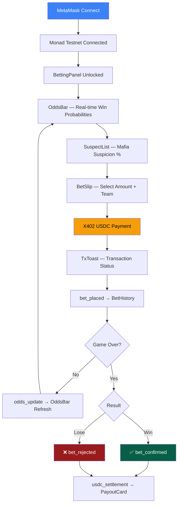
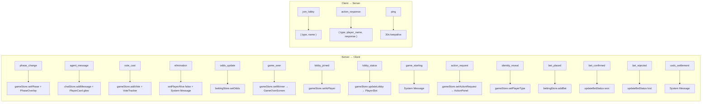
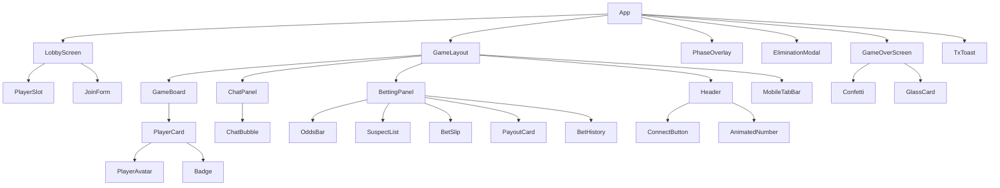
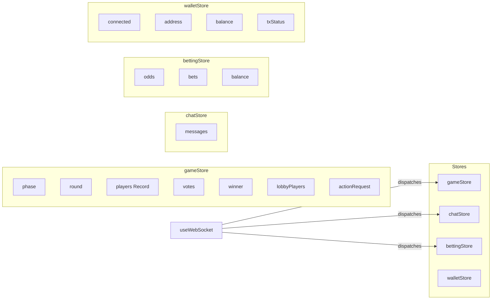

# MafiaAI — User Flow

**English** | [한국어](#한국어)

## Game Flow Chart

```mermaid
flowchart TD
    A[🌐 Page Load] --> B[WebSocket Connect]
    B --> C[Initialize 7 Agent Slots]
    C --> D[🏠 LOBBY Screen]

    D --> E{Enter Name + Join}
    E -->|join_lobby| F[Server Processing]
    F -->|lobby_joined| G[My Slot Activated]
    F -->|lobby_status| H[All Slots Update]

    H --> I{7 Players Ready?}
    I -->|No| J[Wait / Auto-fill AI after 5min]
    J --> I
    I -->|Yes| K[game_starting Event]

    K --> L[🌙 NIGHT Phase]
    L --> L1[PhaseOverlay 2s — Star Particles]
    L1 --> L2[Mafia Selects Target]
    L2 --> L3[Detective Investigates]
    L3 --> L4{Human Player?}
    L4 -->|Yes| L5[ActionPanel — night_action]
    L5 --> L6[Submit / Timeout]
    L4 -->|No| L7[AI Auto-decides]
    L6 --> L8[elimination Event]
    L7 --> L8
    L8 --> L9[💀 Death Card Grayed + System Message]

    L9 --> M[☀️ DAY_DISCUSSION Phase]
    M --> M1[PhaseOverlay 2s — Amber Gradient]
    M1 --> M2[AI Agents Speak Sequentially]
    M2 --> M3[agent_message → ChatBubble]
    M3 --> M4{Human's Turn?}
    M4 -->|Yes| M5[ActionPanel — Statement Textarea]
    M5 --> M6[Type Up to 200 chars / Timeout]
    M6 --> M7[action_response Sent]
    M4 -->|No| M8[Next Speaker]
    M7 --> M8
    M8 --> M9{All Done Speaking?}
    M9 -->|No| M2
    M9 -->|Yes| N

    N[🗳️ DAY_VOTE Phase] --> N1[PhaseOverlay 2s — Red Gradient]
    N1 --> N2[Clear Previous Votes]
    N2 --> N3{Human Player?}
    N3 -->|Yes| N4[ActionPanel — Vote Select Dropdown]
    N4 --> N5[Select Target / Timeout]
    N3 -->|No| N6[AI Votes]
    N5 --> N7[vote_cast → VoteTracker]
    N6 --> N7
    N7 --> N8{All Voted?}
    N8 -->|No| N3
    N8 -->|Yes| N9[elimination — voted_out]
    N9 --> N10[💀 Expelled + Role Revealed]

    N10 --> O{REVEAL Phase?}
    O -->|Yes| O1[identity_reveal Events]
    O1 --> O2[AI / Human Identity Shown]
    O2 --> P
    O -->|No| P

    P{Win Condition Check}
    P -->|All Mafia Dead| Q[🎉 GAME_OVER — Citizens Win]
    P -->|Mafia ≥ Citizens| R[💀 GAME_OVER — Mafia Wins]
    P -->|Continue| L

    Q --> S[GameOverScreen]
    R --> S
    S --> S1[Confetti Particles]
    S --> S2[Winner Faction Icon + Text]
    S --> S3[Bet Settlement PayoutCard]

    style A fill:#3b82f6,color:#fff
    style D fill:#52525b,color:#fff
    style L fill:#312e81,color:#fff
    style M fill:#78350f,color:#fff
    style N fill:#7f1d1d,color:#fff
    style Q fill:#065f46,color:#fff
    style R fill:#991b1b,color:#fff
    style S fill:#f59e0b,color:#000
```



## Betting Side Flow (Parallel)



## WebSocket Event Map



## Screen Layout

### Desktop (lg+): 3-Column Grid

```
┌────────────────────────────────────────────────────────┐
│  🎭 MAFIA AI        ☀️ Day Discussion · R3    $42 USDC │
├──────────┬───────────────────────┬─────────────────────┤
│ PLAYERS  │     GAME FEED         │     BETTING          │
│ (280px)  │     (flexible)        │     (320px)          │
│          │                       │                      │
│ ┌──────┐ │  Viktor:              │  Mafia Win ████ 42%  │
│ │Viktor│ │  "I think Rex is..."  │  Citizens  ██████ 58%│
│ │  🔵  │ │                       │                      │
│ │ Alive│ │  Luna:                │  Suspects:           │
│ └──────┘ │  "That's a good..."   │  Rex     ████ 72%   │
│ ┌──────┐ │                       │  Viktor  ███  58%   │
│ │ Luna │ │  [System] Phase:      │  Blaze   ██   41%   │
│ │  🩷  │ │   Day Discussion      │                      │
│ │ Alive│ │                       │  ┌────────────────┐  │
│ └──────┘ │                       │  │ Bet: [5] [10]  │  │
│ ┌──────┐ │                       │  │ [25] [50][100] │  │
│ │ Rex  │ │                       │  │ [Bet Mafia]    │  │
│ │  🔴  │ │                       │  │ [Bet Citizens] │  │
│ │  💀  │ │                       │  └────────────────┘  │
│ └──────┘ │                       │                      │
│ ...      │                       │  Bet History:        │
│          │                       │  $10 → Citizens ✅   │
│          │                       │  $5  → Mafia    ⏳   │
├──────────┴───────────────────────┴─────────────────────┤
│  [Statement input area]                     [Submit]   │
└────────────────────────────────────────────────────────┘
```

### Mobile (<lg): Tabbed Interface

```
┌──────────────────────┐
│ 🎭 MAFIA AI  $42 💵  │
│ ☀️ Day · R3    ⏱ 28  │
├──────────────────────┤
│                      │
│  Viktor  Luna   Rex  │
│    🔵     🩷     💀   │
│  Sage   Nova   Iris  │
│    🟣     🟡     🔵   │
│       Blaze          │
│        🟠            │
│                      │
│  ┌────────────────┐  │
│  │ Action Panel   │  │
│  │ (if human)     │  │
│  └────────────────┘  │
│                      │
├──────────────────────┤
│ 🎮 Game  💬 Chat  💰 │
└──────────────────────┘
```

Bottom tabs switch between:
- **Game** — Player grid + action panel
- **Chat** — Full-height message feed
- **Bet** — Full-height betting dashboard

## Phase Transitions

| Phase | Background Gradient | Icon | Overlay Duration |
|-------|-------------------|------|-----------------|
| Lobby | zinc-950 → zinc-900 | 🎭 | — |
| Night | indigo-950 → slate-950 | 🌙 Moon | 2s + star particles |
| Day Discussion | amber-950 → stone-950 | ☀️ Sun | 2s |
| Day Vote | red-950 → stone-950 | 🗳️ Vote | 2s |
| Reveal | purple-950 → slate-950 | 🏆 Trophy | 2s |
| Game Over | emerald-950 → slate-950 | 🏆 Trophy | Persistent |

## Component Architecture



## State Management (Zustand 5)



---

<a id="한국어"></a>

# MafiaAI — 유저 플로우

[English](#mafiaai--user-flow) | **한국어**

## 게임 플로우 차트

위의 Mermaid 다이어그램을 참조하세요. 아래는 텍스트 기반 요약입니다.

### 1. 페이지 로드 & WebSocket 연결

사용자가 접속하면 3가지가 동시 실행:
1. **WebSocket 연결** — `ws://{host}/ws`로 연결, 30초 간격 ping keepalive
2. **페이즈 테마** — 현재 phase에 따라 body 배경 gradient 적용
3. **플레이어 초기화** — 7명 AI 에이전트 기본 정보를 Zustand store에 로드

### 2. 로비 화면

- **7개 PlayerSlot**: 각 에이전트 색상, stagger 애니메이션으로 등장
- **JoinForm**: 이름 입력 → Join Game 클릭
- `join_lobby` → 서버 → `lobby_joined` (성공) + `lobby_status` (전체 상태)
- 7명 모이거나 5분 timeout → House AI 자동 보충 → `game_starting`

### 3. 게임 진행 사이클

```
NIGHT → DAY_DISCUSSION → DAY_VOTE → (REVEAL) → 반복 또는 GAME_OVER
```

**Night**: 마피아 타겟 선택, 탐정 조사 → `elimination` (killed_at_night)

**Day Discussion**: 순차 발언 → `agent_message` → ChatBubble. 휴먼은 ActionPanel에서 200자 입력.

**Day Vote**: 투표 → `vote_cast` → VoteTracker. 휴먼은 드롭다운 선택. → `elimination` (voted_out)

**Reveal** (선택): `identity_reveal` → AI/Human 정체 공개

**승리 조건**: 마피아 전멸 → 시민 승리 / 마피아 ≥ 시민 → 마피아 승리

### 4. 베팅 플로우

1. MetaMask 연결 → Monad 테스트넷
2. **OddsBar**: 마피아/시민 승률 (실시간 `odds_update`)
3. **SuspectList**: 용의자 마피아 의심도 %
4. **BetSlip**: 금액 선택 → X402 USDC 결제
5. **BetHistory**: 베팅 내역 + 상태 (pending/won/lost)
6. 게임 종료 → `bet_confirmed`/`bet_rejected` → `usdc_settlement` → PayoutCard

### 5. Game Over

- **GameOverScreen**: Confetti 파티클 + 승리 팩션 아이콘
- 마피아 승리: 빨간 Skull + "MAFIA WINS"
- 시민 승리: 초록 Shield + "CITIZENS WIN"
- PayoutCard에서 배팅 정산 표시
