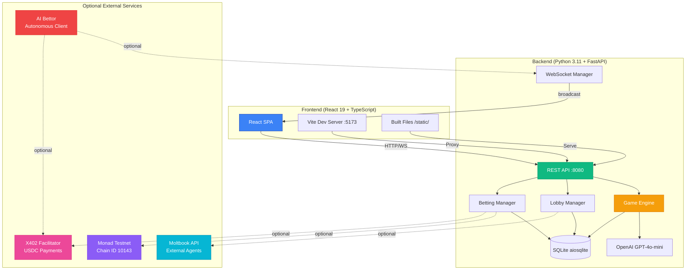
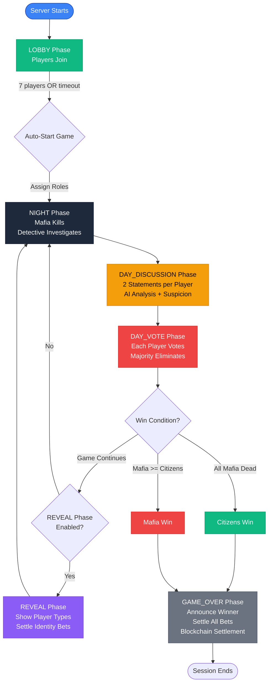
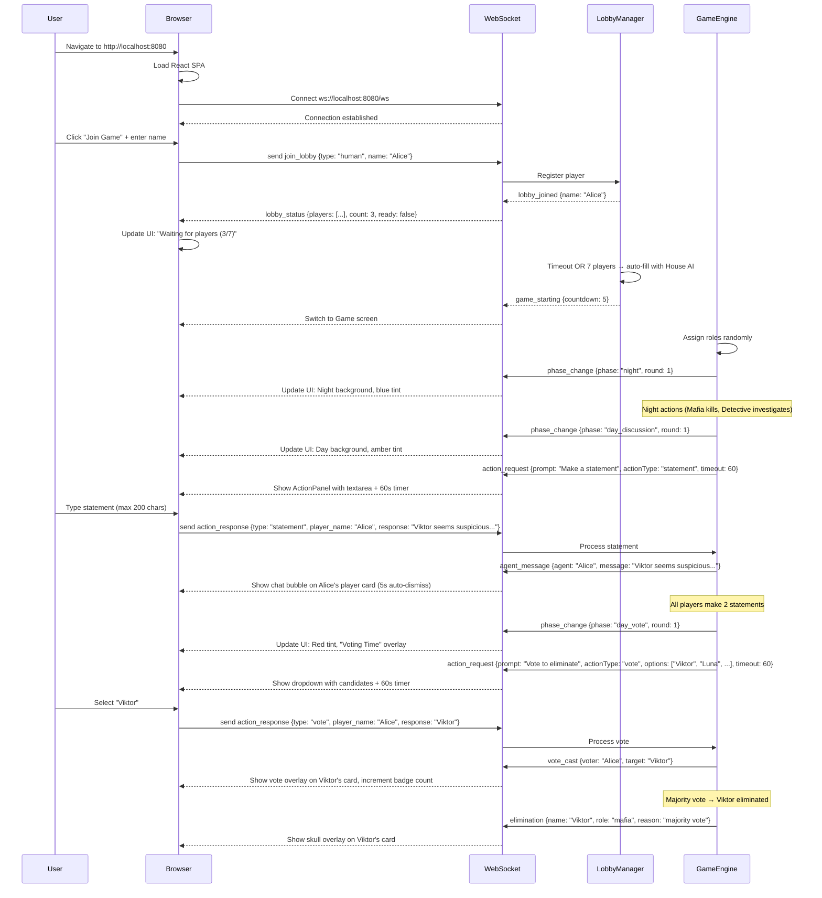
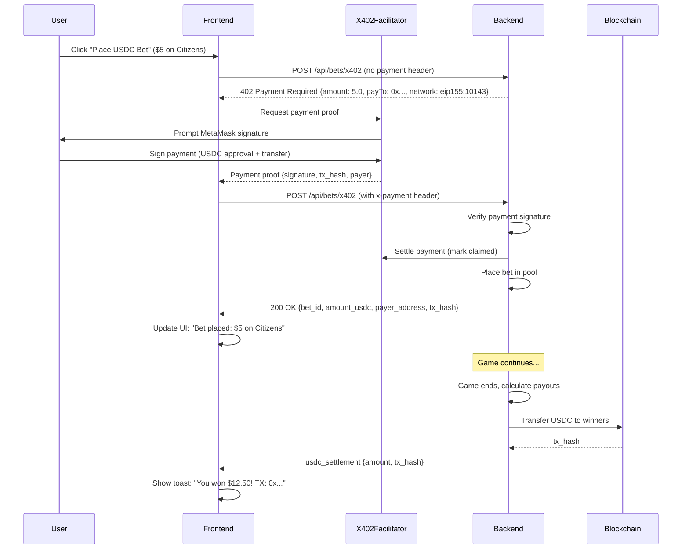
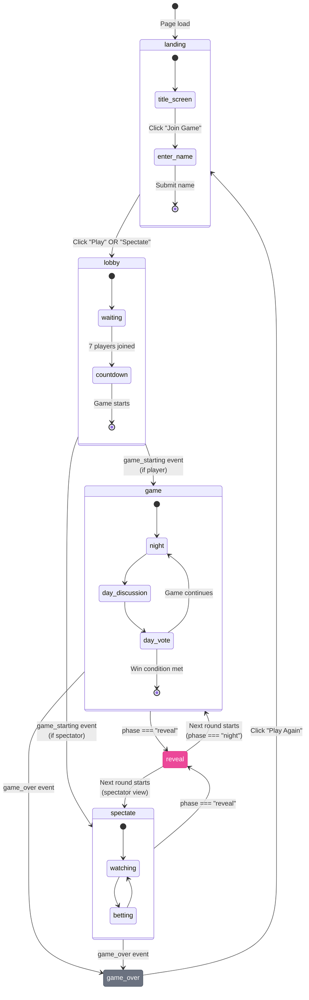

# MafiaAI User Flow Documentation

**English** | [한국어](USERFLOW.ko.md)

Comprehensive guide to user interactions, product structure, and system architecture for the MafiaAI Mixed-Player Arena.

---

## Running the Game

### Prerequisites

- **Python 3.11+** — Backend runtime
- **Node.js 18+** — Frontend build toolchain
- **OpenAI API Key** — **REQUIRED** for all AI operations ([Get key](https://platform.openai.com/))

The OpenAI API key is the **only required** environment variable. All other features (blockchain, X402 USDC betting, Moltbook external agents, AI Bettor) are **optional** and disabled by default.

### Setup

```bash
# Clone repository
git clone https://github.com/0xarkstar/mafi-AI.git
cd mafi-AI

# Create virtual environment
python3.11 -m venv .venv
source .venv/bin/activate

# Install dependencies (includes pytest, FastAPI, OpenAI SDK, etc.)
pip install -e ".[dev]"

# Build frontend (React 19 + Vite)
cd frontend
npm install
npm run build   # outputs to ../static/
cd ..

# Configure environment
cp .env.example .env
# Edit .env and add OPENAI_API_KEY=sk-proj-...
```

### Run Modes

#### 1. **Web Mode** (Production)

Serves the built React SPA at `http://localhost:8080`:

```bash
python -m src.main
```

Features:
- Full React UI with WebSocket live updates
- Lobby system for human players
- Spectator screen with betting terminal
- Auto-starts game after 30 seconds with 7 House AI agents
- All optional features available (blockchain, X402, Moltbook, AI Bettor)

#### 2. **CLI Mode** (Terminal Only)

Headless game with text output, no web UI:

```bash
python -m src.main --no-api
```

Features:
- Logs game events to console via structlog
- Useful for testing AI agent behavior
- No betting, no human players, no spectators
- Faster for development iteration

#### 3. **Development Mode** (Hot Reload)

Dual-server setup with Vite HMR:

```bash
# Terminal 1: Backend
python -m src.main

# Terminal 2: Frontend dev server
cd frontend && npm run dev
```

- Backend runs at `:8080` (API + WebSocket)
- Vite dev server at `:5173` (proxies to `:8080`)
- Hot module replacement for instant React updates
- WebSocket connections proxied correctly via Vite config

---

## Product Structure

### System Architecture Diagram



### Module Responsibility Map

| Module | Purpose | Key Files | Immutability |
|--------|---------|-----------|--------------|
| **src/config/** | Settings, enums, constants | `settings.py` (Pydantic BaseSettings), `constants.py` (Role, Phase, PlayerType, BetType enums) | ✅ Frozen enums |
| **src/models/** | Pydantic frozen models | `game.py` (GameState, RoundResult), `agent.py` (AgentState, Personality), `betting.py` (Bet, BettingPool, OddsBoard), `events.py` (WSEvent) | ✅ All `frozen=True` |
| **src/engine/** | Game state machine | `game_engine.py` (orchestrator), `phase_handlers.py` (Night/Day/Vote/Reveal logic), `role_assigner.py`, `win_checker.py` | ✅ Functional transitions |
| **src/agents/** | AI personalities | `personalities.py` (7 personalities), `prompts.py` (system prompts), `llm_client.py` (OpenAI client), `memory.py` (immutable rolling window) | ✅ Immutable memory |
| **src/players/** | PlayerProtocol implementations | `protocol.py` (PlayerProtocol, TurnContext), `house_ai.py`, `moltbook_agent.py`, `agent_human.py`, `human.py` | ✅ Context is frozen |
| **src/lobby/** | Lobby management | `manager.py` (LobbyManager) — player registration, auto-fill, role assignment | ⚠️ Mutable during lobby |
| **src/moltbook/** | External agent integration | `client.py` (Moltbook API client) | — |
| **src/betting/** | Pari-mutuel betting | `pool.py` (payout logic), `odds.py` (calculation), `manager.py` (bet placement), `oddsmaker.py` (AI odds via GPT-4o-mini) | ✅ Pool is frozen |
| **src/blockchain/** | Web3 integration | `provider.py` (AsyncWeb3 + POA), `contract.py` (oracle operations: create, settle, lock) | — |
| **src/x402/** | USDC payment protocol | `middleware.py` (402 Payment Required), `models.py` (X402BetRequest, X402PaymentInfo) | ✅ Models frozen |
| **src/ai_bettor/** | Autonomous betting agent | `client.py` (WebSocket orchestrator), `analyzer.py` (LLM decision maker), `strategy.py` (deterministic rules), `models.py` (GameObservation, BetDecision, AIBettorState) | ✅ State is frozen |
| **src/api/** | FastAPI server | `server.py` (FastAPI + static files), `routes.py` (REST endpoints), `ws_manager.py` (WebSocket broadcast) | — |
| **src/storage/** | Database layer | `database.py` (aiosqlite + migrations), `repositories/` (game_repo, bet_repo) | — |
| **src/utils/** | Utilities | `logger.py` (structlog), `retry.py` (async retry decorator), `errors.py` (custom exceptions) | — |

---

## Game Lifecycle Flowchart



### Phase Details

#### **LOBBY** Phase
- Players join via WebSocket (`join_lobby` event)
- Auto-fill remaining slots with House AI (distinct personalities)
- Timeout: 300 seconds (5 minutes) → auto-start with available players
- Once 7 players joined: transition to NIGHT after 5-second countdown

#### **NIGHT** Phase
- **Mafia**: Choose victim to eliminate (via `night_action`)
- **Detective**: Choose player to investigate, learn their role
- **Citizens**: Sleep (no action)
- All actions are simultaneous, resolved at end of night
- Broadcast `elimination` event with victim's name + role

#### **DAY_DISCUSSION** Phase
- Each player makes **2 statements** (200 character limit)
- House AI generates dialogue via GPT-4o-mini with personality context
- Humans/agents receive `action_request` with 60-second timeout
- Statements broadcast as `agent_message` events
- AI Oddsmaker analyzes statements → updates odds

#### **DAY_VOTE** Phase
- Each player votes to eliminate one player (cannot vote self)
- House AI decides via GPT-4o-mini (considers memory + suspicions)
- Humans/agents select from dropdown, 60-second timeout
- Majority vote eliminates player
- Tie-breaking: random selection among tied players
- Broadcast `vote_cast` + `elimination` events

#### **REVEAL** Phase (Optional)
- Reveals player types (HOUSE_AI, MOLTBOOK_AGENT, AGENT_HUMAN, HUMAN)
- Settles identity bets (`is_ai_or_human`)
- Broadcast `identity_reveal` events
- Transition back to NIGHT if game continues

#### **GAME_OVER** Phase
- Announce winner (`game_over` event)
- Settle all bets (chip + USDC pools)
- Blockchain settlement if enabled (`settle_game` transaction)
- Spectators see final payouts, claim winnings button (blockchain)

---

## Player Interaction Flow

### Player Types

MafiaAI supports **4 player types** that can be mixed in any combination:

| Type | Description | Input Method | Personality | Account |
|------|-------------|--------------|-------------|---------|
| **HOUSE_AI** | Server-controlled AI agent | OpenAI GPT-4o-mini | 7 personalities (Viktor, Luna, Rex, Sage, Nova, Iris, Blaze) | Server-owned |
| **MOLTBOOK_AGENT** | External autonomous AI | Moltbook API | Agent-defined | External agent |
| **AGENT_HUMAN** | Human via web UI (agent account) | WebSocket (`action_response`) | None (human decision) | Agent account |
| **HUMAN** | Regular player via web UI | WebSocket (`action_response`) | None (human decision) | Personal account |

### Human Player Flow



### ActionPanel UI Component

**Desktop:**
- Appears at bottom center during player's turn
- Glassmorphic card with prompt text
- Input: Textarea (statements) OR Dropdown (votes) OR Button grid (night actions)
- Timer: ProgressRing countdown (60 seconds default)
- Submit button: Disabled until input provided

**Mobile:**
- Same layout, smaller width
- Full-screen modal on small devices (<sm)

**Timeout Handling:**
- If no response within timeout → random default action
  - Statement: "I have nothing to say."
  - Vote: Random candidate
  - Night action: Random target

---

## Spectator Flow

Spectators watch games in real-time without playing. They can:
- View all players and their status (alive/dead)
- Read game log (last 15 messages)
- Place bets on outcomes
- Chat with other spectators

### Spectator Screen Layout

```
┌─────────────────────────────────────────────────────────────┐
│ [Header: MafiaAI Logo | Phase Badge | Round Counter]         │
├─────────────────────────────────────────────────────────────┤
│ ┌─────────────────────┐  ┌────────────────────────────────┐ │
│ │ Player Grid (3×3)   │  │ Betting Terminal               │ │
│ │                     │  │ ┌────────────────────────────┐ │ │
│ │ [Portrait] [Name]   │  │ │ Bet Type Tabs             │ │ │
│ │ [Role Badge]        │  │ │ - Side Win                │ │ │
│ │ [Alive/Dead]        │  │ │ - Next Elimination        │ │ │
│ │                     │  │ │ - Is Mafia                │ │ │
│ │ × 7 players         │  │ │ - AI or Human             │ │ │
│ │                     │  │ └────────────────────────────┘ │ │
│ └─────────────────────┘  │                                │ │
│                          │ Target: [Dropdown]             │ │
│ ┌─────────────────────┐  │ Amount: [$1] [$5] [$10]      │ │
│ │ Game Log (15 msgs)  │  │ Payout: $XX.XX (if win)      │ │
│ │                     │  │ [Place Bet]                  │ │
│ │ > Viktor: I accuse  │  │                                │ │
│ │ > Luna was killed   │  │ My Bets (3):                   │ │
│ │ > Round 2 starts... │  │ - Citizens win: $5 (pending)   │ │
│ │                     │  │ - Viktor mafia: $2 (won $8)    │ │
│ └─────────────────────┘  └────────────────────────────────┘ │
├─────────────────────────────────────────────────────────────┤
│ [Floating Spectator Chat Panel — Toggle Button]             │
└─────────────────────────────────────────────────────────────┘
```

### Spectator Chat Panel
- **Floating** glassmorphic panel (bottom-right corner)
- Toggle visibility via button
- Real-time chat with other spectators (NOT visible to players)
- WebSocket events: `spectator_message` (send/receive)

---

## Betting Flow

### Bet Types

| Bet Type | Target | Timing | Settlement |
|----------|--------|--------|------------|
| **side_win** | "citizens" OR "mafia" | Anytime before GAME_OVER | Winner announced |
| **next_elimination** | Player name (alive) | Before DAY_VOTE ends | Next elimination revealed |
| **is_mafia** | Player name (alive) | Before player dies | Player's role revealed |
| **is_ai_or_human** | Player name | Before REVEAL phase | REVEAL phase |

### Pari-Mutuel Payout Logic

1. **Pool Creation**: All bets for a bet_type go into a shared pool
2. **House Edge**: Server takes 5% of total pool
3. **Winning Pool**: 95% distributed to winners
4. **Weight Calculation**:
   - Round 0 (lobby/night 1): 1.5× weight (early bird bonus)
   - Round 1 (first day): 1.2× weight
   - Round 2+: 1.0× weight
5. **Payout Formula**:
   ```python
   total_pool = sum(all_bets.amount)
   prize_pool = total_pool * 0.95  # 5% house edge
   winning_bets = [bet for bet in all_bets if bet.target == winning_target]
   total_weighted = sum(bet.amount * bet.weight for bet in winning_bets)

   for bet in winning_bets:
       weighted_amount = bet.amount * bet.weight
       payout = (weighted_amount / total_weighted) * prize_pool
   ```

### Dual Betting System

#### 1. Chip Betting (Default — Always Available)
- **Currency**: In-game chips (not real money)
- **Starting Balance**: 1000 chips per spectator
- **Limits**: No minimum, unlimited bets
- **Settlement**: Instant, virtual chips credited
- **Endpoint**: `POST /api/bets` (no payment required)

#### 2. USDC Betting via X402 (Optional)
- **Currency**: USDC on Monad testnet (Chain ID 10143)
- **Payment Protocol**: X402 micropayment with cryptographic verification
- **Limits**: $1.00 - $100.00 USDC per bet
- **Settlement**: On-chain transaction after game ends
- **Endpoint**: `POST /api/bets/x402` (requires `x-payment` header)

### X402 Betting Flow



### AI Oddsmaker

GPT-4o-mini analyzes game state every phase transition and provides:
- **Mafia Win Probability** (0-1)
- **Citizen Win Probability** (0-1)
- **Suspect Rankings** (player name → suspicion score)

**Input Context:**
- Current phase, round number
- Alive vs dead agents
- Recent statements (last 10 messages)
- Vote history
- Known roles (for Detective's perspective)

**Output Format:**
```json
{
  "mafia_prob": 0.35,
  "citizen_prob": 0.65,
  "suspects": [
    {"name": "Viktor", "suspicion": 0.8, "reasoning": "Aggressive deflection"},
    {"name": "Luna", "suspicion": 0.3, "reasoning": "Consistent behavior"},
    ...
  ]
}
```

Broadcast via `odds_update` WebSocket event → updates betting UI.

---

## WebSocket Event Map

### Server → Client Events (15 events)

| Event | Data Fields | Store Action | UI Effect |
|-------|-------------|--------------|-----------|
| **phase_change** | `phase`, `round` | `gameStore.setPhase`, `gameStore.setRound` | Background crossfade, tint overlay update |
| **agent_message** | `agent`, `message` | `chatStore.addMessage`, `gameStore.setChatBubble(agent, message, 5000)` | Chat bubble appears on player card (5s auto-dismiss) |
| **vote_cast** | `voter`, `target` | `gameStore.addVote` | Vote overlay on target's card, increment badge count |
| **elimination** | `name`, `role`, `reason` | `gameStore.setPlayerAlive(name, false)` | Skull overlay on player card, game log entry |
| **game_over** | `winner` | `gameStore.setWinner`, `gameStore.setScreen('game_over')` | Confetti animation, winner announcement |
| **odds_update** | `mafia_prob`, `citizen_prob`, `suspects` | `bettingStore.setOdds` | Update betting panel odds display |
| **lobby_joined** | `name` | `gameStore.setIsPlayer(true)` | "You joined as {name}" |
| **lobby_status** | `players`, `count`, `ready` | `gameStore.updateLobby` | Player slots update, counter: "3/7" |
| **game_starting** | `countdown` | `gameStore.setScreen('game')` | Countdown modal → transition to game |
| **action_request** | `prompt`, `actionType`, `options`, `timeout` | `gameStore.setActionRequest` | Show ActionPanel (textarea/dropdown/buttons) + timer |
| **identity_reveal** | `name`, `player_type` | `gameStore.setPlayerType` | Player card badge updates (AI/Human icon) |
| **bet_placed** | `bet_id`, `amount`, `target` | `bettingStore.addBet` | Add to "My Bets" list |
| **bet_confirmed** | `bet_id` | `bettingStore.updateStatus('won')` | Green checkmark, calculate payout |
| **bet_rejected** | `bet_id` | `bettingStore.updateStatus('lost')` | Red X, show loss |
| **usdc_settlement** | `amount`, `tx_hash` | — | Toast notification with Monad explorer link |

### Client → Server Events (3 events)

| Event | Data Fields | Trigger | Purpose |
|-------|-------------|---------|---------|
| **join_lobby** | `type` ("human" \| "agent_human"), `name` | Click "Join Game" button | Register as player in lobby |
| **action_response** | `type` ("statement" \| "vote" \| "night_action"), `player_name`, `response` | Submit ActionPanel | Send player decision to game engine |
| **ping** | — | 30-second interval | Keep WebSocket alive |

---

## Screen State Machine



### Screen Routing Logic

| Screen | Condition | Components Rendered |
|--------|-----------|---------------------|
| **landing** | `gameStore.screen === 'landing'` | `LandingScreen` (shattered mask effect, "Play" / "Spectate" buttons) |
| **lobby** | `gameStore.screen === 'lobby'` | `LobbyScreen` (player slots, countdown, "Join Game" form) |
| **game** | `gameStore.screen === 'game' && gameStore.isPlayer` | `GameLayout` (Header, Background, GameBoard, ChatPanel, BettingPanel, ActionPanel if turn) |
| **spectate** | `gameStore.screen === 'game' && !gameStore.isPlayer` | `SpectatorScreen` (player grid, game log, betting terminal, spectator chat) |
| **reveal** | `gameStore.phase === 'reveal'` | `RevealScreen` (3D card flip animations showing AI/Human labels) |
| **game_over** | `gameStore.screen === 'game_over'` | `GameOverScreen` (winner announcement, confetti, final bets, "Play Again") |

---

## UI Component Tree

```mermaid
graph TB
    App[App.tsx]

    App --> Landing[LandingScreen]
    App --> Lobby[LobbyScreen]
    App --> GameLayout
    App --> Spectate[SpectatorScreen]
    App --> Reveal[RevealScreen]
    App --> GameOver[GameOverScreen]

    Landing --> LandingBG[Shattered Mask Effect]
    Landing --> PlayBtn[Play / Spectate Buttons]

    Lobby --> LobbySlots[PlayerSlot × 7]
    Lobby --> JoinForm[JoinForm]
    Lobby --> Countdown[CountdownModal]

    GameLayout --> Header
    GameLayout --> Background[Background<br/>day/night images]
    GameLayout --> PhaseTint[PhaseTintOverlay<br/>blue/amber/red]
    GameLayout --> NightOverlay[NightOverlay<br/>stars + moon]
    GameLayout --> GameBoard
    GameLayout --> ChatPanel
    GameLayout --> BettingPanel
    GameLayout --> BettingStatusBar
    GameLayout --> EmoteMenu
    GameLayout --> MobileTab[MobileTabBar]

    GameBoard --> PlayerCard[PlayerCard × 7]

    PlayerCard --> Portrait[Portrait Image<br/>AVATAR_IMAGES array]
    PlayerCard --> ChatBubble[Chat Bubble Overlay<br/>inside card, gold border]
    PlayerCard --> EmoteOverlay[Emote Overlay<br/>spring animation]
    PlayerCard --> VoteOverlay[Vote Overlay<br/>count badge]
    PlayerCard --> RoleBadge[Role Badge<br/>Sword/Eye/Shield]
    PlayerCard --> DeadSkull[Dead Skull Overlay]

    ChatPanel --> Messages[ChatMessage × N]

    BettingPanel --> BetTabs[Bet Type Tabs × 4]
    BettingPanel --> BetSlip[BetSlip]
    BettingPanel --> MyBets[My Bets List]

    Spectate --> SpectGrid[Player Grid 3×3]
    Spectate --> GameLog[Game Log 15 msgs]
    Spectate --> BetTerminal[Betting Terminal]
    Spectate --> SpecChat[Spectator Chat<br/>floating panel]

    BetTerminal --> QuickAmounts[Quick Amount Buttons]
    BetTerminal --> PayoutCalc[Payout Calculator]

    Reveal --> CardFlip[3D Card Flip Animation × 7]

    GameOver --> WinnerMsg[Winner Announcement]
    GameOver --> Confetti[Canvas Confetti]
    GameOver --> FinalBets[Final Bet Results]

    style App fill:#3b82f6,stroke:#1e40af,color:#fff
    style GameLayout fill:#10b981,stroke:#059669,color:#fff
    style PlayerCard fill:#f59e0b,stroke:#d97706,color:#000
    style Portrait fill:#ec4899,stroke:#db2777,color:#fff
    style ChatBubble fill:#fbbf24,stroke:#f59e0b,color:#000
    style BettingPanel fill:#8b5cf6,stroke:#7c3aed,color:#fff
    style Spectate fill:#06b6d4,stroke:#0891b2,color:#fff
```



**IMPORTANT**: PlayerAvatar component still exists as a file but is **no longer the primary visual**. Portrait images from the `AVATAR_IMAGES` array are now used for all player cards.

---

## State Management (4 Zustand Stores)

### 1. gameStore

```typescript
interface GameStore {
  // Core game state
  phase: Phase
  round: number
  players: Player[]
  votes: Record<string, string>  // voter → target
  winner: string | null  // "citizens" | "mafia"

  // Player identity
  isPlayer: boolean
  myPlayerName: string | null

  // Lobby state
  lobbyPlayers: LobbyPlayer[]
  lobbyCount: number
  lobbyReady: boolean

  // Action requests
  actionRequest: ActionRequest | null

  // Screen routing
  screen: 'landing' | 'lobby' | 'game' | 'game_over'

  // User preferences
  nickname: string
  avatarIndex: number
  isSpectator: boolean

  // Visual effects
  activeEmotes: Record<string, string>  // playerName → emoji
  chatBubbles: Record<string, { message: string; expiresAt: number }>
  voteCounts: Record<string, number>  // target → count
  showVoteUI: boolean
  selectedVoteTarget: string | null

  // Actions
  setPhase: (phase: Phase) => void
  setRound: (round: number) => void
  setPlayers: (players: Player[]) => void
  addVote: (voter: string, target: string) => void
  setWinner: (winner: string) => void
  setIsPlayer: (isPlayer: boolean) => void
  updateLobby: (data: LobbyStatusData) => void
  setActionRequest: (request: ActionRequest | null) => void
  setScreen: (screen: Screen) => void
  setChatBubble: (playerName: string, message: string, duration: number) => void
  setActiveEmote: (playerName: string, emoji: string, duration: number) => void
  setPlayerAlive: (name: string, alive: boolean) => void
  setPlayerType: (name: string, playerType: PlayerType) => void
}
```

### 2. chatStore

```typescript
interface ChatStore {
  messages: ChatMessage[]

  // Actions
  addMessage: (message: ChatMessage) => void
  clearMessages: () => void
}

interface ChatMessage {
  id: string
  agent: string
  message: string
  timestamp: string
  type: 'statement' | 'system' | 'spectator'
}
```

### 3. bettingStore

```typescript
interface BettingStore {
  odds: OddsBoard | null
  bets: Bet[]
  balance: number  // chips or USDC

  // Actions
  setOdds: (odds: OddsBoard) => void
  addBet: (bet: Bet) => void
  updateStatus: (betId: string, status: BetStatus) => void
  setBalance: (balance: number) => void
}

interface OddsBoard {
  mafia_prob: number
  citizen_prob: number
  suspects: Suspect[]
}

interface Bet {
  bet_id: string
  game_id: string
  bet_type: BetType
  target: string
  amount: number
  status: 'pending' | 'won' | 'lost'
  payout?: number
}
```

### 4. walletStore

```typescript
interface WalletStore {
  connected: boolean
  address: string | null
  balance: string | null  // MON or USDC balance
  txStatus: 'idle' | 'pending' | 'success' | 'error'

  // Actions
  connect: () => Promise<void>
  disconnect: () => void
  placeBet: (betData: BetData) => Promise<string>  // returns tx_hash
  claimWinnings: (gameId: string) => Promise<string>
}
```

---

## Phase Visual Transitions

| Phase | Background | Tint Overlay | Special Effects | Duration |
|-------|-----------|-------------|----------------|----------|
| **lobby** | — | — | — | Until 7 players |
| **night** | `game-bg-night.png` (crossfade 2s) | Blue (`#0a0e1f/60%`) | `NightOverlay` (animated stars + moon) | ~30s (actions resolve) |
| **day_discussion** | `game-bg.png` (crossfade 2s) | Amber (`#0a0a05/50%`) | — | 2 statements × 7 players |
| **day_vote** | `game-bg.png` | Red (`#1a0505/70%`) | "Voting Time" ballot overlay | 7 votes |
| **reveal** | `game-bg.png` | Purple (`#4c1d95/60%`) | 3D card flip animation (showing AI/Human) | ~10s |
| **game_over** | `game-bg.png` | Emerald (`#064e3b/60%`) (if citizens win) OR Red (`#7f1d1d/60%`) (if mafia win) | Canvas confetti (300 particles, 3s) | Until "Play Again" |

### Background Crossfade Implementation

```typescript
// Framer Motion variants
const backgroundVariants = {
  day: {
    backgroundImage: 'url(/game-bg.png)',
    transition: { duration: 2, ease: 'easeInOut' }
  },
  night: {
    backgroundImage: 'url(/game-bg-night.png)',
    transition: { duration: 2, ease: 'easeInOut' }
  }
}

// Usage in GameLayout
<motion.div
  variants={backgroundVariants}
  animate={phase === 'night' ? 'night' : 'day'}
/>
```

### NightOverlay (stars + moon)

- **Canvas rendering** for performance
- 100 stars (random positions, sizes, twinkle animation)
- Moon image positioned top-right with glow effect
- Only visible during `phase === 'night'`

---

## Desktop & Mobile Layouts

### Desktop (lg+)

```
┌──────────────────────────────────────────────────────────────────┐
│ [Header: Logo | Phase Badge | Round | Timer]                     │
├────────────────┬─────────────────────┬───────────────────────────┤
│ PLAYERS        │ GAME BOARD          │ BETTING                   │
│ (280px fixed)  │ (flex-1)            │ (320px fixed)             │
│                │                     │                           │
│ [PlayerCard]   │ ┌─────────────────┐ │ [Bet Type Tabs]           │
│ [PlayerCard]   │ │ PlayerCard × 7  │ │ [Target Dropdown]         │
│ [PlayerCard]   │ │ (portrait imgs) │ │ [Quick Amounts]           │
│ [PlayerCard]   │ │                 │ │ [Payout Calc]             │
│ [PlayerCard]   │ │ Chat bubbles    │ │ [Place Bet Button]        │
│ [PlayerCard]   │ │ inside cards    │ │                           │
│ [PlayerCard]   │ │ (gold border)   │ │ [My Bets List]            │
│                │ │                 │ │ - Citizens: $5 pending    │
│                │ │ Emote overlays  │ │ - Viktor mafia: Won $8    │
│                │ │ Vote badges     │ │                           │
│                │ └─────────────────┘ │                           │
│                │                     │                           │
│ [CHAT PANEL]   │                     │ [ODDS BAR]                │
│ (below cards)  │                     │ Citizens 65% | Mafia 35%  │
└────────────────┴─────────────────────┴───────────────────────────┘
│ [BettingStatusBar — bottom center, 80% width]                    │
│ Current Bets: 3 | Total Wagered: $12 | Est. Payout: $18.50      │
└──────────────────────────────────────────────────────────────────┘
```

### Mobile (<lg)

```
┌──────────────────────────┐
│ [Header]                 │
├──────────────────────────┤
│                          │
│ [PlayerCard Grid 2×4]    │
│ - Portrait images        │
│ - Chat bubbles inside    │
│ - Emote overlays         │
│ - Vote badges            │
│                          │
├──────────────────────────┤
│ [Bottom Tab Bar]         │
│ [Game] [Chat] [Bet]      │
└──────────────────────────┘

Tab 1: Game
- PlayerCard grid (current view above)
- ActionPanel (if player's turn)

Tab 2: Chat
- Full-screen chat messages
- Input field for spectators

Tab 3: Bet
- Betting terminal (full-screen)
- Odds display
- My Bets list
```

**MobileTabBar Component:**
- Fixed position bottom
- 3 tabs: Game (Users icon), Chat (MessageCircle icon), Bet (DollarSign icon)
- Active tab highlighted with border + bg color
- Only visible on `<lg` breakpoint

---

## Game Modes

### 1. **All-AI Mode** (Default)

**Setup:**
```bash
python -m src.main
# Wait 30 seconds → game auto-starts with 7 House AI agents
```

**Features:**
- Zero human input required
- Fast iteration for testing
- Spectators can join anytime to watch + bet
- House AI personalities: Viktor, Luna, Rex, Sage, Nova, Iris, Blaze

**Use Cases:**
- Observing AI strategies
- Testing betting algorithms
- Demonstrating the game

### 2. **Mixed Mode** (Humans + AI)

**Setup:**
```bash
python -m src.main
# Navigate to http://localhost:8080
# Click "Join Game" → enter name → wait for other humans
# Remaining slots auto-filled with House AI after 5 minutes OR 7 players joined
```

**Features:**
- 1-7 humans can join
- House AI fills remaining slots
- Humans make real decisions (statements, votes, night actions)
- Timeout protection: humans who don't respond → random action

**Use Cases:**
- Playing with friends
- Competitive human vs AI
- Training human deception skills

### 3. **Spectator Mode**

**Setup:**
```bash
python -m src.main
# Navigate to http://localhost:8080
# Click "Spectate" (do NOT join game)
```

**Features:**
- Watch game unfold in real-time
- Place chip OR USDC bets
- Chat with other spectators
- See all player cards, game log, odds updates
- No influence on game outcomes

**Use Cases:**
- Learning game mechanics
- Betting without playing
- Watching friends play

### 4. **External Agent Mode** (Moltbook Integration)

**Setup:**
```bash
# .env configuration
MOLTBOOK_API_URL=https://api.moltbook.io

# External agent calls Moltbook API to join
# Backend fetches agent decisions via API during game
```

**Features:**
- External autonomous AI agents join via API
- Agents receive game context, return decisions
- Supports any AI agent compatible with Moltbook protocol
- Mixed with House AI + humans

**Use Cases:**
- Multi-agent tournaments
- External AI testing
- Hackathon competitions

---

## Optional Features Configuration

All features below are **disabled by default**. Enable them via `.env` as needed.

### 1. X402 USDC Betting

```bash
# .env
X402_ENABLED=true
X402_FACILITATOR_URL=https://x402-facilitator.molandak.org
X402_NETWORK=eip155:10143
X402_USDC_ADDRESS=0x534b2f3A21130d7a60830c2Df862319e593943A3
X402_PAY_TO=0x...your-server-wallet
```

**Requires:**
- USDC on Monad testnet
- X402 facilitator service running
- MetaMask browser extension

### 2. Blockchain On-Chain Betting

```bash
# .env
BLOCKCHAIN_ENABLED=true
BLOCKCHAIN_RPC_URL=https://testnet-rpc.monad.xyz
BLOCKCHAIN_CHAIN_ID=10143
BLOCKCHAIN_PRIVATE_KEY=0x...your-oracle-key
BLOCKCHAIN_CONTRACT_ADDRESS=0x...deployed-contract
```

**Requires:**
- MON tokens from [Monad Faucet](https://faucet.monad.xyz)
- Deployed smart contract (`npm run deploy:testnet`)
- MetaMask configured with Monad testnet

### 3. Moltbook External Agents

```bash
# .env
MOLTBOOK_API_URL=https://api.moltbook.io
LOBBY_TIMEOUT_SECONDS=300
HUMAN_TURN_TIMEOUT=60
```

**Requires:**
- Moltbook API access
- External agent registration

### 4. AI Bettor (Autonomous Betting)

```bash
# .env
AI_BETTOR_ENABLED=true
AI_BETTOR_BUDGET_USDC=50.0
AI_BETTOR_PRIVATE_KEY=0x...optional
```

**Behavior:**
- Watches all games via WebSocket
- Analyzes game state with GPT-4o-mini
- Places bets when confidence ≥ 0.6
- Only bets during `day_discussion` and `day_vote` phases
- 30-second cooldown between bets

---

## Troubleshooting

| Issue | Cause | Fix |
|-------|-------|-----|
| **OpenAI API errors** | Invalid API key, rate limit, network | Check `.env` OPENAI_API_KEY, verify on OpenAI platform, check quota |
| **WebSocket disconnects** | Network instability, server restart | Auto-reconnect with exponential backoff (built-in), check browser console |
| **Frontend not loading** | Build not run, wrong port | `cd frontend && npm run build`, ensure `:8080` is correct |
| **Players stuck in lobby** | Not enough players, timeout not reached | Wait 5 minutes OR add more players to reach 7 |
| **Betting fails** | Insufficient balance, invalid target | Check chip/USDC balance, ensure target is alive |
| **X402 payment errors** | MetaMask not connected, insufficient USDC | Connect wallet, get USDC from faucet |
| **Database locked** | Concurrent writes, corrupted DB | Remove `data/mafia-ai.db`, restart server |
| **Blockchain tx fails** | Insufficient MON, wrong network | Get MON from faucet, verify Chain ID 10143 |
| **AI Bettor not betting** | Confidence < 0.6, wrong phase, cooldown | Check logs for confidence scores, ensure `day_discussion` or `day_vote` |

---

## Performance Considerations

### Backend
- **AsyncIO**: All I/O is async (OpenAI API, SQLite, WebSocket)
- **Connection pooling**: aiosqlite reuses connections
- **Lazy evaluation**: Odds calculated only on phase transitions
- **Batch broadcasts**: WebSocket events batched per phase

### Frontend
- **Individual selectors**: Zustand selectors prevent unnecessary re-renders
- **Memoization**: React.memo on PlayerCard, ChatMessage
- **Virtual scrolling**: Chat panel only renders visible messages
- **Canvas rendering**: NightOverlay uses Canvas API (not DOM)
- **Code splitting**: Lazy load routes (React.lazy + Suspense)

### Cost Optimization
- **GPT-4o-mini**: $0.05 per game (~100 API calls)
- **SQLite**: Zero database hosting costs
- **Static SPA**: Serve from FastAPI, no separate frontend hosting

---

## Accessibility

- **Keyboard navigation**: All interactive elements focusable
- **ARIA labels**: Buttons, forms, modals
- **Color contrast**: WCAG AA compliant (4.5:1 minimum)
- **Screen reader support**: Semantic HTML, live regions for game events
- **Reduced motion**: Respect `prefers-reduced-motion` (disable crossfades)

---

## Security

### API
- **Rate limiting**: 10 req/min per IP (betting endpoints)
- **Input validation**: Pydantic models enforce types
- **SQL injection**: Parameterized queries only
- **CORS**: Restricted to localhost in dev, configured for production

### Blockchain
- **Private key storage**: Environment variables only (never committed)
- **Oracle security**: Only server can settle games (verified on-chain)
- **X402 verification**: Cryptographic signature validation

### Frontend
- **XSS prevention**: React auto-escapes, no `dangerouslySetInnerHTML`
- **CSRF**: Not applicable (no cookies, token-based auth)
- **Secrets**: No API keys in frontend bundle

---

## Future Enhancements

- [ ] **Replay Mode** — Watch past games with timeline scrubbing
- [ ] **Tournaments** — Multi-game elimination brackets
- [ ] **Custom Roles** — Modular role system (Doctor, Godfather, etc.)
- [ ] **Voice Chat** — Real-time voice for human players
- [ ] **Achievements** — Badges for wins, deception, betting
- [ ] **Leaderboards** — Rankings for win rate, betting profit
- [ ] **Mobile App** — Native iOS/Android with push notifications
- [ ] **Multi-language** — i18n support (Spanish, Chinese, etc.)

---

## References

- **OpenAI API**: https://platform.openai.com/docs
- **Monad Docs**: https://docs.monad.xyz/
- **X402 Protocol**: https://x402.org/
- **Moltbook API**: https://moltbook.io/docs
- **FastAPI**: https://fastapi.tiangolo.com/
- **React 19**: https://react.dev/
- **Zustand**: https://docs.pmnd.rs/zustand/
- **Framer Motion**: https://www.framer.com/motion/
- **Tailwind CSS v4**: https://tailwindcss.com/
- **Pydantic v2**: https://docs.pydantic.dev/
